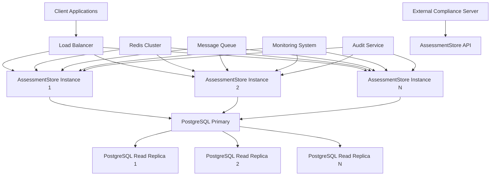

# AssessmentStore Service Architecture Design

## Executive Summary

The AssessmentStore service is designed to replace the current EventEmitter-based event handling system with a centralized, reliable state management solution for all assessments. This architecture addresses the critical issues identified in the current system, including event name mismatches, memory leaks, race conditions, and inconsistent implementations between JavaScript and TypeScript versions.

## Architecture Overview

### 1. System Architecture



### 2. Core Design Principles

#### 2.1 Centralized State Management
- **Single Source of Truth**: All assessment state is managed in a centralized database
- **Atomic Operations**: All state changes are atomic and consistent
- **Optimistic Locking**: Version-based concurrency control prevents conflicts
- **Eventual Consistency**: Cache layer provides fast reads with eventual consistency

#### 2.2 Promise-Based Coordination
- **Synchronous API**: Promise-based methods provide predictable behavior
- **No Event Dependencies**: Eliminates event name mismatches and timing issues
- **Timeout Handling**: Built-in timeout mechanisms prevent hanging operations
- **Error Propagation**: Comprehensive error handling and recovery

#### 2.3 Horizontal Scalability
- **Stateless Service**: Each AssessmentStore instance is stateless
- **Shared Resources**: Database and cache are shared across instances
- **Load Balancing**: Traffic distributed across multiple instances
- **Auto-Scaling**: Instances can be added or removed based on load

## Detailed Architecture Components

### 1. AssessmentStore Core Service

#### 1.1 Service Architecture
```typescript
class AssessmentStore {
  private databaseService: DatabaseService;
  private cacheService: CacheService;
  private eventEmitter: AssessmentEventEmitter;
  private metrics: MetricsCollector;
  private config: AssessmentStoreConfig;
  
  constructor(config: AssessmentStoreConfig) {
    this.config = config;
    this.databaseService = new DatabaseService(config.database);
    this.cacheService = new CacheService(config.cache);
    this.eventEmitter = new AssessmentEventEmitter();
    this.metrics = new MetricsCollector();
  }
  
  // Core API methods
  async createAssessment(request: AssessmentRequest): Promise<string>
  async waitForCompletion(assessmentId: string, timeout?: number): Promise<AssessmentState>
  async getState(assessmentId: string): Promise<AssessmentState>
  async updateProgress(assessmentId: string, progress: number, message?: string): Promise<void>
  async completeAssessment(assessmentId: string, result: AssessmentResult): Promise<void>
  async failAssessment(assessmentId: string, error: string): Promise<void>
  async cancelAssessment(assessmentId: string, reason?: string): Promise<void>
  
  // Query methods
  async listAssessments(filters: AssessmentFilters): Promise<AssessmentState[]>
  async searchAssessments(query: string): Promise<AssessmentState[]>
  async getAssessmentStats(filters?: AssessmentFilters): Promise<AssessmentStats>
  
  // Batch operations
  async batchCreateAssessments(requests: AssessmentRequest[]): Promise<string[]>
  async batchUpdateProgress(updates: ProgressUpdate[]): Promise<void>
  async batchRetryFailedAssessments(maxRetries: number): Promise<string[]>
  
  // Maintenance operations
  async cleanupOldAssessments(retentionDays: number): Promise<number>
  async getHealthStatus(): Promise<HealthStatus>
  async getMetrics(): Promise<AssessmentMetrics>
  
  // Migration operations
  async isMigrationComplete(): Promise<boolean>
  async enableLegacyMode(enabled: boolean): Promise<void>
  async getMigrationStatus(): Promise<MigrationStatus>
}
```

#### 1.2 State Management Architecture
```typescript
class AssessmentStateManager {
  private states: Map<string, AssessmentState> = new Map();
  private locks: Map<string, Promise<void>> = new Map();
  
  async getState(assessmentId: string): Promise<AssessmentState> {
    // Check cache first
    const cached = await this.cacheService.get(assessmentId);
    if (cached) {
      return cached;
    }
    
    // Get from database
    const state = await this.databaseService.getState(assessmentId);
    
    // Update cache
    await this.cacheService.set(assessmentId, state);
    
    return state;
  }
  
  async updateState(assessmentId: string, updateFn: (state: AssessmentState) => AssessmentState): Promise<AssessmentState> {
    // Acquire lock for this assessment
    const lock = this.acquireLock(assessmentId);
    
    try {
      await lock;
      
      // Get current state
      let currentState = await this.getState(assessmentId);
      
      // Apply update
      const updatedState = updateFn(currentState);
      
      // Validate state transition
      this.validateStateTransition(currentState.state, updatedState.state);
      
      // Save to database with optimistic locking
      const savedState = await this.databaseService.saveState(updatedState);
      
      // Update cache
      await this.cacheService.set(assessmentId, savedState);
      
      // Emit event
      await this.eventEmitter.emit({
        type: 'assessment.updated',
        assessmentId,
        data: savedState
      });
      
      return savedState;
    } finally {
      this.releaseLock(assessmentId);
    }
  }
  
  private acquireLock(assessmentId: string): Promise<void> {
    const existingLock = this.locks.get(assessmentId);
    
    if (existingLock) {
      return existingLock;
    }
    
    const newLock = new Promise<void>((resolve) => {
      // Lock acquisition logic
      setTimeout(resolve, 0);
    });
    
    this.locks.set(assessmentId, newLock);
    return newLock;
  }
  
  private releaseLock(assessmentId: string): void {
    this.locks.delete(assessmentId);
  }
  
  private validateStateTransition(fromState: AssessmentState, toState: AssessmentState): void {
    const validTransitions: Record<AssessmentState, AssessmentState[]> = {
      [AssessmentState.PENDING]: [AssessmentState.PROCESSING, AssessmentState.CANCELLED],
      [AssessmentState.PROCESSING]: [AssessmentState.COMPLETED, AssessmentState.FAILED, AssessmentState.CANCELLED],
      [AssessmentState.COMPLETED]: [],
      [AssessmentState.FAILED]: [AssessmentState.PENDING], // Retry
      [AssessmentState.CANCELLED]: []
    };
    
    const validNextStates = validTransitions[fromState];
    if (!validNextStates.includes(toState)) {
      throw new AssessmentStateTransitionError(fromState, toState);
    }
  }
}
```

### 2. Database Architecture

#### 2.1 Database Schema
```sql
-- Assessment states table
CREATE TABLE assessment_states (
    assessment_id VARCHAR(255) PRIMARY KEY,
    state VARCHAR(50) NOT NULL,
    version INTEGER NOT NULL DEFAULT 1,
    progress INTEGER NOT NULL DEFAULT 0,
    message TEXT,
    created_at TIMESTAMP WITH TIME ZONE NOT NULL DEFAULT NOW(),
    updated_at TIMESTAMP WITH TIME ZONE NOT NULL DEFAULT NOW(),
    completed_at TIMESTAMP WITH TIME ZONE,
    request_data JSONB NOT NULL,
    result_data JSONB,
    error_message TEXT,
    retry_count INTEGER NOT NULL DEFAULT 0,
    next_retry_at TIMESTAMP WITH TIME ZONE,
    metadata JSONB
);

-- Audit trail table
CREATE TABLE assessment_audit_trail (
    id SERIAL PRIMARY KEY,
    assessment_id VARCHAR(255) NOT NULL,
    action VARCHAR(50) NOT NULL,
    old_state VARCHAR(50),
    new_state VARCHAR(50) NOT NULL,
    old_version INTEGER,
    new_version INTEGER NOT NULL,
    user_id VARCHAR(255),
    details JSONB,
    created_at TIMESTAMP WITH TIME ZONE NOT NULL DEFAULT NOW(),
    FOREIGN KEY (assessment_id) REFERENCES assessment_states(assessment_id)
);

-- Performance metrics table
CREATE TABLE assessment_metrics (
    id SERIAL PRIMARY KEY,
    assessment_id VARCHAR(255) NOT NULL,
    metric_name VARCHAR(100) NOT NULL,
    metric_value NUMERIC NOT NULL,
    created_at TIMESTAMP WITH TIME ZONE NOT NULL DEFAULT NOW(),
    FOREIGN KEY (assessment_id) REFERENCES assessment_states(assessment_id)
);

-- Indexes for performance
CREATE INDEX idx_assessment_states_state_created ON assessment_states(state, created_at);
CREATE INDEX idx_assessment_states_version ON assessment_states(version);
CREATE INDEX idx_assessment_states_next_retry ON assessment_states(next_retry_at) 
    WHERE next_retry_at IS NOT NULL;
CREATE INDEX idx_assessment_audit_trail_assessment ON assessment_audit_trail(assessment_id);
CREATE INDEX idx_assessment_audit_trail_created ON assessment_audit_trail(created_at);
CREATE INDEX idx_assessment_metrics_assessment ON assessment_metrics(assessment_id);
CREATE INDEX idx_assessment_metrics_created ON assessment_metrics(created_at);

-- Constraints
ALTER TABLE assessment_states 
ADD CONSTRAINT chk_progress CHECK (progress >= 0 AND progress <= 100),
ADD CONSTRAINT chk_version CHECK (version > 0),
ADD CONSTRAINT chk_retry_count CHECK (retry_count >= 0);

-- Functions for automatic timestamp updates
CREATE OR REPLACE FUNCTION update_updated_at_column()
RETURNS TRIGGER AS $$
BEGIN
    NEW.updated_at = NOW();
    RETURN NEW;
END;
$$ language 'plpgsql';

CREATE TRIGGER update_assessment_states_updated_at 
    BEFORE UPDATE ON assessment_states 
    FOR EACH ROW EXECUTE FUNCTION update_updated_at_column();
```

#### 2.2 Database Service Architecture
```typescript
class DatabaseService {
  private pool: Pool;
  private logger: Logger;
  
  constructor(config: DatabaseConfig, logger: Logger) {
    this.pool = new Pool({
      host: config.host,
      port: config.port,
      database: config.database,
      user: config.username,
      password: config.password,
      ssl: config.ssl || false,
      max: config.maxConnections || 20,
      min: config.minConnections || 5,
      idleTimeoutMillis: 30000,
      connectionTimeoutMillis: 2000
    });
    this.logger = logger;
  }
  
  async getState(assessmentId: string): Promise<AssessmentState> {
    const query = `
      SELECT assessment_id, state, version, progress, message, 
             created_at, updated_at, completed_at, request_data, 
             result_data, error_message, retry_count, next_retry_at, metadata
      FROM assessment_states 
      WHERE assessment_id = $1
      FOR UPDATE SKIP LOCKED
    `;
    
    const result = await this.pool.query(query, [assessmentId]);
    
    if (result.rows.length === 0) {
      throw new AssessmentNotFoundError(assessmentId);
    }
    
    return this.mapRowToAssessmentState(result.rows[0]);
  }
  
  async saveState(state: AssessmentState): Promise<AssessmentState> {
    const query = `
      INSERT INTO assessment_states (
        assessment_id, state, version, progress, message,
        created_at, updated_at, completed_at, request_data,
        result_data, error_message, retry_count, next_retry_at, metadata
      ) VALUES ($1, $2, $3, $4, $5, $6, $7, $8, $9, $10, $11, $12, $13, $14)
      ON CONFLICT (assessment_id) DO UPDATE SET
        state = EXCLUDED.state,
        version = EXCLUDED.version,
        progress = EXCLUDED.progress,
        message = EXCLUDED.message,
        updated_at = EXCLUDED.updated_at,
        completed_at = EXCLUDED.completed_at,
        result_data = EXCLUDED.result_data,
        error_message = EXCLUDED.error_message,
        retry_count = EXCLUDED.retry_count,
        next_retry_at = EXCLUDED.next_retry_at,
        metadata = EXCLUDED.metadata
      RETURNING *
    `;
    
    const values = [
      state.assessmentId,
      state.state,
      state.version,
      state.progress,
      state.message,
      state.createdAt,
      state.updatedAt,
      state.completedAt,
      JSON.stringify(state.requestData),
      state.resultData ? JSON.stringify(state.resultData) : null,
      state.errorMessage,
      state.retryCount,
      state.nextRetryAt,
      state.metadata ? JSON.stringify(state.metadata) : null
    ];
    
    const result = await this.pool.query(query, values);
    return this.mapRowToAssessmentState(result.rows[0]);
  }
  
  async withTransaction<T>(callback: (client: PoolClient) => Promise<T>): Promise<T> {
    const client = await this.pool.connect();
    try {
      await client.query('BEGIN');
      const result = await callback(client);
      await client.query('COMMIT');
      return result;
    } catch (error) {
      await client.query('ROLLBACK');
      throw error;
    } finally {
      client.release();
    }
  }
  
  private mapRowToAssessmentState(row: any): AssessmentState {
    return {
      assessmentId: row.assessment_id,
      state: row.state,
      version: row.version,
      progress: row.progress,
      message: row.message,
      createdAt: row.created_at,
      updatedAt: row.updated_at,
      completedAt: row.completed_at,
      requestData: JSON.parse(row.request_data),
      resultData: row.result_data ? JSON.parse(row.result_data) : undefined,
      errorMessage: row.error_message,
      retryCount: row.retry_count,
      nextRetryAt: row.next_retry_at,
      metadata: row.metadata ? JSON.parse(row.metadata) : undefined
    };
  }
}
```

### 3. Caching Architecture

#### 3.1 Multi-Layer Caching Strategy
```typescript
class CacheService {
  private memoryCache: MemoryCache;
  private redisCache: RedisCache;
  private cacheConfig: CacheConfig;
  
  constructor(config: CacheConfig) {
    this.cacheConfig = config;
    this.memoryCache = new MemoryCache(config.memory);
    this.redisCache = new RedisCache(config.redis);
  }
  
  async get(assessmentId: string): Promise<AssessmentState | null> {
    // Try memory cache first
    const memoryResult = this.memoryCache.get(assessmentId);
    if (memoryResult) {
      return memoryResult;
    }
    
    // Try Redis cache
    const redisResult = await this.redisCache.get(assessmentId);
    if (redisResult) {
      // Update memory cache
      this.memoryCache.set(assessmentId, redisResult);
      return redisResult;
    }
    
    return null;
  }
  
  async set(assessmentId: string, state: AssessmentState): Promise<void> {
    // Set in memory cache
    this.memoryCache.set(assessmentId, state);
    
    // Set in Redis cache
    await this.redisCache.set(assessmentId, state);
  }
  
  async invalidate(assessmentId: string): Promise<void> {
    // Invalidate memory cache
    this.memoryCache.invalidate(assessmentId);
    
    // Invalidate Redis cache
    await this.redisCache.invalidate(assessmentId);
  }
  
  async bulkGet(assessmentIds: string[]): Promise<Map<string, AssessmentState>> {
    const results = new Map<string, AssessmentState>();
    
    // Bulk get from memory cache
    const memoryResults = this.memoryCache.bulkGet(assessmentIds);
    memoryResults.forEach((state, id) => results.set(id, state));
    
    // Get remaining from Redis cache
    const remainingIds = assessmentIds.filter(id => !results.has(id));
    if (remainingIds.length > 0) {
      const redisResults = await this.redisCache.bulkGet(remainingIds);
      redisResults.forEach((state, id) => {
        results.set(id, state);
        this.memoryCache.set(id, state);
      });
    }
    
    return results;
  }
  
  async bulkSet(states: Map<string, AssessmentState>): Promise<void> {
    // Bulk set to memory cache
    this.memoryCache.bulkSet(states);
    
    // Bulk set to Redis cache
    await this.redisCache.bulkSet(states);
  }
}

class MemoryCache {
  private cache: Map<string, CacheEntry<AssessmentState>>;
  private maxSize: number;
  private ttl: number;
  
  constructor(config: MemoryCacheConfig) {
    this.cache = new Map();
    this.maxSize = config.maxSize;
    this.ttl = config.ttl;
  }
  
  get(assessmentId: string): AssessmentState | null {
    const entry = this.cache.get(assessmentId);
    if (!entry || Date.now() > entry.expiresAt) {
      this.cache.delete(assessmentId);
      return null;
    }
    return entry.data;
  }
  
  set(assessmentId: string, state: AssessmentState): void {
    // Evict if cache is full (LRU strategy)
    if (this.cache.size >= this.maxSize) {
      const oldestKey = this.cache.keys().next().value;
      this.cache.delete(oldestKey);
    }
    
    this.cache.set(assessmentId, {
      data: state,
      expiresAt: Date.now() + this.ttl
    });
  }
  
  invalidate(assessmentId: string): void {
    this.cache.delete(assessmentId);
  }
  
  bulkGet(assessmentIds: string[]): Map<string, AssessmentState> {
    const results = new Map<string, AssessmentState>();
    
    for (const id of assessmentIds) {
      const state = this.get(id);
      if (state) {
        results.set(id, state);
      }
    }
    
    return results;
  }
  
  bulkSet(states: Map<string, AssessmentState>): void {
    states.forEach((state, id) => this.set(id, state));
  }
}
```

### 4. Event Architecture

#### 4.1 Event System Design
```typescript
class AssessmentEventEmitter {
  private subscriptions: Map<string, EventSubscription[]> = new Map();
  private eventQueue: AssessmentEvent[] = [];
  private isProcessing: boolean = false;
  
  async on(eventTypes: string[], handler: AssessmentEventHandler): EventSubscription {
    const subscription: EventSubscription = {
      id: this.generateSubscriptionId(),
      eventTypes,
      handler,
      active: true,
      createdAt: new Date().toISOString()
    };
    
    for (const eventType of eventTypes) {
      if (!this.subscriptions.has(eventType)) {
        this.subscriptions.set(eventType, []);
      }
      this.subscriptions.get(eventType)!.push(subscription);
    }
    
    return subscription;
  }
  
  async off(subscriptionId: string): boolean {
    let removed = false;
    
    for (const [eventType, subscriptions] of this.subscriptions.entries()) {
      const index = subscriptions.findIndex(sub => sub.id === subscriptionId);
      if (index > -1) {
        subscriptions.splice(index, 1);
        removed = true;
      }
    }
    
    return removed;
  }
  
  async emit(event: AssessmentEvent): Promise<void> {
    // Add to queue for processing
    this.eventQueue.push(event);
    
    // Process queue if not already processing
    if (!this.isProcessing) {
      this.isProcessing = true;
      await this.processEventQueue();
      this.isProcessing = false;
    }
  }
  
  private async processEventQueue(): Promise<void> {
    while (this.eventQueue.length > 0) {
      const event = this.eventQueue.shift()!;
      await this.deliverEvent(event);
    }
  }
  
  private async deliverEvent(event: AssessmentEvent): Promise<void> {
    const subscriptions = this.subscriptions.get(event.type) || [];
    
    for (const subscription of subscriptions) {
      if (subscription.active) {
        try {
          await subscription.handler(event);
        } catch (error) {
          console.error('Event handler error:', error);
        }
      }
    }
  }
  
  private generateSubscriptionId(): string {
    return `sub_${Date.now()}_${Math.random().toString(36).substr(2, 9)}`;
  }
}
```

### 5. Monitoring and Observability

#### 5.1 Metrics Collection
```typescript
class MetricsCollector {
  private metrics: AssessmentStoreMetrics;
  private registry: Registry;
  
  constructor() {
    this.registry = new Registry();
    this.metrics = this.createMetrics();
  }
  
  private createMetrics(): AssessmentStoreMetrics {
    return {
      // Assessment metrics
      totalAssessments: new Counter({
        name: 'assessmentstore_total_assessments',
        help: 'Total number of assessments created',
        registers: [this.registry]
      }),
      
      activeAssessments: new Gauge({
        name: 'assessmentstore_active_assessments',
        help: 'Number of currently active assessments',
        registers: [this.registry]
      }),
      
      completedAssessments: new Counter({
        name: 'assessmentstore_completed_assessments',
        help: 'Total number of completed assessments',
        registers: [this.registry]
      }),
      
      failedAssessments: new Counter({
        name: 'assessmentstore_failed_assessments',
        help: 'Total number of failed assessments',
        registers: [this.registry]
      }),
      
      // Performance metrics
      processingTime: new Histogram({
        name: 'assessmentstore_processing_time_seconds',
        help: 'Time spent processing assessments',
        buckets: [0.1, 0.5, 1, 2, 5, 10, 30, 60],
        registers: [this.registry]
      }),
      
      queueWaitTime: new Histogram({
        name: 'assessmentstore_queue_wait_time_seconds',
        help: 'Time spent waiting in queue',
        buckets: [0.01, 0.05, 0.1, 0.5, 1, 5, 10],
        registers: [this.registry]
      }),
      
      // System metrics
      memoryUsage: new Gauge({
        name: 'assessmentstore_memory_usage_bytes',
        help: 'Memory usage in bytes',
        registers: [this.registry]
      }),
      
      cpuUsage: new Gauge({
        name: 'assessmentstore_cpu_usage_percent',
        help: 'CPU usage percentage',
        registers: [this.registry]
      }),
      
      // Error metrics
      errorRate: new Counter({
        name: 'assessmentstore_errors_total',
        help: 'Total number of errors',
        labelNames: ['error_type', 'assessment_id'],
        registers: [this.registry]
      })
    };
  }
  
  recordAssessmentCreated(): void {
    this.metrics.totalAssessments.inc();
    this.metrics.activeAssessments.inc();
  }
  
  recordAssessmentCompleted(duration: number): void {
    this.metrics.activeAssessments.dec();
    this.metrics.completedAssessments.inc();
    this.metrics.processingTime.observe(duration);
  }
  
  recordAssessmentFailed(duration: number): void {
    this.metrics.activeAssessments.dec();
    this.metrics.failedAssessments.inc();
    this.metrics.processingTime.observe(duration);
  }
  
  recordError(errorType: string, assessmentId?: string): void {
    const labels: { [key: string]: string } = { error_type: errorType };
    if (assessmentId) {
      labels.assessment_id = assessmentId;
    }
    this.metrics.errorRate.inc(labels);
  }
  
  getMetrics(): string {
    return this.registry.metrics();
  }
}
```

## Integration Architecture

### 1. External Service Integration

#### 1.1 Compliance Server Integration
```typescript
class ComplianceServerIntegration {
  private httpClient: HttpClient;
  private config: ComplianceServerConfig;
  
  constructor(config: ComplianceServerConfig) {
    this.config = config;
    this.httpClient = new HttpClient({
      baseURL: config.baseUrl,
      timeout: config.timeout,
      headers: {
        'Content-Type': 'application/json',
        'Authorization': `Bearer ${config.apiKey}`
      }
    });
  }
  
  async executeAssessment(assessmentId: string, request: AssessmentRequest): Promise<AssessmentResult> {
    try {
      const response = await this.httpClient.post('/assessments', {
        assessmentId,
        ...request
      });
      
      return response.data;
    } catch (error) {
      throw new AssessmentExecutionError(`Failed to execute assessment: ${error.message}`);
    }
  }
  
  async getAssessmentStatus(assessmentId: string): Promise<AssessmentStatus> {
    try {
      const response = await this.httpClient.get(`/assessments/${assessmentId}/status`);
      return response.data;
    } catch (error) {
      throw new AssessmentStatusError(`Failed to get assessment status: ${error.message}`);
    }
  }
  
  async cancelAssessment(assessmentId: string): Promise<void> {
    try {
      await this.httpClient.delete(`/assessments/${assessmentId}`);
    } catch (error) {
      throw new AssessmentCancellationError(`Failed to cancel assessment: ${error.message}`);
    }
  }
}
```

#### 1.2 Audit Service Integration
```typescript
class AuditServiceIntegration {
  private auditService: AuditService;
  
  constructor(auditService: AuditService) {
    this.auditService = auditService;
  }
  
  async logAssessmentEvent(event: AssessmentEvent, userId?: string): Promise<void> {
    const auditLog: AuditLog = {
      id: this.generateAuditId(),
      timestamp: new Date().toISOString(),
      action: this.mapAssessmentEventToAction(event.type),
      actor: userId || 'system',
      target: 'assessment',
      result: this.mapAssessmentEventToResult(event.type),
      details: {
        assessmentId: event.assessmentId,
        eventType: event.type,
        data: event.data
      },
      ipAddress: this.getClientIP(),
      userAgent: this.getUserAgent()
    };
    
    await this.auditService.log(auditLog);
  }
  
  private mapAssessmentEventToAction(eventType: string): string {
    const actionMap: Record<string, string> = {
      'assessment.created': 'assessment_created',
      'assessment.started': 'assessment_started',
      'assessment.progress': 'assessment_progress',
      'assessment.completed': 'assessment_completed',
      'assessment.failed': 'assessment_failed',
      'assessment.cancelled': 'assessment_cancelled'
    };
    
    return actionMap[eventType] || 'assessment_unknown';
  }
  
  private mapAssessmentEventToResult(eventType: string): 'success' | 'failed' | 'pending' {
    if (eventType === 'assessment.completed') return 'success';
    if (eventType === 'assessment.failed') return 'failed';
    return 'pending';
  }
  
  private generateAuditId(): string {
    return `audit_${Date.now()}_${Math.random().toString(36).substr(2, 9)}`;
  }
}
```

### 2. API Architecture

#### 2.1 REST API Design
```typescript
class AssessmentStoreAPI {
  private assessmentStore: AssessmentStore;
  private auditService: AuditService;
  private metrics: MetricsCollector;
  
  constructor(assessmentStore: AssessmentStore, auditService: AuditService, metrics: MetricsCollector) {
    this.assessmentStore = assessmentStore;
    this.auditService = auditService;
    this.metrics = metrics;
  }
  
  // Assessment creation endpoint
  async createAssessment(req: Request, res: Response): Promise<void> {
    const startTime = Date.now();
    
    try {
      const request: AssessmentRequest = req.body;
      const userId = this.getUserId(req);
      
      // Validate request
      this.validateAssessmentRequest(request);
      
      // Create assessment
      const assessmentId = await this.assessmentStore.createAssessment(request);
      
      // Log audit event
      await this.auditService.logAssessmentEvent({
        type: 'assessment.created',
        assessmentId,
        data: request
      }, userId);
      
      // Record metrics
      this.metrics.recordAssessmentCreated();
      
      res.json({
        assessmentId,
        status: 'created',
        message: 'Assessment created successfully',
        estimatedTime: request.options?.timeout || 30000
      });
      
    } catch (error) {
      this.metrics.recordError('create_assessment_error');
      this.handleError(error, res);
    } finally {
      const duration = Date.now() - startTime;
      this.metrics.recordQueueWaitTime(duration);
    }
  }
  
  // Assessment status endpoint
  async getAssessmentStatus(req: Request, res: Response): Promise<void> {
    const startTime = Date.now();
    
    try {
      const { assessmentId } = req.params;
      const userId = this.getUserId(req);
      
      const state = await this.assessmentStore.getState(assessmentId);
      
      res.json({
        assessmentId,
        status: state.state,
        progress: state.progress,
        message: state.message,
        createdAt: state.createdAt,
        updatedAt: state.updatedAt,
        completedAt: state.completedAt
      });
      
    } catch (error) {
      this.metrics.recordError('get_status_error', req.params.assessmentId);
      this.handleError(error, res);
    } finally {
      const duration = Date.now() - startTime;
      this.metrics.recordQueueWaitTime(duration);
    }
  }
  
  // Assessment completion endpoint
  async waitForAssessmentCompletion(req: Request, res: Response): Promise<void> {
    const startTime = Date.now();
    
    try {
      const { assessmentId } = req.params;
      const { timeout = 30000 } = req.query;
      const userId = this.getUserId(req);
      
      const state = await this.assessmentStore.waitForCompletion(assessmentId, Number(timeout));
      
      // Log completion event
      await this.auditService.logAssessmentEvent({
        type: state.state === AssessmentState.COMPLETED ? 'assessment.completed' : 'assessment.failed',
        assessmentId,
        data: state
      }, userId);
      
      // Record metrics
      if (state.state === AssessmentState.COMPLETED) {
        this.metrics.recordAssessmentCompleted(Date.now() - startTime);
      } else {
        this.metrics.recordAssessmentFailed(Date.now() - startTime);
      }
      
      res.json({
        assessmentId,
        status: state.state,
        result: state.resultData,
        error: state.errorMessage,
        duration: state.duration
      });
      
    } catch (error) {
      this.metrics.recordError('wait_completion_error', req.params.assessmentId);
      this.handleError(error, res);
    } finally {
      const duration = Date.now() - startTime;
      this.metrics.recordQueueWaitTime(duration);
    }
  }
  
  private validateAssessmentRequest(request: AssessmentRequest): void {
    if (!request.assessmentType) {
      throw new ValidationError('Assessment type is required');
    }
    
    if (!request.options) {
      throw new ValidationError('Assessment options are required');
    }
    
    if (request.progress < 0 || request.progress > 100) {
      throw new ValidationError('Progress must be between 0 and 100');
    }
  }
  
  private handleError(error: Error, res: Response): void {
    if (error instanceof AssessmentNotFoundError) {
      res.status(404).json({
        error: {
          code: 'ASSESSMENT_NOT_FOUND',
          message: error.message
        }
      });
    } else if (error instanceof AssessmentTimeoutError) {
      res.status(408).json({
        error: {
          code: 'ASSESSMENT_TIMEOUT',
          message: error.message
        }
      });
    } else {
      res.status(500).json({
        error: {
          code: 'INTERNAL_ERROR',
          message: 'Internal server error'
        }
      });
    }
  }
}
```

## Security Architecture

### 1. Authentication and Authorization
```typescript
class SecurityManager {
  private jwtService: JWTService;
  private permissionService: PermissionService;
  
  constructor(jwtService: JWTService, permissionService: PermissionService) {
    this.jwtService = jwtService;
    this.permissionService = permissionService;
  }
  
  async authenticate(token: string): Promise<User> {
    try {
      const payload = this.jwtService.verify(token);
      return await this.getUserById(payload.userId);
    } catch (error) {
      throw new AuthenticationError('Invalid or expired token');
    }
  }
  
  async authorize(user: User, permission: string, resource?: string): Promise<boolean> {
    return await this.permissionService.hasPermission(user, permission, resource);
  }
  
  async validateAssessmentAccess(user: User, assessmentId: string): Promise<boolean> {
    // Check if user has permission to access this assessment
    const hasPermission = await this.authorize(user, 'view:assessment', assessmentId);
    
    if (!hasPermission) {
      return false;
    }
    
    // Additional business logic for assessment access
    return await this.checkAssessmentOwnership(user, assessmentId);
  }
  
  private async checkAssessmentOwnership(user: User, assessmentId: string): Promise<boolean> {
    // Check if user created the assessment or has appropriate permissions
    const assessment = await this.assessmentStore.getState(assessmentId);
    return assessment.requestData.userId === user.id || 
           user.role === Role.ADMIN ||
           user.role === Role.HUMAN_OVERSIGHT;
  }
}
```

### 2. Data Encryption
```typescript
class EncryptionService {
  private algorithm: string;
  private key: Buffer;
  
  constructor(secretKey: string) {
    this.algorithm = 'aes-256-gcm';
    this.key = crypto.createHash('sha256').update(secretKey).digest();
  }
  
  encrypt(data: string): { encrypted: string; iv: string; tag: string } {
    const iv = crypto.randomBytes(16);
    const cipher = crypto.createCipher(this.algorithm, this.key);
    
    let encrypted = cipher.update(data, 'utf8', 'hex');
    encrypted += cipher.final('hex');
    
    const tag = cipher.getAuthTag();
    
    return {
      encrypted,
      iv: iv.toString('hex'),
      tag: tag.toString('hex')
    };
  }
  
  decrypt(encrypted: string, iv: string, tag: string): string {
    const decipher = crypto.createDecipher(this.algorithm, this.key);
    decipher.setAuthTag(Buffer.from(tag, 'hex'));
    
    let decrypted = decipher.update(encrypted, 'hex', 'utf8');
    decrypted += decipher.final('utf8');
    
    return decrypted;
  }
}
```

## Deployment Architecture

### 1. Containerization
```dockerfile
# Dockerfile for AssessmentStore
FROM node:18-alpine

WORKDIR /app

# Copy package files
COPY package*.json ./

# Install dependencies
RUN npm ci --only=production

# Copy source code
COPY . .

# Build the application
RUN npm run build

# Create non-root user
RUN addgroup -g 1001 -S nodejs
RUN adduser -S assessmentstore -u 1001

# Change ownership
RUN chown -R assessmentstore:nodejs /app
USER assessmentstore

# Expose port
EXPOSE 3000

# Health check
HEALTHCHECK --interval=30s --timeout=3s --start-period=5s --retries=3 \
  CMD node healthcheck.js

# Start the application
CMD ["npm", "start"]
```

### 2. Kubernetes Deployment
```yaml
# assessmentstore-deployment.yaml
apiVersion: apps/v1
kind: Deployment
metadata:
  name: assessmentstore
  labels:
    app: assessmentstore
spec:
  replicas: 3
  selector:
    matchLabels:
      app: assessmentstore
  template:
    metadata:
      labels:
        app: assessmentstore
    spec:
      containers:
      - name: assessmentstore
        image: assessmentstore:latest
        ports:
        - containerPort: 3000
        env:
        - name: NODE_ENV
          value: "production"
        - name: DATABASE_URL
          valueFrom:
            secretKeyRef:
              name: assessmentstore-secrets
              key: database-url
        - name: REDIS_URL
          valueFrom:
            secretKeyRef:
              name: assessmentstore-secrets
              key: redis-url
        - name: JWT_SECRET
          valueFrom:
            secretKeyRef:
              name: assessmentstore-secrets
              key: jwt-secret
        resources:
          requests:
            memory: "256Mi"
            cpu: "250m"
          limits:
            memory: "512Mi"
            cpu: "500m"
        livenessProbe:
          httpGet:
            path: /health
            port: 3000
          initialDelaySeconds: 30
          periodSeconds: 10
        readinessProbe:
          httpGet:
            path: /ready
            port: 3000
          initialDelaySeconds: 5
          periodSeconds: 5
---
apiVersion: v1
kind: Service
metadata:
  name: assessmentstore-service
spec:
  selector:
    app: assessmentstore
  ports:
  - protocol: TCP
    port: 80
    targetPort: 3000
  type: LoadBalancer
---
apiVersion: networking.k8s.io/v1
kind: Ingress
metadata:
  name: assessmentstore-ingress
  annotations:
    nginx.ingress.kubernetes.io/rewrite-target: /
    cert-manager.io/cluster-issuer: letsencrypt-prod
spec:
  tls:
  - hosts:
    - assessmentstore.example.com
    secretName: assessmentstore-tls
  rules:
  - host: assessmentstore.example.com
    http:
      paths:
      - path: /
        pathType: Prefix
        backend:
          service:
            name: assessmentstore-service
            port:
              number: 80
```

## Conclusion

The AssessmentStore service architecture provides a comprehensive solution for centralized state management that addresses all the critical issues identified in the current EventEmitter-based system. The architecture ensures:

1. **Reliability**: Atomic state transitions and comprehensive error handling
2. **Scalability**: Horizontal scaling with shared state management
3. **Performance**: Multi-layer caching and optimized database queries
4. **Security**: Authentication, authorization, and data encryption
5. **Observability**: Comprehensive monitoring and metrics collection
6. **Maintainability**: Clean code structure and comprehensive documentation

This architecture provides a solid foundation for replacing the current system while maintaining full compatibility and ensuring zero-downtime migration.