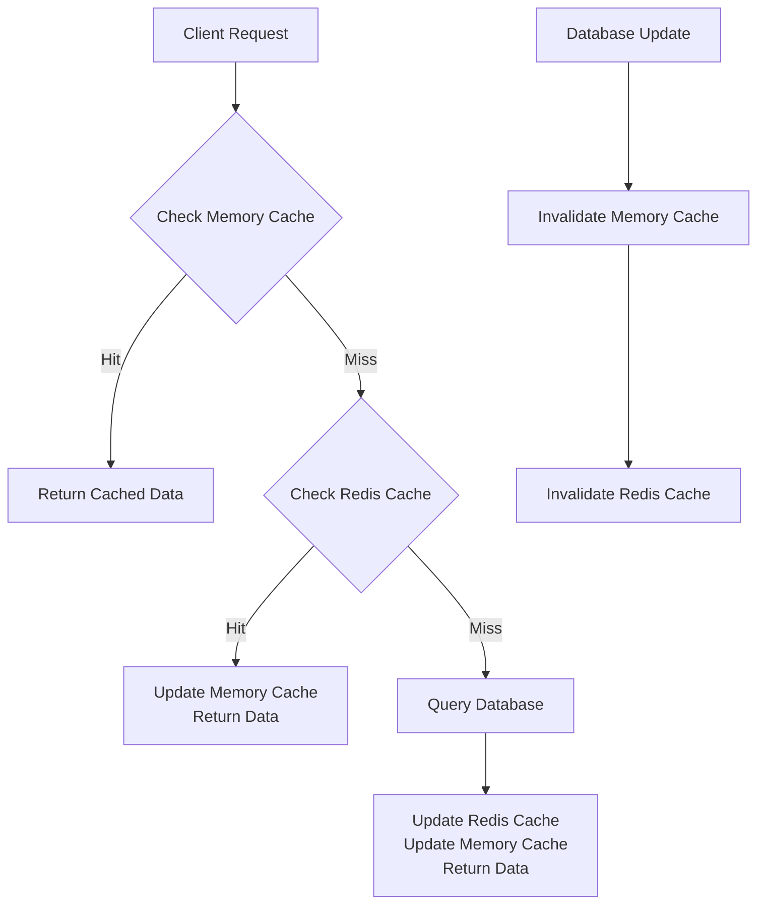
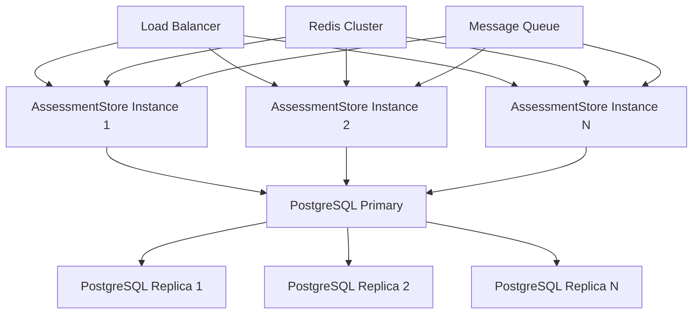

# AssessmentStore Performance and Scalability Strategy

## Overview

This document outlines comprehensive performance and scalability strategies for the AssessmentStore service, designed to handle high-volume assessment processing while maintaining reliability and responsiveness.

## Performance Architecture

### 1. Multi-Layer Caching Strategy

#### 1.1 In-Memory Cache (L1)
```typescript
class AssessmentCache {
  private memoryCache: Map<string, CacheEntry<AssessmentState>>;
  private maxSize: number;
  private ttl: number;
  
  constructor(maxSize = 10000, ttl = 30000) {
    this.memoryCache = new Map();
    this.maxSize = maxSize;
    this.ttl = ttl;
  }
  
  get(assessmentId: string): AssessmentState | null {
    const entry = this.memoryCache.get(assessmentId);
    if (!entry || Date.now() > entry.expiresAt) {
      this.memoryCache.delete(assessmentId);
      return null;
    }
    return entry.data;
  }
  
  set(assessmentId: string, state: AssessmentState): void {
    // Evict if cache is full (LRU strategy)
    if (this.memoryCache.size >= this.maxSize) {
      const oldestKey = this.memoryCache.keys().next().value;
      this.memoryCache.delete(oldestKey);
    }
    
    this.memoryCache.set(assessmentId, {
      data: state,
      expiresAt: Date.now() + this.ttl
    });
  }
}
```

#### 1.2 Redis Cache (L2)
```typescript
interface RedisCacheConfig {
  host: string;
  port: number;
  password?: string;
  db?: number;
  prefix: string;
}

class RedisAssessmentCache {
  private redis: RedisClient;
  private prefix: string;
  private ttl: number;
  
  constructor(config: RedisCacheConfig, ttl = 300000) {
    this.redis = createClient({
      socket: { host: config.host, port: config.port },
      password: config.password,
      database: config.db || 0
    });
    this.prefix = config.prefix;
    this.ttl = ttl;
  }
  
  async get(assessmentId: string): Promise<AssessmentState | null> {
    const key = `${this.prefix}:${assessmentId}`;
    const data = await this.redis.get(key);
    return data ? JSON.parse(data) : null;
  }
  
  async set(assessmentId: string, state: AssessmentState): Promise<void> {
    const key = `${this.prefix}:${assessmentId}`;
    await this.redis.setex(key, this.ttl / 1000, JSON.stringify(state));
  }
  
  async invalidate(assessmentId: string): Promise<void> {
    const key = `${this.prefix}:${assessmentId}`;
    await this.redis.del(key);
  }
}
```

#### 1.3 Cache Hierarchy Strategy


### 2. Database Optimization

#### 2.1 Connection Pooling
```typescript
interface DatabasePoolConfig {
  host: string;
  port: number;
  database: string;
  username: string;
  password: string;
  maxConnections: number;
  minConnections: number;
  idleTimeoutMillis: number;
  connectionTimeoutMillis: number;
}

class OptimizedDatabasePool {
  private pool: Pool;
  
  constructor(config: DatabasePoolConfig) {
    this.pool = new Pool({
      host: config.host,
      port: config.port,
      database: config.database,
      user: config.username,
      password: config.password,
      max: config.maxConnections,
      min: config.minConnections,
      idleTimeoutMillis: config.idleTimeoutMillis,
      connectionTimeoutMillis: config.connectionTimeoutMillis,
      // Additional optimizations
      allowExitOnIdle: true,
      maxUses: 7500 // Recycle connections after 7500 uses
    });
  }
  
  async withConnection<T>(callback: (client: PoolClient) => Promise<T>): Promise<T> {
    const client = await this.pool.connect();
    try {
      return await callback(client);
    } finally {
      client.release();
    }
  }
}
```

#### 2.2 Query Optimization
```typescript
class OptimizedQueries {
  // Optimized assessment state query
  static getAssessmentState(client: PoolClient, assessmentId: string): Promise<AssessmentState> {
    return client.query(`
      SELECT 
        assessment_id,
        state,
        version,
        progress,
        message,
        created_at,
        updated_at,
        completed_at,
        request_data,
        result_data,
        error_message,
        retry_count,
        next_retry_at
      FROM assessment_states 
      WHERE assessment_id = $1
      FOR UPDATE SKIP LOCKED
    `, [assessmentId]);
  }
  
  // Optimized bulk insert for batch operations
  static bulkInsertAssessments(client: PoolClient, assessments: AssessmentRequest[]): Promise<void> {
    const values = assessments.map((assessment, index) => {
      const baseIndex = index * 8 + 1;
      return `(
        $${baseIndex},
        $${baseIndex + 1},
        $${baseIndex + 2},
        $${baseIndex + 3},
        $${baseIndex + 4},
        $${baseIndex + 5},
        $${baseIndex + 6},
        $${baseIndex + 7}
      )`;
    }).join(',');
    
    const params = assessments.flatMap(assessment => [
      assessment.id,
      'pending',
      1,
      JSON.stringify(assessment.requestData),
      null,
      null,
      null,
      0
    ]);
    
    return client.query(`
      INSERT INTO assessment_states (
        assessment_id, state, version, request_data, 
        result_data, error_message, completed_at, progress
      ) VALUES ${values}
      ON CONFLICT (assessment_id) DO NOTHING
    `, params);
  }
}
```

#### 2.3 Index Strategy
```sql
-- Core indexes for performance
CREATE INDEX idx_assessment_states_assessment_id ON assessment_states(assessment_id);
CREATE INDEX idx_assessment_states_state_created ON assessment_states(state, created_at);
CREATE INDEX idx_assessment_states_priority_created ON assessment_states(priority, created_at);
CREATE INDEX idx_assessment_states_next_retry ON assessment_states(next_retry_at) 
    WHERE next_retry_at IS NOT NULL;

-- Composite indexes for common query patterns
CREATE INDEX idx_assessment_states_state_priority_created ON assessment_states(state, priority, created_at);
CREATE INDEX idx_assessment_states_server_type_created ON assessment_states(
    (request_data->>'serverName'), 
    (request_data->>'assessmentType'), 
    created_at
);

-- Partial indexes for filtered queries
CREATE INDEX idx_assessment_states_active ON assessment_states(assessment_id, state, progress) 
    WHERE state IN ('pending', 'processing');

-- Covering indexes for read optimization
CREATE INDEX idx_assessment_states_covering ON assessment_states(assessment_id, state, progress, completed_at) 
    INCLUDE (request_data, result_data);
```

### 3. Concurrency Control

#### 3.1 Optimistic Locking Implementation
```typescript
class OptimisticLockManager {
  async updateWithLock(
    assessmentId: string,
    expectedVersion: number,
    updateFn: (current: AssessmentState) => Promise<AssessmentState>
  ): Promise<AssessmentState> {
    const maxRetries = 3;
    let currentVersion = expectedVersion;
    
    for (let attempt = 0; attempt < maxRetries; attempt++) {
      try {
        // Get current state with lock
        const currentState = await this.getAssessmentStateWithLock(assessmentId);
        
        // Check version
        if (currentState.version !== currentVersion) {
          throw new AssessmentLockError(assessmentId, currentVersion, currentState.version);
        }
        
        // Apply update
        const updatedState = await updateFn(currentState);
        updatedState.version = currentState.version + 1;
        
        // Save updated state
        await this.saveAssessmentState(updatedState);
        
        return updatedState;
      } catch (error) {
        if (error instanceof AssessmentLockError && attempt < maxRetries - 1) {
          // Retry with updated version
          currentVersion = (await this.getAssessmentState(assessmentId)).version;
          continue;
        }
        throw error;
      }
    }
    
    throw new Error('Max retries exceeded for optimistic lock');
  }
}
```

#### 3.2 Pessimistic Locking Strategy
```typescript
class PessimisticLockManager {
  private lockTimeout = 30000; // 30 seconds
  private lockMap = new Map<string, NodeJS.Timeout>();
  
  async acquireLock(assessmentId: string): Promise<boolean> {
    const existingLock = this.lockMap.get(assessmentId);
    if (existingLock) {
      // Check if lock has expired
      if (Date.now() < existingLock) {
        return false;
      }
      // Remove expired lock
      this.lockMap.delete(assessmentId);
    }
    
    // Acquire new lock
    const lockExpiry = Date.now() + this.lockTimeout;
    this.lockMap.set(assessmentId, lockExpiry);
    
    // Set up cleanup
    setTimeout(() => {
      this.lockMap.delete(assessmentId);
    }, this.lockTimeout);
    
    return true;
  }
  
  async releaseLock(assessmentId: string): void {
    this.lockMap.delete(assessmentId);
  }
}
```

## Scalability Architecture

### 1. Horizontal Scaling Strategy

#### 1.1 Service Architecture


#### 1.2 Stateless Service Design
```typescript
class ScalableAssessmentStore implements AssessmentStore {
  private databasePool: OptimizedDatabasePool;
  private redisCache: RedisAssessmentCache;
  private eventEmitter: AssessmentEventEmitter;
  
  // All methods are stateless and rely on shared resources
  async createAssessment(request: AssessmentRequest): Promise<string> {
    // Implementation uses shared database and cache
    // No local state that needs synchronization
  }
  
  async waitForCompletion(assessmentId: string, timeout?: number): Promise<AssessmentState> {
    // Implementation uses polling with shared state
    // No blocking operations that would prevent scaling
  }
}
```

### 2. Database Scaling

#### 2.1 Read Replicas
```typescript
class DatabaseReplicaManager {
  private primary: Pool;
  private replicas: Pool[];
  private replicaWeights: number[];
  
  async executeRead<T>(queryFn: (client: PoolClient) => Promise<T>): Promise<T> {
    // Use weighted round-robin for replica selection
    const replicaIndex = this.selectReplica();
    const replica = this.replicas[replicaIndex];
    
    return replica.connect().then(client => {
      try {
        return queryFn(client);
      } finally {
        client.release();
      }
    });
  }
  
  private selectReplica(): number {
    // Weighted random selection based on replica capacity
    const totalWeight = this.replicaWeights.reduce((sum, weight) => sum + weight, 0);
    let random = Math.random() * totalWeight;
    
    for (let i = 0; i < this.replicaWeights.length; i++) {
      random -= this.replicaWeights[i];
      if (random <= 0) {
        return i;
      }
    }
    
    return this.replicaWeights.length - 1;
  }
}
```

#### 2.2 Connection Pool Optimization
```typescript
class AdaptiveConnectionPool {
  private pool: Pool;
  private metrics: ConnectionPoolMetrics;
  
  constructor(config: DatabasePoolConfig) {
    this.pool = new Pool(config);
    this.metrics = new ConnectionPoolMetrics();
    
    // Monitor pool usage and adjust dynamically
    setInterval(() => this.optimizePool(), 30000);
  }
  
  private optimizePool(): void {
    const usage = this.metrics.getUsage();
    
    if (usage.waitingTime > 1000 && usage.idlePercentage < 0.1) {
      // Increase pool size
      this.pool.options.max = Math.min(
        this.pool.options.max + 5,
        this.pool.options.max * 1.5
      );
    } else if (usage.idlePercentage > 0.3) {
      // Decrease pool size
      this.pool.options.max = Math.max(
        this.pool.options.max - 5,
        this.pool.options.min
      );
    }
  }
}
```

### 3. Caching Scaling

#### 3.1 Redis Cluster Setup
```typescript
interface RedisClusterConfig {
  nodes: Array<{ host: string; port: number }>;
  options: RedisClusterOptions;
}

class RedisClusterManager {
  private cluster: Cluster;
  
  constructor(config: RedisClusterConfig) {
    this.cluster = new Cluster(config.nodes, {
      enableOfflineQueue: false,
      scale_reads: true,
      maxRetriesPerRequest: 3,
      retryDelayOnFailover: 100,
      ...config.options
    });
  }
  
  // Consistent hashing for assessment IDs
  private getRedisNode(assessmentId: string): RedisType {
    const hash = crc32(assessmentId);
    const nodeIndex = hash % this.cluster.nodes.length;
    return this.cluster.nodes[nodeIndex];
  }
  
  async get(assessmentId: string): Promise<AssessmentState | null> {
    const node = this.getRedisNode(assessmentId);
    return node.get(this.getKey(assessmentId));
  }
  
  async set(assessmentId: string, state: AssessmentState): Promise<void> {
    const node = this.getRedisNode(assessmentId);
    await node.setex(this.getKey(assessmentId), this.ttl, JSON.stringify(state));
  }
}
```

## Performance Monitoring

### 1. Metrics Collection

#### 1.1 Core Metrics
```typescript
interface AssessmentStoreMetrics {
  // Assessment metrics
  totalAssessments: Counter;
  activeAssessments: Gauge;
  completedAssessments: Counter;
  failedAssessments: Counter;
  
  // Performance metrics
  processingTime: Histogram;
  queueWaitTime: Histogram;
  databaseQueryTime: Histogram;
  cacheHitRate: Gauge;
  
  // System metrics
  memoryUsage: Gauge;
  cpuUsage: Gauge;
  activeConnections: Gauge;
  
  // Error metrics
  errorRate: Counter;
  retryCount: Counter;
  timeoutCount: Counter;
}

class MetricsCollector {
  private metrics: AssessmentStoreMetrics;
  
  recordAssessmentCreated(): void {
    this.metrics.totalAssessments.inc();
    this.metrics.activeAssessments.inc();
  }
  
  recordAssessmentCompleted(duration: number): void {
    this.metrics.activeAssessments.dec();
    this.metrics.completedAssessments.inc();
    this.metrics.processingTime.observe(duration);
  }
  
  recordDatabaseQuery(query: string, duration: number): void {
    this.metrics.databaseQueryTime.observe(duration);
  }
  
  recordCacheHit(): void {
    this.metrics.cacheHitRate.inc(1, { type: 'hit' });
  }
  
  recordCacheMiss(): void {
    this.metrics.cacheHitRate.inc(1, { type: 'miss' });
  }
}
```

#### 1.2 Real-time Monitoring
```typescript
class RealTimeMonitor {
  private metrics: MetricsCollector;
  private alerts: AlertManager;
  
  constructor() {
    // Set up real-time metrics collection
    setInterval(() => this.collectMetrics(), 5000);
    setInterval(() => this.checkAlerts(), 10000);
  }
  
  private collectMetrics(): void {
    const systemMetrics = this.getSystemMetrics();
    const assessmentMetrics = this.getAssessmentMetrics();
    
    // Update metrics
    this.metrics.memoryUsage.set(systemMetrics.memory);
    this.metrics.cpuUsage.set(systemMetrics.cpu);
    this.metrics.activeAssessments.set(assessmentMetrics.active);
    
    // Check for anomalies
    this.detectAnomalies(assessmentMetrics);
  }
  
  private checkAlerts(): void {
    const metrics = this.metrics.getCurrentMetrics();
    
    // Alert on high error rate
    if (metrics.errorRate > 0.05) {
      this.alerts.send('High error rate detected', {
        errorRate: metrics.errorRate,
        timestamp: new Date().toISOString()
      });
    }
    
    // Alert on long processing times
    if (metrics.averageProcessingTime > 30000) {
      this.alerts.send('Slow processing detected', {
        averageProcessingTime: metrics.averageProcessingTime,
        timestamp: new Date().toISOString()
      });
    }
  }
}
```

### 2. Performance Testing

#### 2.1 Load Testing Strategy
```typescript
class AssessmentStoreLoadTester {
  private store: AssessmentStore;
  private results: LoadTestResult[];
  
  async runLoadTest(config: LoadTestConfig): Promise<LoadTestResult> {
    const startTime = Date.now();
    const results: LoadTestResult = {
      totalRequests: 0,
      successfulRequests: 0,
      failedRequests: 0,
      averageResponseTime: 0,
      maxResponseTime: 0,
      minResponseTime: Infinity,
      throughput: 0,
      errorRate: 0
    };
    
    // Create test workers
    const workers = Array.from({ length: config.concurrency }, () => 
      this.createTestWorker(config, results)
    );
    
    // Run test
    await Promise.all(workers);
    
    // Calculate results
    const duration = Date.now() - startTime;
    results.throughput = results.totalRequests / (duration / 1000);
    results.errorRate = results.failedRequests / results.totalRequests;
    results.averageResponseTime = this.calculateAverageResponseTime(results);
    
    return results;
  }
  
  private createTestWorker(config: LoadTestConfig, results: LoadTestResult): Promise<void> {
    return new Promise(async (resolve) => {
      const requests = Array.from({ length: config.requestsPerWorker }, async () => {
        const start = Date.now();
        results.totalRequests++;
        
        try {
          await this.executeTestRequest(config);
          results.successfulRequests++;
        } catch (error) {
          results.failedRequests++;
        }
        
        const duration = Date.now() - start;
        results.maxResponseTime = Math.max(results.maxResponseTime, duration);
        results.minResponseTime = Math.min(results.minResponseTime, duration);
      });
      
      await Promise.all(requests);
      resolve();
    });
  }
  
  private async executeTestRequest(config: LoadTestConfig): Promise<void> {
    const request: AssessmentRequest = {
      id: `test_${Date.now()}_${Math.random()}`,
      assessmentType: AssessmentType.COMPLIANCE,
      options: {
        includeDetails: false,
        generateReport: false,
        saveResults: true,
        checkServerStatus: false,
        validateConfig: false,
        checkCompliance: false,
        deepScan: false
      },
      timestamp: new Date().toISOString(),
      source: 'test'
    };
    
    await this.store.createAssessment(request);
    await this.store.waitForCompletion(request.id, 5000);
  }
}
```

#### 2.2 Stress Testing
```typescript
class StressTestRunner {
  async runStressTest(): Promise<void> {
    const stressLevels = [
      { concurrency: 10, duration: 60 },    // Light load
      { concurrency: 50, duration: 120 },   // Medium load
      { concurrency: 100, duration: 180 },  // Heavy load
      { concurrency: 200, duration: 300 }   // Extreme load
    ];
    
    for (const level of stressLevels) {
      console.log(`Running stress test: ${level.concurrency} concurrent users for ${level.duration} seconds`);
      
      const result = await this.loadTester.runLoadTest({
        concurrency: level.concurrency,
        duration: level.duration,
        requestsPerWorker: level.duration
      });
      
      console.log('Stress test results:', result);
      
      // Check if system can handle the load
      if (result.errorRate > 0.1 || result.averageResponseTime > 10000) {
        console.warn('System may not be able to handle this load level');
        break;
      }
    }
  }
}
```

## Optimization Strategies

### 1. Query Optimization

#### 1.1 Query Analysis
```typescript
class QueryOptimizer {
  private slowQueryThreshold = 1000; // 1 second
  private queryMetrics: Map<string, QueryMetrics> = new Map();
  
  async executeQuery<T>(query: string, params: any[], callback: (client: PoolClient) => Promise<T>): Promise<T> {
    const startTime = Date.now();
    
    try {
      const result = await callback(await this.databasePool.connect());
      const duration = Date.now() - startTime;
      
      this.recordQueryMetrics(query, duration, true);
      
      if (duration > this.slowQueryThreshold) {
        this.logSlowQuery(query, duration, params);
      }
      
      return result;
    } catch (error) {
      const duration = Date.now() - startTime;
      this.recordQueryMetrics(query, duration, false);
      throw error;
    }
  }
  
  private recordQueryMetrics(query: string, duration: number, success: boolean): void {
    const metrics = this.queryMetrics.get(query) || {
      count: 0,
      totalTime: 0,
      minTime: Infinity,
      maxTime: 0,
      errors: 0
    };
    
    metrics.count++;
    metrics.totalTime += duration;
    metrics.minTime = Math.min(metrics.minTime, duration);
    metrics.maxTime = Math.max(metrics.maxTime, duration);
    if (!success) metrics.errors++;
    
    this.queryMetrics.set(query, metrics);
  }
  
  getSlowQueries(): Array<{ query: string; avgTime: number; count: number }> {
    return Array.from(this.queryMetrics.entries())
      .map(([query, metrics]) => ({
        query,
        avgTime: metrics.totalTime / metrics.count,
        count: metrics.count
      }))
      .filter(metrics => metrics.avgTime > this.slowQueryThreshold)
      .sort((a, b) => b.avgTime - a.avgTime);
  }
}
```

#### 1.2 Index Optimization
```typescript
class IndexOptimizer {
  async analyzeIndexUsage(): Promise<IndexAnalysisResult> {
    const query = `
      SELECT 
        schemaname,
        tablename,
        indexname,
        idx_scan,
        idx_tup_read,
        idx_tup_fetch,
        pg_size_pretty(pg_relation_size(indexname::text)) as index_size
      FROM pg_stat_user_indexes
      ORDER BY idx_scan DESC;
    `;
    
    const result = await this.databasePool.query(query);
    return this.analyzeIndexUsage(result.rows);
  }
  
  private analyzeIndexUsage(rows: any[]): IndexAnalysisResult {
    const totalScans = rows.reduce((sum, row) => sum + parseInt(row.idx_scan), 0);
    const unusedIndexes = rows.filter(row => parseInt(row.idx_scan) === 0);
    const frequentlyUsedIndexes = rows.filter(row => parseInt(row.idx_scan) > 1000);
    
    return {
      totalIndexes: rows.length,
      totalScans,
      unusedIndexes,
      frequentlyUsedIndexes,
      recommendations: this.generateRecommendations(rows)
    };
  }
  
  private generateRecommendations(rows: any[]): string[] {
    const recommendations: string[] = [];
    
    // Recommend dropping unused indexes
    const unusedIndexes = rows.filter(row => parseInt(row.idx_scan) === 0);
    if (unusedIndexes.length > 0) {
      recommendations.push(`Consider dropping ${unusedIndexes.length} unused indexes`);
    }
    
    // Recommend adding composite indexes for frequently queried patterns
    const frequentQueries = this.analyzeFrequentQueries();
    if (frequentQueries.length > 0) {
      recommendations.push('Consider adding composite indexes for frequent query patterns');
    }
    
    return recommendations;
  }
}
```

### 2. Memory Optimization

#### 2.1 Memory Management
```typescript
class MemoryOptimizer {
  private maxMemoryUsage = 512 * 1024 * 1024; // 512MB
  private currentMemoryUsage = 0;
  
  async executeWithMemoryLimit<T>(task: () => Promise<T>): Promise<T> {
    const startMemory = process.memoryUsage().heapUsed;
    
    try {
      const result = await task();
      return result;
    } finally {
      const endMemory = process.memoryUsage().heapUsed;
      this.currentMemoryUsage += endMemory - startMemory;
      
      if (this.currentMemoryUsage > this.maxMemoryUsage) {
        this.performMemoryCleanup();
      }
    }
  }
  
  private performMemoryCleanup(): void {
    // Clear cache
    this.cache.clear();
    
    // Force garbage collection
    if (global.gc) {
      global.gc();
    }
    
    // Reset memory tracking
    this.currentMemoryUsage = process.memoryUsage().heapUsed;
    
    console.log('Memory cleanup performed');
  }
}
```

### 3. Network Optimization

#### 3.1 Connection Pooling
```typescript
class NetworkOptimizer {
  private connectionPools: Map<string, ConnectionPool> = new Map();
  
  async getConnection(service: string): Promise<Connection> {
    let pool = this.connectionPools.get(service);
    
    if (!pool) {
      pool = this.createConnectionPool(service);
      this.connectionPools.set(service, pool);
    }
    
    return pool.getConnection();
  }
  
  private createConnectionPool(service: string): ConnectionPool {
    const config = this.getServiceConfig(service);
    return new ConnectionPool({
      min: config.minConnections,
      max: config.maxConnections,
      acquireTimeoutMillis: config.acquireTimeout,
      idleTimeoutMillis: config.idleTimeout
    });
  }
  
  private getServiceConfig(service: string): ServiceConfig {
    const configs: Record<string, ServiceConfig> = {
      database: {
        minConnections: 5,
        maxConnections: 20,
        acquireTimeout: 5000,
        idleTimeout: 30000
      },
      redis: {
        minConnections: 2,
        maxConnections: 10,
        acquireTimeout: 1000,
        idleTimeout: 10000
      }
    };
    
    return configs[service] || configs.database;
  }
}
```

## Implementation Roadmap

### Phase 1: Foundation (Weeks 1-2)
- [ ] Implement basic caching layer
- [ ] Set up database connection pooling
- [ ] Create core performance monitoring
- [ ] Implement basic query optimization

### Phase 2: Performance Optimization (Weeks 3-4)
- [ ] Add Redis caching layer
- [ ] Implement connection pool optimization
- [ ] Create comprehensive metrics collection
- [ ] Add query analysis and optimization

### Phase 3: Scalability (Weeks 5-6)
- [ ] Implement horizontal scaling architecture
- [ ] Set up Redis cluster
- [ ] Create database read replicas
- [ ] Add load balancing

### Phase 4: Advanced Optimization (Weeks 7-8)
- [ ] Implement memory optimization
- [ ] Add network optimization
- [ ] Create advanced monitoring and alerting
- [ ] Performance testing framework

### Phase 5: Production Readiness (Weeks 9-10)
- [ ] Load testing and validation
- [ ] Performance baseline establishment
- [ ] Continuous monitoring setup
- [ ] Performance SLA definition

## Success Criteria

### Performance Metrics
- **Response Time**: < 100ms for 95% of requests
- **Throughput**: > 1000 assessments per minute
- **Error Rate**: < 0.1%
- **Availability**: 99.99%

### Scalability Metrics
- **Horizontal Scaling**: Support for 10+ instances
- **Database Scaling**: Support for read replicas
- **Cache Scaling**: Redis cluster support
- **Connection Management**: Efficient connection pooling

### Monitoring Metrics
- **Real-time Monitoring**: 5-second granularity
- **Alerting**: Automated alerts for anomalies
- **Performance Tracking**: Historical performance data
- **Capacity Planning**: Resource usage forecasting

This comprehensive performance and scalability strategy ensures that the AssessmentStore service can handle high-volume assessment processing while maintaining reliability, responsiveness, and cost-effectiveness.