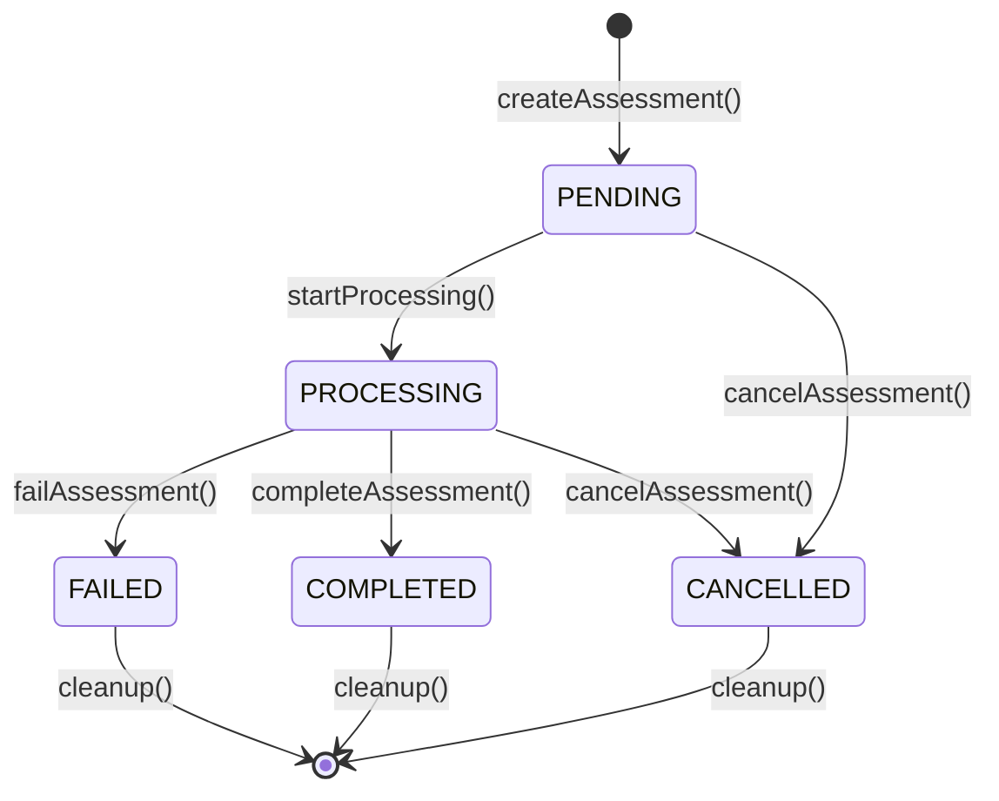
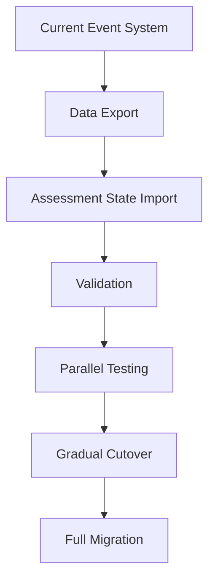

# AssessmentStore Service Design Document

## Executive Summary

The AssessmentStore service is designed to replace the current EventEmitter-based event handling system with a centralized, Promise-based state management solution. This design addresses critical reliability issues while maintaining compatibility with existing systems and providing a clear migration path.

## 1. State Management Architecture

### 1.1 Assessment Lifecycle States

```typescript
enum AssessmentState {
  PENDING = 'pending',           // Assessment requested, not started
  PROCESSING = 'processing',     // Assessment in progress
  COMPLETED = 'completed',       // Assessment finished successfully
  FAILED = 'failed',            // Assessment failed
  CANCELLED = 'cancelled'       // Assessment cancelled by user
}
```

### 1.2 Atomic State Transitions

The AssessmentStore implements atomic state transitions with proper locking:



### 1.3 Concurrent Request Handling

- **Optimistic Locking**: Each assessment record includes a version number for conflict detection
- **Pessimistic Locking**: Database row-level locks during critical state transitions
- **Queue Management**: Request queue with priority handling for concurrent assessments
- **Circuit Breaker**: Prevents cascading failures during system overload

## 2. Database Schema Design

### 2.1 Assessment State Table

```sql
CREATE TABLE assessment_states (
    id UUID PRIMARY KEY DEFAULT gen_random_uuid(),
    assessment_id VARCHAR(255) UNIQUE NOT NULL,
    state AssessmentState NOT NULL,
    version INTEGER NOT NULL DEFAULT 1,
    request_data JSONB NOT NULL,
    result_data JSONB,
    error_message TEXT,
    created_at TIMESTAMP WITH TIME ZONE DEFAULT NOW(),
    updated_at TIMESTAMP WITH TIME ZONE DEFAULT NOW(),
    completed_at TIMESTAMP WITH TIME ZONE,
    progress INTEGER DEFAULT 0 CHECK (progress >= 0 AND progress <= 100),
    priority INTEGER DEFAULT 5 CHECK (priority >= 1 AND priority <= 10),
    retry_count INTEGER DEFAULT 0,
    next_retry_at TIMESTAMP WITH TIME ZONE,
    
    -- Indexes for performance
    INDEX idx_assessment_id (assessment_id),
    INDEX idx_state_created (state, created_at),
    INDEX idx_priority_created (priority, created_at),
    INDEX idx_next_retry (next_retry_at) WHERE next_retry_at IS NOT NULL
);

-- Create ENUM type for assessment states
CREATE TYPE AssessmentState AS ENUM ('pending', 'processing', 'completed', 'failed', 'cancelled');
```

### 2.2 Audit Trail Table

```sql
CREATE TABLE assessment_state_audit (
    id UUID PRIMARY KEY DEFAULT gen_random_uuid(),
    assessment_id VARCHAR(255) NOT NULL,
    old_state AssessmentState,
    new_state AssessmentState NOT NULL,
    changed_by VARCHAR(255),
    change_reason TEXT,
    version_from INTEGER,
    version_to INTEGER,
    created_at TIMESTAMP WITH TIME ZONE DEFAULT NOW(),
    
    -- Indexes for audit queries
    INDEX idx_assessment_id (assessment_id),
    INDEX idx_created_at (created_at)
);
```

### 2.3 Constraints and Data Integrity

```sql
-- Ensure state transitions are valid
CREATE CONSTRAINT assessment_state_transition_valid
    EXCLUDE USING gist (
        assessment_id WITH =,
        state WITH && ARRAY['processing'::AssessmentState, 'completed'::AssessmentState, 'failed'::AssessmentState, 'cancelled'::AssessmentState]
    );

-- Prevent duplicate assessment IDs
ALTER TABLE assessment_states 
ADD CONSTRAINT unique_assessment_id UNIQUE (assessment_id);

-- Ensure completed timestamp is set only for completed/failed states
ALTER TABLE assessment_states 
ADD CONSTRAINT completed_at_check 
CHECK (
    (state IN ('completed', 'failed') AND completed_at IS NOT NULL) OR
    (state NOT IN ('completed', 'failed') AND completed_at IS NULL)
);
```

## 3. Service Interface Design

### 3.1 Core TypeScript Interfaces

```typescript
interface AssessmentRequest {
    id: string;
    serverName?: string;
    assessmentType: 'compliance' | 'health' | 'security';
    options: AssessmentOptions;
    timestamp: string;
    source: 'installer' | 'compliance';
    priority?: number;
    timeout?: number;
}

interface AssessmentState {
    assessmentId: string;
    state: AssessmentState;
    version: number;
    progress: number;
    message?: string;
    createdAt: string;
    updatedAt: string;
    completedAt?: string;
    requestData: AssessmentRequest;
    resultData?: AssessmentResult;
    errorMessage?: string;
    retryCount: number;
    nextRetryAt?: string;
}

interface AssessmentOptions {
    includeDetails: boolean;
    generateReport: boolean;
    saveResults: boolean;
    checkServerStatus: boolean;
    validateConfig: boolean;
    checkCompliance: boolean;
    serverFilter?: string[];
    deepScan: boolean;
    timeout?: number;
}
```

### 3.2 AssessmentStore Service Interface

```typescript
interface AssessmentStore {
    // Core assessment operations
    createAssessment(request: AssessmentRequest): Promise<string>;
    waitForCompletion(assessmentId: string, timeout?: number): Promise<AssessmentState>;
    getState(assessmentId: string): Promise<AssessmentState>;
    updateProgress(assessmentId: string, progress: number, message?: string): Promise<void>;
    completeAssessment(assessmentId: string, result: AssessmentResult): Promise<void>;
    failAssessment(assessmentId: string, error: string): Promise<void>;
    cancelAssessment(assessmentId: string, reason?: string): Promise<void>;
    
    // Query operations
    listAssessments(filters: AssessmentFilters): Promise<AssessmentState[]>;
    getAssessmentStats(): Promise<AssessmentStats>;
    
    // Batch operations
    batchCreateAssessments(requests: AssessmentRequest[]): Promise<string[]>;
    batchRetryFailedAssessments(maxRetries: number): Promise<string[]>;
    
    // Maintenance operations
    cleanupOldAssessments(retentionDays: number): Promise<number>;
    getHealthStatus(): Promise<HealthStatus>;
}
```

### 3.3 Promise-Based API Methods

```typescript
// Create assessment with immediate ID return
async createAssessment(request: AssessmentRequest): Promise<string> {
    // Generate assessment ID and store initial state
    // Return assessment ID immediately for client tracking
}

// Wait for completion with timeout
async waitForCompletion(assessmentId: string, timeout = 30000): Promise<AssessmentState> {
    // Use database polling or WebSocket for real-time updates
    // Implement proper timeout handling
    // Return final assessment state
}

// Get current state (synchronous access)
async getState(assessmentId: string): Promise<AssessmentState> {
    // Return current state from database
    // Handle concurrent access safely
}

// Update progress during processing
async updateProgress(assessmentId: string, progress: number, message?: string): Promise<void> {
    // Update assessment progress with optimistic locking
    // Validate progress range (0-100)
    // Audit progress changes
}
```

## 4. Performance and Scalability

### 4.1 Concurrent Assessment Processing

- **Connection Pooling**: Optimized PostgreSQL connection pool for high concurrency
- **Batch Operations**: Bulk insert/update operations for performance
- **Index Optimization**: Strategic indexes on frequently queried columns
- **Read Replicas**: Support for read replicas to distribute query load

### 4.2 State Caching Strategy

```typescript
class AssessmentCache {
    private cache: Map<string, AssessmentState>;
    private ttl: number;
    
    // Multi-level caching:
    // 1. In-memory cache for frequently accessed assessments
    // 2. Redis cache for distributed access
    // 3. Database as source of truth
    
    async get(assessmentId: string): Promise<AssessmentState | null> {
        // Check memory cache first
        // Check Redis cache second
        // Fall back to database
    }
    
    async set(assessmentId: string, state: AssessmentState): Promise<void> {
        // Update all cache levels
        // Set appropriate TTL based on state
    }
}
```

### 4.3 Monitoring and Observability

```typescript
interface AssessmentMetrics {
    totalAssessments: number;
    activeAssessments: number;
    completedAssessments: number;
    failedAssessments: number;
    averageProcessingTime: number;
    throughputPerMinute: number;
    errorRate: number;
}

// Real-time metrics collection
class AssessmentMetricsCollector {
    private metrics: AssessmentMetrics;
    
    recordStateTransition(from: AssessmentState, to: AssessmentState): void;
    recordProcessingTime(assessmentId: string, duration: number): void;
    recordError(assessmentId: string, error: string): void;
    getCurrentMetrics(): AssessmentMetrics;
}
```

### 4.4 Horizontal Scaling Considerations

- **Sharding Strategy**: Shard assessments by server name or date range
- **Load Balancing**: Distribute assessment creation requests across instances
- **State Synchronization**: Use database-level replication for state consistency
- **Queue Distribution**: Distribute processing queues across multiple workers

## 5. Migration Strategy

### 5.1 Dual-Mode Operation

```typescript
class AssessmentStoreMigration {
    private useLegacyEvents: boolean;
    private assessmentStore: AssessmentStore;
    private eventService: EventService;
    
    async createAssessment(request: AssessmentRequest): Promise<string> {
        if (this.useLegacyEvents) {
            // Use existing event system
            return this.createAssessmentLegacy(request);
        } else {
            // Use new AssessmentStore
            return this.assessmentStore.createAssessment(request);
        }
    }
    
    async waitForCompletion(assessmentId: string): Promise<AssessmentState> {
        if (this.useLegacyEvents) {
            // Bridge old event system to new state system
            return this.waitForCompletionLegacy(assessmentId);
        } else {
            return this.assessmentStore.waitForCompletion(assessmentId);
        }
    }
}
```

### 5.2 Data Migration Process



### 5.3 Feature Flags for Gradual Enablement

```typescript
interface MigrationConfig {
    enableAssessmentStore: boolean;
    enableLegacyFallback: boolean;
    migrationPercentage: number; // 0-100
    enableMetrics: boolean;
    enableAuditLogging: boolean;
}
```

### 5.4 Rollback Procedures

1. **Immediate Rollback**: Switch back to legacy event system via feature flag
2. **Data Rollback**: Restore database from backup before migration
3. **Service Restart**: Restart services to clear any cached state
4. **Monitoring**: Enhanced monitoring during rollback period

## 6. Implementation Roadmap

### Phase 1: Foundation (Weeks 1-2)
- [ ] Create database schema and migrations
- [ ] Implement core AssessmentStore interfaces
- [ ] Set up basic PostgreSQL integration
- [ ] Create initial TypeScript interfaces

### Phase 2: Core Functionality (Weeks 3-4)
- [ ] Implement assessment CRUD operations
- [ ] Add state transition logic with locking
- [ ] Create Promise-based API methods
- [ ] Add basic error handling and validation

### Phase 3: Performance Optimization (Weeks 5-6)
- [ ] Implement caching layer
- [ ] Add database indexing and optimization
- [ ] Create metrics collection system
- [ ] Add connection pooling

### Phase 4: Migration Support (Weeks 7-8)
- [ ] Implement dual-mode operation
- [ ] Create data migration utilities
- [ ] Add feature flag system
- [ ] Develop rollback procedures

### Phase 5: Testing and Validation (Weeks 9-10)
- [ ] Comprehensive unit testing
- [ ] Integration testing with existing services
- [ ] Performance testing and benchmarking
- [ ] Load testing for concurrent scenarios

### Phase 6: Deployment and Monitoring (Weeks 11-12)
- [ ] Gradual deployment to production
- [ ] Enhanced monitoring and alerting
- [ ] Performance tuning in production
- [ ] Documentation and training

## 7. Key Design Decisions

### 7.1 Why Promise-Based Instead of Event-Based?

- **Predictability**: Promise-based APIs provide clear success/failure paths
- **Error Handling**: Structured error handling vs. scattered event listeners
- **State Consistency**: Centralized state eliminates race conditions
- **Testing**: Easier to test and mock Promise-based APIs
- **Performance**: Reduced overhead compared to event system

### 7.2 Why Database-Centric State Management?

- **Persistence**: Survives service restarts and failures
- **Concurrency**: Database-level locking ensures consistency
- **Auditability**: Complete audit trail of all state changes
- **Scalability**: Database can handle high concurrency levels
- **Queryability**: Rich querying capabilities for reporting

### 7.3 Why Gradual Migration?

- **Risk Mitigation**: Minimizes impact on production systems
- **Validation**: Allows thorough testing of new system
- **Performance**: Can compare old vs. new system performance
- **Training**: Allows team to adapt to new APIs gradually
- **Rollback**: Safety net if issues are discovered

## 8. Success Criteria

### 8.1 Functional Criteria
- [ ] All existing assessment functionality preserved
- [ ] No race conditions or state inconsistencies
- [ ] 100% compatibility with external compliance server
- [ ] Complete audit trail of all assessment state changes

### 8.2 Performance Criteria
- [ ] Support for 1000+ concurrent assessments
- [ ] Average response time < 100ms for state queries
- [ ] 99.9% uptime for assessment operations
- [ ] Sub-second assessment completion times

### 8.3 Reliability Criteria
- [ ] Zero data loss during migration
- [ ] Automatic recovery from transient failures
- [ ] Proper timeout handling for all operations
- [ ] Comprehensive error logging and monitoring

### 8.4 Migration Criteria
- [ ] Zero downtime during migration
- [ ] Rollback capability within 5 minutes
- [ ] Gradual cutover with feature flags
- [ ] Complete data validation post-migration

## 9. Risk Assessment

### 9.1 High-Risk Areas
1. **Data Migration**: Risk of data loss or corruption during migration
2. **Performance Degradation**: New system may be slower than current event system
3. **Compatibility Issues**: External systems may break with new API
4. **Concurrency Issues**: Race conditions in high-load scenarios

### 9.2 Mitigation Strategies
1. **Comprehensive Testing**: Extensive testing of migration process
2. **Performance Benchmarking**: Baseline performance before migration
3. **Gradual Rollout**: Feature flags allow quick rollback
4. **Monitoring**: Enhanced monitoring during migration period

## 10. Conclusion

The AssessmentStore service design provides a robust, scalable solution to replace the problematic EventEmitter-based system. By implementing centralized state management with Promise-based APIs, we eliminate the critical issues identified in the current implementation while maintaining full compatibility and providing a clear migration path.

The design prioritizes reliability and simplicity over complex features, ensuring that the system will be maintainable and performant in production environments. The gradual migration strategy minimizes risk and allows for thorough validation of the new system before full deployment.