# MCP Server Integration Architecture Diagrams

## Overview

This document provides comprehensive integration architecture diagrams for MCP (Model Context Protocol) servers within the KiloCode ecosystem. The diagrams cover system architecture, data flow, component relationships, and deployment patterns, following the **Simple, Robust, Secure** approach.

## Architecture Philosophy

### Key Principles
1. **Simplicity**: Provide clear, intuitive architecture diagrams
2. **Robustness**: Ensure reliable system design with proper redundancy
3. **Security**: Implement secure architecture with proper access controls
4. **Consistency**: Maintain consistent architecture patterns across all components
5. **Scalability**: Design for future growth and performance optimization

### Architecture Types
- **System Architecture**: High-level system components and relationships
- **Data Flow Architecture**: Data movement and processing patterns
- **Component Architecture**: Detailed component interactions
- **Deployment Architecture**: Infrastructure and deployment patterns

---

## System Architecture Diagrams

### 1. High-Level System Architecture

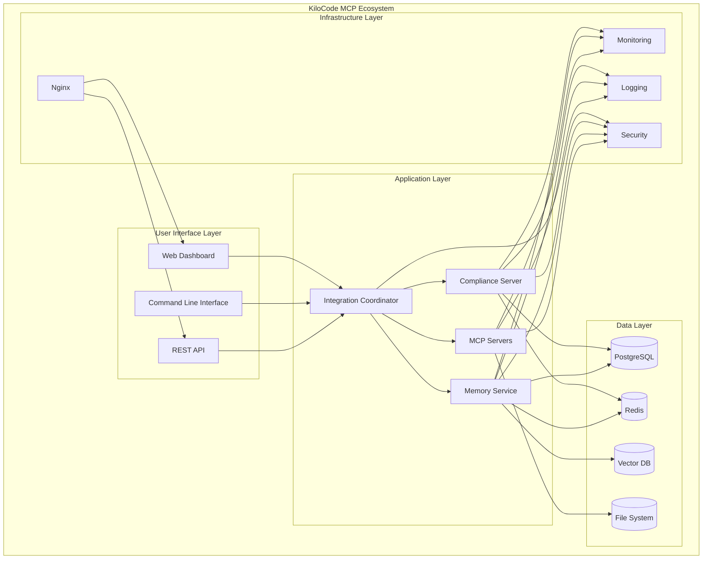

### 2. MCP Server Architecture

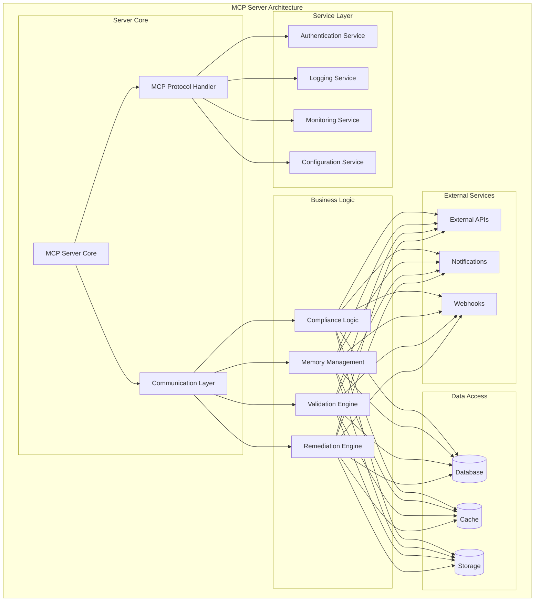

### 3. Integration Coordinator Architecture

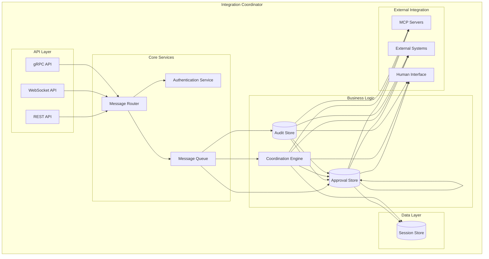

---

## Data Flow Architecture Diagrams

### 1. Compliance Check Data Flow

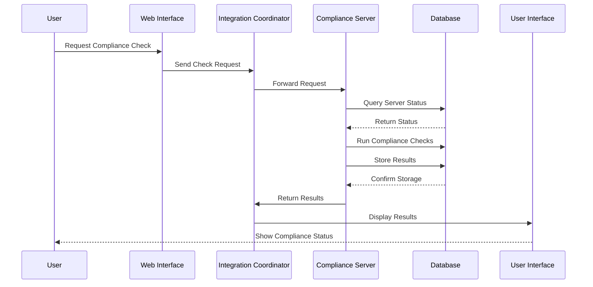

### 2. Memory Service Data Flow

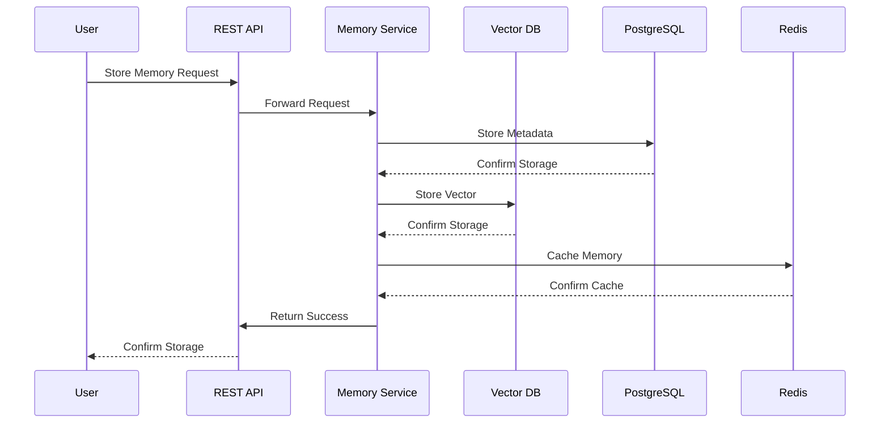

### 3. Integration Flow

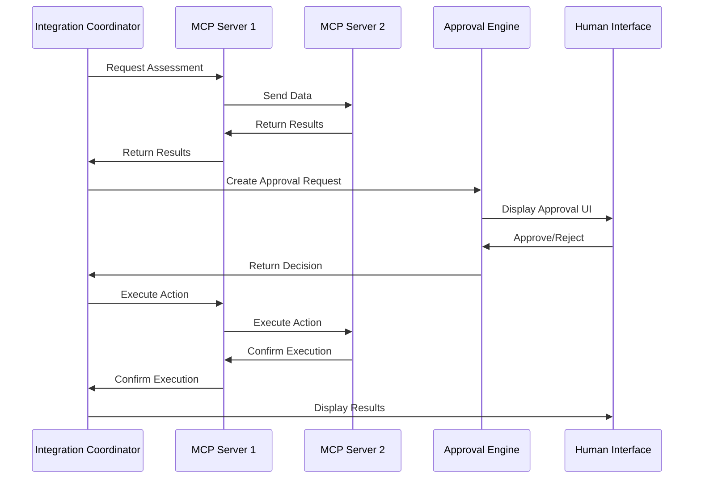

---

## Component Architecture Diagrams

### 1. Compliance Server Components

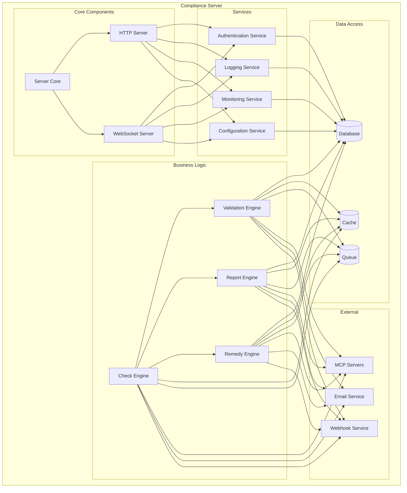

### 2. Memory Service Components

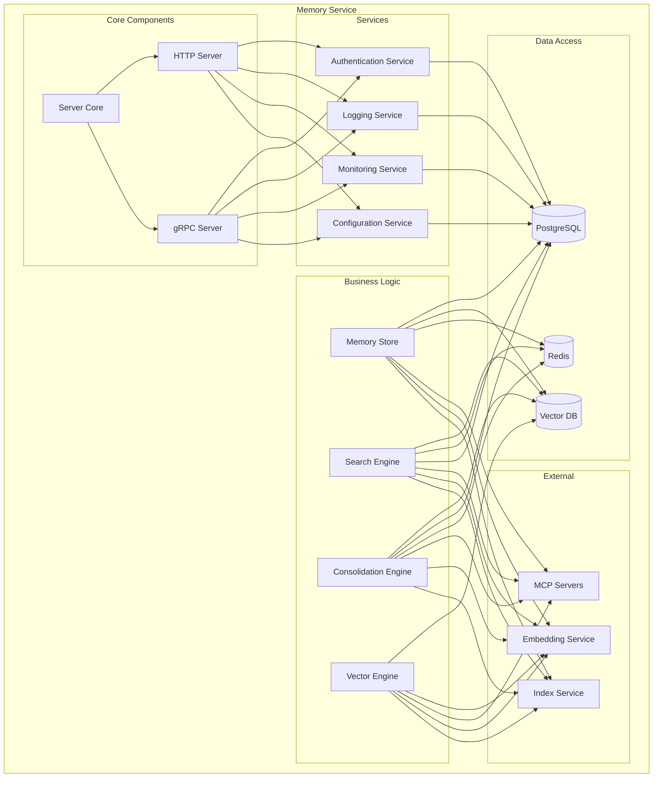

### 3. Integration Coordinator Components

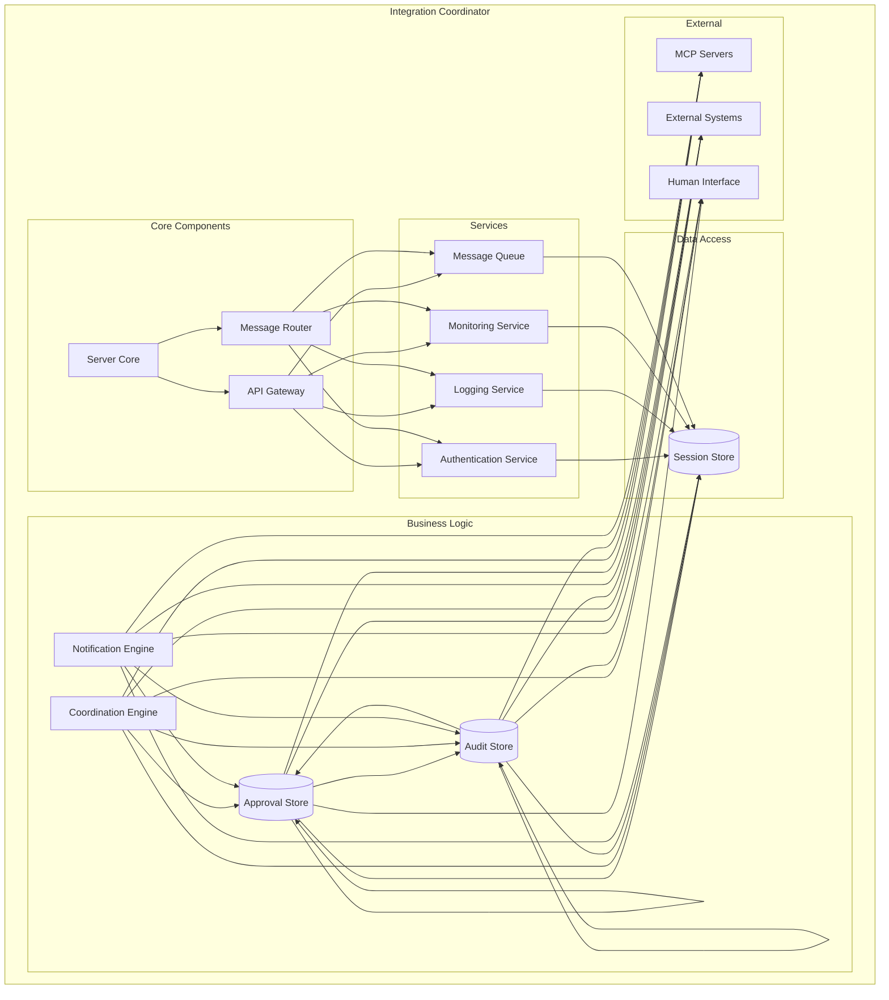

---

## Deployment Architecture Diagrams

### 1. Production Deployment Architecture

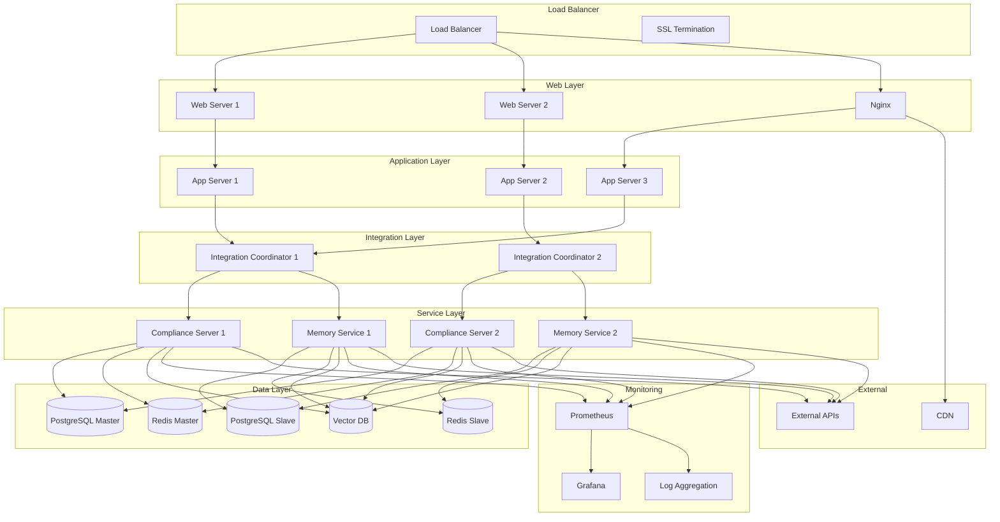

### 2. Development Deployment Architecture

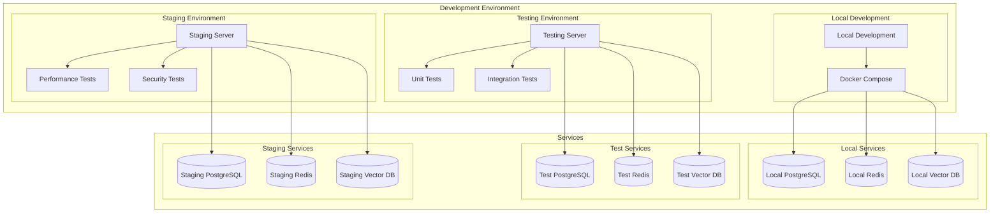

### 3. Container Architecture

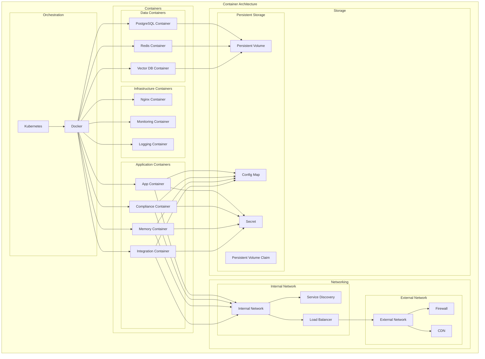

---

## Security Architecture Diagrams

### 1. Security Architecture

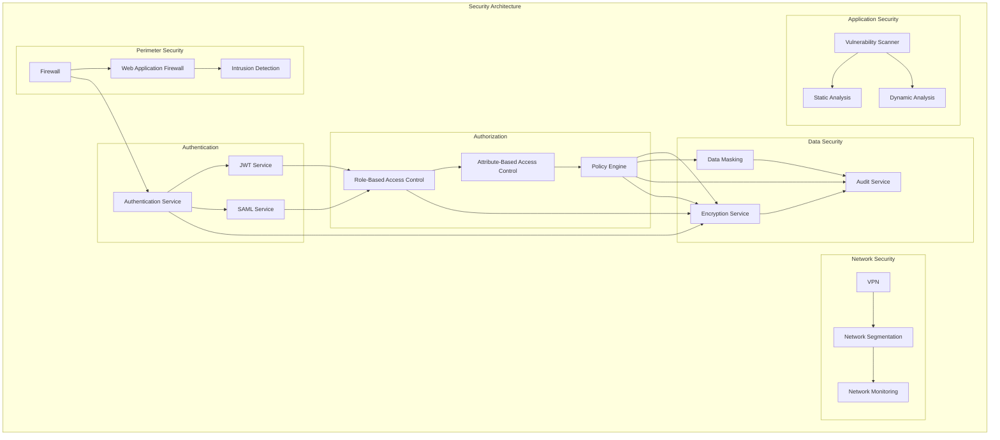

### 2. Data Flow Security

```mermaid
graph TB
    subgraph "Data Flow Security"
        subgraph "Input Security"
            VALIDATE[Input Validation]
            SANITIZE[Input Sanitization]
            RATE_LIMIT[Rate Limiting]
        end
        
        subgraph "Processing Security"
            ENCRYPT_PROC[Encryption]
            LOG_PROC[Secure Logging]
            AUDIT_PROC[Audit Logging]
        end
        
        subgraph "Output Security"
            MASK_OUTPUT[Data Masking]
            FILTER_OUTPUT[Output Filtering]
            ENCRYPT_OUTPUT[Output Encryption]
        end
        
        subgraph "Storage Security"
            ENCRYPT_STORE[Encryption at Rest]
            BACKUP[Secure Backup]
            RETENTION[Data Retention]
        end
        
        subgraph "Access Security"
            AUTH_ACCESS[Authentication]
            AUTHZ_ACCESS[Authorization]
            MONITOR_ACCESS[Access Monitoring]
        end
    end
    
    VALIDATE --> SANITIZE
    SANITIZE --> RATE_LIMIT
    
    RATE_LIMIT --> ENCRYPT_PROC
    ENCRYPT_PROC --> LOG_PROC
    LOG_PROC --> AUDIT_PROC
    
    AUDIT_PROC --> MASK_OUTPUT
    MASK_OUTPUT --> FILTER_OUTPUT
    FILTER_OUTPUT --> ENCRYPT_OUTPUT
    
    ENCRYPT_OUTPUT --> ENCRYPT_STORE
    ENCRYPT_STORE --> BACKUP
    BACKUP --> RETENTION
    
    AUTH_ACCESS --> AUTHZ_ACCESS
    AUTHZ_ACCESS --> MONITOR_ACCESS
    
    MONITOR_ACCESS --> VALIDATE
    MONITOR_ACCESS --> ENCRYPT_PROC
    MONITOR_ACCESS --> ENCRYPT_STORE
```

---

## Monitoring Architecture Diagrams

### 1. Monitoring Architecture

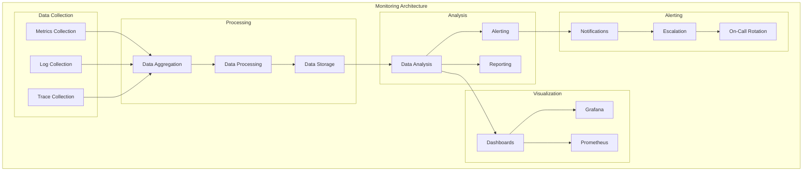

### 2. Health Check Architecture

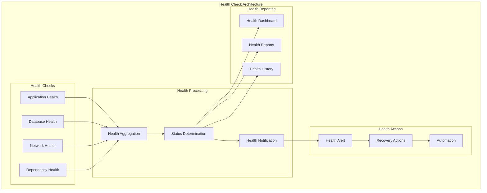

---

## Backup and Recovery Architecture Diagrams

### 1. Backup Architecture

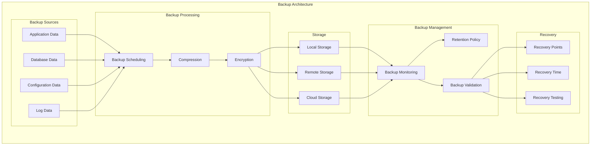

### 2. Disaster Recovery Architecture

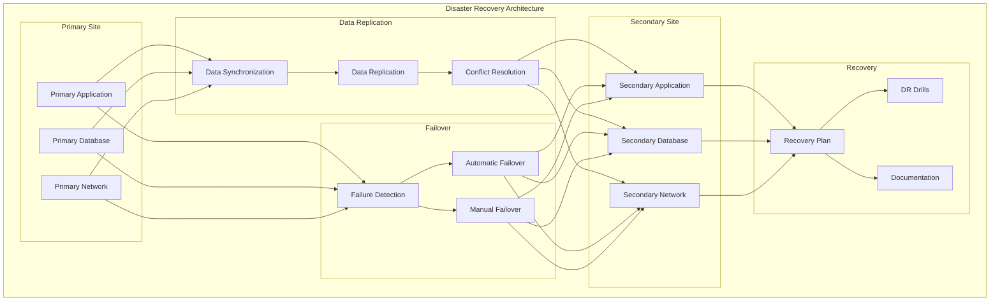

---

## Support and Contact Information

### Technical Support
- **Email**: support@kilocode.com
- **Phone**: +1 (555) 123-4567
- **Hours**: 24/7 for production support

### Architecture Support
- **Architecture Documentation**: [KiloCode Architecture Documentation](https://kilocode.com/docs/architecture)
- **Diagram Tools**: [KiloCode Diagram Tools](https://kilocode.com/tools/diagrams)
- **Community Forum**: [KiloCode Community](https://community.kilocode.com)

### Documentation Resources
- **System Architecture Guide**: [KiloCode System Architecture Guide](https://kilocode.com/docs/system-architecture)
- **Data Flow Guide**: [KiloCode Data Flow Guide](https://kilocode.com/docs/data-flow)
- **Deployment Guide**: [KiloCode Deployment Guide](https://kilocode.com/docs/deployment)

---

*These integration architecture diagrams are part of the KiloCode MCP Setup and Configuration Architecture Plan and should be reviewed and updated regularly to reflect changes in architecture design and best practices.*