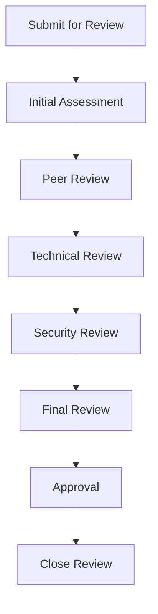

# Documentation Review Processes

## Overview

This document provides comprehensive documentation review processes for MCP (Model Context Protocol) servers within the KiloCode ecosystem. The processes follow the **Simple, Robust, Secure** approach and ensure proper quality assurance of all documentation.

## Review Philosophy

### Key Principles
1. **Simplicity**: Use straightforward review processes
2. **Robustness**: Implement comprehensive review procedures
3. **Security**: Secure review process with proper access controls
4. **Consistency**: Maintain consistent review standards across all documentation
5. **Collaboration**: Foster collaborative review environment

### Review Goals
- **Quality Assurance**: Ensure documentation meets quality standards
- **Accuracy Verification**: Verify all information is accurate and current
- **Completeness Check**: Ensure documentation is complete and comprehensive
- **Consistency Maintenance**: Maintain consistency across all documentation
- **Continuous Improvement**: Continuously improve documentation quality

## Review Process Overview

### 1. Review Lifecycle



### 2. Review Types

#### 2.1 Content Review
- **Focus**: Content accuracy, clarity, and completeness
- **Reviewers**: Documentation team members
- **Criteria**: Writing standards, content guidelines
- **Timeline**: 24-48 hours

#### 2.2 Technical Review
- **Focus**: Technical accuracy, examples, and procedures
- **Reviewers**: Technical leads, subject matter experts
- **Criteria**: Technical standards, best practices
- **Timeline**: 48-72 hours

#### 2.3 Security Review
- **Focus**: Security procedures, sensitive information
- **Reviewers**: Security team members
- **Criteria**: Security standards, compliance requirements
- **Timeline**: 24-48 hours

#### 2.4 Final Review
- **Focus**: Overall quality, consistency, and completeness
- **Reviewers**: Documentation team lead
- **Criteria**: Quality standards, release criteria
- **Timeline**: 24 hours

## Review Request Process

### 1. Review Request Template

#### 1.1 Review Request Form
```markdown
# Documentation Review Request

## Documentation Information
- **Document Title**: [Document Title]
- **Document Path**: [Path to Document]
- **Document Type**: [User Guide/Technical Doc/API Doc/Installation Guide]
- **Version**: [Document Version]
- **Last Updated**: [Date]

## Review Information
- **Review Type**: [Content/Technical/Security/Final]
- **Requested Reviewer**: [Name/Team]
- **Review Deadline**: [Date]
- **Priority**: [High/Medium/Low]

## Changes Summary
[Brief description of changes made to the document]

## Review Scope
- [ ] Content accuracy and completeness
- [ ] Technical accuracy and examples
- [ ] Security procedures and information
- [ ] Formatting and structure
- [ ] Links and references
- [ ] Examples and procedures
- [ ] Overall quality and consistency

## Review Criteria
- [ ] Follows documentation standards
- [ ] Content is accurate and current
- [ ] Examples are tested and working
- [ ] Links are valid and accessible
- [ ] Formatting is consistent
- [ ] Terminology is consistent
- [ ] Structure is logical
- [ ] Navigation is intuitive

## Testing Results
- [ ] Build successful
- [ ] Link validation passed
- [ ] Examples tested
- [ ] Integration tests passed
- [ ] Performance tests passed
- [ ] Security tests passed

## Additional Information
[Any additional context or requirements]

## Contact Information
- **Requester**: [Name]
- **Email**: [Email]
- **Phone**: [Phone]
```

#### 1.2 Review Request Workflow
```bash
# Review request workflow
# 1. Complete documentation changes
# 2. Fill out review request form
# 3. Submit review request
# 4. Assign reviewer
# 5. Schedule review
# 6. Conduct review
# 7. Provide feedback
# 8. Address feedback
# 9. Complete review
```

### 2. Review Assignment

#### 2.1 Reviewer Assignment Process
```markdown
# Reviewer Assignment Process

## Assignment Criteria
1. **Expertise**: Reviewer should have expertise in the document's subject matter
2. **Availability**: Reviewer should have availability to complete review on time
3. **Workload**: Reviewer should have reasonable workload
4. **Experience**: Reviewer should have experience with documentation review
5. **Objectivity**: Reviewer should be objective and constructive

## Assignment Process
1. Identify potential reviewers based on expertise
2. Check reviewer availability and workload
3. Assign primary reviewer and backup reviewer
4. Notify reviewers of assignment
5. Confirm reviewer acceptance
6. Schedule review timeline
7. Provide review materials
```

#### 2.2 Reviewer Availability
```bash
# Reviewer availability check
#!/bin/bash

# Check reviewer availability
check_reviewer_availability() {
    local reviewer=$1
    local deadline=$2
    
    # Check reviewer workload
    local current_reviews=$(get_current_reviews "$reviewer")
    local max_reviews=$(get_max_reviews "$reviewer")
    
    if [ "$current_reviews" -ge "$max_reviews" ]; then
        echo "Reviewer $reviewer has maximum workload"
        return 1
    fi
    
    # Check reviewer availability
    local availability=$(get_reviewer_availability "$reviewer")
    if [ "$availability" = "unavailable" ]; then
        echo "Reviewer $reviewer is unavailable"
        return 1
    fi
    
    # Check deadline compatibility
    local reviewer_deadline=$(get_reviewer_deadline "$reviewer")
    if [ "$reviewer_deadline" -lt "$deadline" ]; then
        echo "Reviewer $reviewer cannot meet deadline"
        return 1
    fi
    
    echo "Reviewer $reviewer is available"
    return 0
}

# Get current reviews for reviewer
get_current_reviews() {
    local reviewer=$1
    # Implementation to get current reviews
    echo 0
}

# Get maximum reviews for reviewer
get_max_reviews() {
    local reviewer=$1
    # Implementation to get maximum reviews
    echo 3
}

# Get reviewer availability
get_reviewer_availability() {
    local reviewer=$1
    # Implementation to get availability
    echo "available"
}

# Get reviewer deadline
get_reviewer_deadline() {
    local reviewer=$1
    # Implementation to get deadline
    echo $(date -d "+7 days" +%s)
}
```

## Review Execution Process

### 1. Review Preparation

#### 1.1 Review Preparation Checklist
```markdown
# Review Preparation Checklist

## Before Review
- [ ] Read review request carefully
- [ ] Understand review scope and criteria
- [ ] Gather necessary reference materials
- [ ] Set aside dedicated review time
- [ ] Prepare review tools and templates
- [ ] Review previous reviews and feedback
- [ ] Understand document context and purpose

## During Review
- [ ] Read document thoroughly
- [ ] Take detailed notes
- [ ] Check all examples and procedures
- [ ] Verify all links and references
- [ ] Test all code examples
- [ ] Check formatting and structure
- [ ] Verify terminology consistency
- [ ] Document all findings

## After Review
- [ ] Organize review findings
- [ ] Prioritize issues and recommendations
- [ ] Prepare review report
- [ ] Submit review feedback
- [ ] Follow up on resolution
```

#### 1.2 Review Tools and Templates
```markdown
# Review Tools and Templates

## Review Tools
- **Markdown Editor**: VS Code, Typora, MarkText
- **Link Checker**: LinkChecker, lychee, markdown-link-check
- **Code Editor**: VS Code, Sublime Text, Atom
- **Reference Manager**: Zotero, Mendeley, EndNote
- **Collaboration Tool**: GitHub, GitLab, Bitbucket
- **Communication Tool**: Slack, Teams, Email

## Review Templates
- **Review Checklist**: Comprehensive checklist for all review types
- **Review Report**: Structured report format for findings
- **Feedback Template**: Template for providing constructive feedback
- **Issue Tracker**: Template for tracking issues and resolutions
- **Review Summary**: Template for summarizing review results
```

### 2. Review Execution

#### 2.1 Review Execution Guidelines
```markdown
# Review Execution Guidelines

## Review Approach
1. **Initial Read-Through**: Read document to understand overall structure and content
2. **Detailed Review**: Review each section systematically
3. **Example Testing**: Test all examples and procedures
4. **Link Validation**: Verify all links and references
5. **Consistency Check**: Check for consistency across the document
6. **Quality Assessment**: Evaluate overall quality and effectiveness

## Review Focus Areas
- **Content Accuracy**: Verify all information is accurate and current
- **Completeness**: Ensure all necessary information is included
- **Clarity**: Check that content is clear and easy to understand
- **Structure**: Verify logical structure and organization
- **Formatting**: Check consistent formatting and presentation
- **Examples**: Test and verify all examples and procedures
- **Links**: Validate all links and references
- **Terminology**: Ensure consistent terminology usage

## Review Best Practices
- **Be Constructive**: Provide helpful, actionable feedback
- **Be Specific**: Give specific examples and suggestions
- **Be Objective**: Focus on quality, not personal preferences
- **Be Thorough**: Review all aspects of the document
- **Be Timely**: Complete reviews within agreed timeframe
- **Be Professional**: Maintain professional and respectful tone
```

#### 2.2 Review Execution Process
```bash
# Review execution workflow
# 1. Prepare for review
# 2. Read document thoroughly
# 3. Review content accuracy
# 4. Review technical accuracy
# 5. Review security aspects
# 6. Review formatting and structure
# 7. Test examples and procedures
# 8. Validate links and references
# 9. Check consistency
# 10. Document findings
# 11. Prepare review report
# 12. Submit review feedback
```

## Review Feedback Process

### 1. Feedback Guidelines

#### 1.1 Feedback Guidelines
```markdown
# Feedback Guidelines

## Constructive Feedback Principles
1. **Be Specific**: Provide specific examples and suggestions
2. **Be Actionable**: Give clear, actionable recommendations
3. **Be Respectful**: Maintain respectful and professional tone
4. **Be Balanced**: Provide both positive and constructive feedback
5. **Be Timely**: Provide feedback within agreed timeframe

## Feedback Structure
- **Positive Feedback**: Highlight what works well
- **Areas for Improvement**: Identify specific areas needing improvement
- **Recommendations**: Provide specific recommendations for improvement
- **Examples**: Include examples to illustrate points
- **Priorities**: Indicate priority levels for issues

## Feedback Categories
- **Content Issues**: Accuracy, completeness, clarity
- **Technical Issues**: Examples, procedures, technical accuracy
- **Formatting Issues**: Structure, formatting, presentation
- **Link Issues**: Broken links, invalid references
- **Consistency Issues**: Terminology, structure, formatting
- **Security Issues**: Security procedures, sensitive information
```

#### 1.2 Feedback Template
```markdown
# Documentation Review Feedback

## Review Information
- **Document Title**: [Document Title]
- **Document Path**: [Path to Document]
- **Review Type**: [Content/Technical/Security/Final]
- **Reviewer**: [Reviewer Name]
- **Review Date**: [Date]
- **Review Deadline**: [Date]

## Overall Assessment
[Overall assessment of the document]

## Positive Feedback
- [ ] Strength 1: [Description]
- [ ] Strength 2: [Description]
- [ ] Strength 3: [Description]

## Areas for Improvement
- [ ] Issue 1: [Description]
  - **Priority**: [High/Medium/Low]
  - **Recommendation**: [Specific recommendation]
  - **Example**: [Example if applicable]
- [ ] Issue 2: [Description]
  - **Priority**: [High/Medium/Low]
  - **Recommendation**: [Specific recommendation]
  - **Example**: [Example if applicable]
- [ ] Issue 3: [Description]
  - **Priority**: [High/Medium/Low]
  - **Recommendation**: [Specific recommendation]
  - **Example**: [Example if applicable]

## Technical Feedback
- [ ] Technical Issue 1: [Description]
  - **Priority**: [High/Medium/Low]
  - **Recommendation**: [Specific recommendation]
  - **Example**: [Code example or procedure]
- [ ] Technical Issue 2: [Description]
  - **Priority**: [High/Medium/Low]
  - **Recommendation**: [Specific recommendation]
  - **Example**: [Code example or procedure]

## Security Feedback
- [ ] Security Issue 1: [Description]
  - **Priority**: [Critical/High/Medium/Low]
  - **Recommendation**: [Specific recommendation]
  - **Example**: [Security example or procedure]
- [ ] Security Issue 2: [Description]
  - **Priority**: [Critical/High/Medium/Low]
  - **Recommendation**: [Specific recommendation]
  - **Example**: [Security example or procedure]

## Formatting and Structure Feedback
- [ ] Formatting Issue 1: [Description]
  - **Priority**: [High/Medium/Low]
  - **Recommendation**: [Specific recommendation]
  - **Example**: [Formatting example]
- [ ] Structure Issue 1: [Description]
  - **Priority**: [High/Medium/Low]
  - **Recommendation**: [Specific recommendation]
  - **Example**: [Structure example]

## Link and Reference Feedback
- [ ] Link Issue 1: [Description]
  - **Priority**: [High/Medium/Low]
  - **Recommendation**: [Specific recommendation]
  - **Example**: [Link example]
- [ ] Reference Issue 1: [Description]
  - **Priority**: [High/Medium/Low]
  - **Recommendation**: [Specific recommendation]
  - **Example**: [Reference example]

## Consistency Feedback
- [ ] Consistency Issue 1: [Description]
  - **Priority**: [High/Medium/Low]
  - **Recommendation**: [Specific recommendation]
  - **Example**: [Consistency example]
- [ ] Consistency Issue 2: [Description]
  - **Priority**: [High/Medium/Low]
  - **Recommendation**: [Specific recommendation]
  - **Example**: [Consistency example]

## Recommendations Summary
- [ ] High Priority: [Number] issues
- [ ] Medium Priority: [Number] issues
- [ ] Low Priority: [Number] issues
- [ ] Total Issues: [Number] issues

## Next Steps
- [ ] Address high priority issues
- [ ] Address medium priority issues
- [ ] Address low priority issues
- [ ] Re-review after changes
- [ ] Final approval

## Reviewer Contact
- **Name**: [Reviewer Name]
- **Email**: [Reviewer Email]
- **Phone**: [Reviewer Phone]
```

### 2. Feedback Submission

#### 2.1 Feedback Submission Process
```bash
# Feedback submission workflow
# 1. Complete review
# 2. Document all findings
# 3. Prepare feedback report
# 4. Submit feedback through review system
# 5. Notify document author
# 6. Schedule follow-up discussion
# 7. Track feedback resolution
```

#### 2.2 Feedback Tracking
```bash
# Feedback tracking script
#!/bin/bash

# Feedback tracking script
# Usage: ./track-feedback.sh [action] [document-id]

ACTION=$1
DOCUMENT_ID=$2

case $ACTION in
    "add")
        # Add feedback item
        echo "Adding feedback for document: $DOCUMENT_ID"
        # Implementation to add feedback
        ;;
    "list")
        # List feedback items
        echo "Feedback items for document: $DOCUMENT_ID"
        # Implementation to list feedback
        ;;
    "resolve")
        # Mark feedback as resolved
        echo "Resolving feedback item: $DOCUMENT_ID"
        # Implementation to resolve feedback
        ;;
    "status")
        # Check feedback status
        echo "Feedback status for document: $DOCUMENT_ID"
        # Implementation to check status
        ;;
    "report")
        # Generate feedback report
        echo "Generating feedback report for document: $DOCUMENT_ID"
        # Implementation to generate report
        ;;
    *)
        echo "Usage: $0 [add|list|resolve|status|report] [document-id]"
        exit 1
        ;;
esac
```

## Review Resolution Process

### 1. Resolution Process

#### 1.1 Resolution Process Overview
```markdown
# Resolution Process Overview

## Resolution Steps
1. **Receive Feedback**: Document author receives review feedback
2. **Analyze Feedback**: Review and analyze all feedback items
3. **Prioritize Issues**: Prioritize issues based on severity and impact
4. **Address Issues**: Address each feedback item appropriately
5. **Test Changes**: Test all changes and modifications
6. **Submit for Re-review**: Submit updated document for re-review
7. **Verify Resolution**: Verify all issues are resolved
8. **Close Review**: Close the review process

## Resolution Priorities
- **Critical**: Must be resolved immediately (security, safety, legal)
- **High**: Should be resolved quickly (major functionality, user experience)
- **Medium**: Should be resolved within reasonable timeframe (minor issues)
- **Low**: Can be resolved when convenient (cosmetic, minor improvements)

## Resolution Strategies
- **Fix**: Correct the issue directly
- **Clarify**: Add clarification or explanation
- **Remove**: Remove unnecessary or outdated content
- **Replace**: Replace with better or more accurate content
- **Defer**: Defer to future update (low priority)
- **Reject**: Reject feedback with justification (if feedback is incorrect)
```

#### 1.2 Resolution Workflow
```bash
# Resolution workflow
# 1. Receive review feedback
# 2. Analyze and categorize feedback
# 3. Prioritize feedback items
# 4. Create resolution plan
# 5. Implement changes
# 6. Test changes
# 7. Submit for re-review
# 8. Verify resolution
# 9. Close review
```

### 2. Resolution Tracking

#### 2.1 Resolution Tracking System
```markdown
# Resolution Tracking System

## Tracking Fields
- **Feedback ID**: Unique identifier for each feedback item
- **Document ID**: Identifier for the document being reviewed
- **Issue Description**: Description of the issue
- **Priority Level**: Critical/High/Medium/Low
- **Status**: Open/In Progress/Resolved/Closed
- **Assigned To**: Person responsible for resolution
- **Due Date**: Target date for resolution
- **Resolution Date**: Date when issue was resolved
- **Resolution Notes**: Notes about resolution
- **Reviewer**: Who provided the feedback
- **Author**: Who is responsible for resolution

## Tracking Views
- **Open Issues**: All unresolved issues
- **My Issues**: Issues assigned to me
- **Overdue Issues**: Issues past due date
- **Resolved Issues**: Recently resolved issues
- **Closed Reviews**: Completed review processes

## Tracking Reports
- **Resolution Report**: Summary of resolution progress
- **Priority Report**: Issues by priority level
- **Status Report**: Issues by status
- **Trend Report**: Resolution trends over time
```

#### 2.2 Resolution Tracking Script
```bash
#!/bin/bash

# Resolution tracking script
# Usage: ./track-resolution.sh [action] [feedback-id]

ACTION=$1
FEEDBACK_ID=$2

case $ACTION in
    "add")
        # Add resolution item
        echo "Adding resolution item: $FEEDBACK_ID"
        # Implementation to add resolution item
        ;;
    "update")
        # Update resolution item
        echo "Updating resolution item: $FEEDBACK_ID"
        # Implementation to update resolution item
        ;;
    "resolve")
        # Mark resolution as complete
        echo "Resolving item: $FEEDBACK_ID"
        # Implementation to mark as resolved
        ;;
    "status")
        # Check resolution status
        echo "Checking status of: $FEEDBACK_ID"
        # Implementation to check status
        ;;
    "report")
        # Generate resolution report
        echo "Generating resolution report"
        # Implementation to generate report
        ;;
    "cleanup")
        # Clean up old resolution items
        echo "Cleaning up old resolution items"
        # Implementation to clean up
        ;;
    *)
        echo "Usage: $0 [add|update|resolve|status|report|cleanup] [feedback-id]"
        exit 1
        ;;
esac
```

## Review Approval Process

### 1. Approval Process

#### 1.1 Approval Process Overview
```markdown
# Approval Process Overview

## Approval Levels
1. **Peer Approval**: Approval by documentation team members
2. **Technical Approval**: Approval by technical leads
3. **Security Approval**: Approval by security team
4. **Final Approval**: Approval by documentation team lead

## Approval Criteria
- **Content Quality**: Content meets quality standards
- **Technical Accuracy**: Technical information is accurate
- **Security Compliance**: Security requirements are met
- **Formatting Consistency**: Formatting is consistent
- **Completeness**: Document is complete and comprehensive
- **User Experience**: Document is user-friendly and effective

## Approval Process
1. **Submit for Approval**: Document submitted for approval
2. **Review Approval Criteria**: Check against approval criteria
3. **Verify Resolution**: Verify all feedback is resolved
4. **Check Quality**: Check overall quality and completeness
5. **Grant Approval**: Grant approval if criteria are met
6. **Document Approval**: Document approval decision
7. **Notify Stakeholders**: Notify stakeholders of approval
```

#### 1.2 Approval Workflow
```bash
# Approval workflow
# 1. Complete resolution of feedback
# 2. Submit for approval
# 3. Review approval criteria
# 4. Verify all requirements are met
# 5. Grant approval
# 6. Document approval
# 7. Notify stakeholders
# 8. Close review process
```

### 2. Approval Templates

#### 2.1 Approval Request Template
```markdown
# Documentation Approval Request

## Document Information
- **Document Title**: [Document Title]
- **Document Path**: [Path to Document]
- **Document Version**: [Version]
- **Review Type**: [Content/Technical/Security/Final]

## Approval Information
- **Requested Approver**: [Name/Team]
- **Approval Deadline**: [Date]
- **Priority**: [High/Medium/Low]

## Review Summary
- **Review Type**: [Type of review]
- **Review Date**: [Date]
- **Reviewer**: [Reviewer Name]
- **Feedback Items**: [Number] items
- **Resolved Items**: [Number] items
- **Open Items**: [Number] items

## Approval Criteria
- [ ] Content quality standards met
- [ ] Technical accuracy verified
- [ ] Security compliance confirmed
- [ ] Formatting consistency maintained
- [ ] Document completeness ensured
- [ ] User experience evaluated
- [ ] All feedback resolved
- [ ] Overall quality satisfactory

## Testing Results
- [ ] Build successful
- [ ] Link validation passed
- [ ] Examples tested
- [ ] Integration tests passed
- [ ] Performance tests passed
- [ ] Security tests passed

## Approval Request
- [ ] Approve document for publication
- [ ] Approve with minor changes
- [ ] Request additional changes
- [ ] Reject document

## Additional Information
[Any additional context or requirements]

## Contact Information
- **Requester**: [Name]
- **Email**: [Email]
- **Phone**: [Phone]
```

#### 2.2 Approval Decision Template
```markdown
# Documentation Approval Decision

## Document Information
- **Document Title**: [Document Title]
- **Document Path**: [Path to Document]
- **Document Version**: [Version]
- **Review Type**: [Content/Technical/Security/Final]

## Approval Information
- **Approver**: [Approver Name]
- **Approval Date**: [Date]
- **Approval Decision**: [Approved/Approved with Changes/Rejected]

## Approval Summary
[Brief summary of approval decision]

## Approval Criteria Met
- [ ] Content quality standards met
- [ ] Technical accuracy verified
- [ ] Security compliance confirmed
- [ ] Formatting consistency maintained
- [ ] Document completeness ensured
- [ ] User experience evaluated
- [ ] All feedback resolved
- [ ] Overall quality satisfactory

## Approval with Changes
- [ ] Change 1: [Description]
- [ ] Change 2: [Description]
- [ ] Change 3: [Description]

## Rejection Reasons
- [ ] Reason 1: [Description]
- [ ] Reason 2: [Description]
- [ ] Reason 3: [Description]

## Next Steps
- [ ] Approved: Document ready for publication
- [ ] Approved with Changes: Make changes and resubmit
- [ ] Rejected: Address issues and resubmit

## Additional Information
[Any additional context or requirements]

## Approval Contact
- **Approver**: [Name]
- **Email**: [Email]
- **Phone**: [Phone]
```

## Review Metrics and Reporting

### 1. Review Metrics

#### 1.1 Key Performance Indicators
```markdown
# Review Key Performance Indicators

## Quality Metrics
- **Review Coverage**: Percentage of documents reviewed
- **Review Quality**: Quality score of reviews (1-10)
- **Feedback Quality**: Quality score of feedback (1-10)
- **Resolution Rate**: Percentage of feedback resolved
- **Resolution Time**: Average time to resolve feedback
- **Approval Rate**: Percentage of documents approved
- **Rejection Rate**: Percentage of documents rejected

## Efficiency Metrics
- **Review Time**: Average time to complete review
- **Feedback Time**: Average time to provide feedback
- **Resolution Time**: Average time to resolve issues
- **Approval Time**: Average time to approve document
- **Throughput**: Number of documents reviewed per period
- **Backlog**: Number of documents awaiting review

## Satisfaction Metrics
- **Reviewer Satisfaction**: Satisfaction score of reviewers (1-10)
- **Author Satisfaction**: Satisfaction score of authors (1-10)
- **Stakeholder Satisfaction**: Satisfaction score of stakeholders (1-10)
- **Process Satisfaction**: Satisfaction score with review process (1-10)

## Improvement Metrics
- **Issue Reduction**: Reduction in recurring issues
- **Quality Improvement**: Improvement in document quality
- **Process Improvement**: Improvement in review process
- **Efficiency Improvement**: Improvement in review efficiency
```

#### 1.2 Metrics Collection
```bash
# Metrics collection script
#!/bin/bash

# Metrics collection script
# Usage: ./collect-metrics.sh [period]

PERIOD=$1

# Define date range based on period
case $PERIOD in
    "daily")
        START_DATE=$(date -d "yesterday" +%Y-%m-%d)
        END_DATE=$(date -d "today" +%Y-%m-%d)
        ;;
    "weekly")
        START_DATE=$(date -d "1 week ago" +%Y-%m-%d)
        END_DATE=$(date -d "today" +%Y-%m-%d)
        ;;
    "monthly")
        START_DATE=$(date -d "1 month ago" +%Y-%m-%d)
        END_DATE=$(date -d "today" +%Y-%m-%d)
        ;;
    *)
        echo "Usage: $0 [daily|weekly|monthly]"
        exit 1
        ;;
esac

# Collect metrics
echo "Collecting metrics for period: $PERIOD"
echo "Date range: $START_DATE to $END_DATE"

# Quality metrics
REVIEW_COVERAGE=$(calculate_review_coverage "$START_DATE" "$END_DATE")
REVIEW_QUALITY=$(calculate_review_quality "$START_DATE" "$END_DATE")
FEEDBACK_QUALITY=$(calculate_feedback_quality "$START_DATE" "$END_DATE")
RESOLUTION_RATE=$(calculate_resolution_rate "$START_DATE" "$END_DATE")
RESOLUTION_TIME=$(calculate_resolution_time "$START_DATE" "$END_DATE")
APPROVAL_RATE=$(calculate_approval_rate "$START_DATE" "$END_DATE")
REJECTION_RATE=$(calculate_rejection_rate "$START_DATE" "$END_DATE")

# Efficiency metrics
REVIEW_TIME=$(calculate_review_time "$START_DATE" "$END_DATE")
FEEDBACK_TIME=$(calculate_feedback_time "$START_DATE" "$END_DATE")
APPROVAL_TIME=$(calculate_approval_time "$START_DATE" "$END_DATE")
THROUGHPUT=$(calculate_throughput "$START_DATE" "$END_DATE")
BACKLOG=$(calculate_backlog "$START_DATE" "$END_DATE")

# Satisfaction metrics
REVIEWER_SATISFACTION=$(calculate_reviewer_satisfaction "$START_DATE" "$END_DATE")
AUTHOR_SATISFACTION=$(calculate_author_satisfaction "$START_DATE" "$END_DATE")
STAKEHOLDER_SATISFACTION=$(calculate_stakeholder_satisfaction "$START_DATE" "$END_DATE")
PROCESS_SATISFACTION=$(calculate_process_satisfaction "$START_DATE" "$END_DATE")

# Generate metrics report
echo "=== Quality Metrics ==="
echo "Review Coverage: $REVIEW_COVERAGE%"
echo "Review Quality: $REVIEW_QUALITY/10"
echo "Feedback Quality: $FEEDBACK_QUALITY/10"
echo "Resolution Rate: $RESOLUTION_RATE%"
echo "Resolution Time: $RESOLUTION_TIME hours"
echo "Approval Rate: $APPROVAL_RATE%"
echo "Rejection Rate: $REJECTION_RATE%"

echo "=== Efficiency Metrics ==="
echo "Review Time: $REVIEW_TIME hours"
echo "Feedback Time: $FEEDBACK_TIME hours"
echo "Approval Time: $APPROVAL_TIME hours"
echo "Throughput: $THROUGHPUT documents"
echo "Backlog: $BACKLOG documents"

echo "=== Satisfaction Metrics ==="
echo "Reviewer Satisfaction: $REVIEWER_SATISFACTION/10"
echo "Author Satisfaction: $AUTHOR_SATISFACTION/10"
echo "Stakeholder Satisfaction: $STAKEHOLDER_SATISFACTION/10"
echo "Process Satisfaction: $PROCESS_SATISFACTION/10"

# Save metrics to database
save_metrics "$PERIOD" "$START_DATE" "$END_DATE" "$REVIEW_COVERAGE" "$REVIEW_QUALITY" "$FEEDBACK_QUALITY" "$RESOLUTION_RATE" "$RESOLUTION_TIME" "$APPROVAL_RATE" "$REJECTION_RATE" "$REVIEW_TIME" "$FEEDBACK_TIME" "$APPROVAL_TIME" "$THROUGHPUT" "$BACKLOG" "$REVIEWER_SATISFACTION" "$AUTHOR_SATISFACTION" "$STAKEHOLDER_SATISFACTION" "$PROCESS_SATISFACTION"
```

### 2. Review Reporting

#### 2.1 Report Types
```markdown
# Review Report Types

## Daily Reports
- **Review Summary**: Summary of reviews completed
- **Feedback Summary**: Summary of feedback provided
- **Resolution Summary**: Summary of resolutions completed
- **Backlog Report**: Current review backlog status

## Weekly Reports
- **Weekly Review Summary**: Comprehensive weekly review summary
- **Quality Trends**: Quality trends over the past week
- **Efficiency Metrics**: Efficiency metrics for the week
- **Satisfaction Survey**: Weekly satisfaction survey results
- **Issue Analysis**: Analysis of recurring issues

## Monthly Reports
- **Monthly Review Summary**: Comprehensive monthly review summary
- **Performance Metrics**: Monthly performance metrics
- **Process Improvement**: Process improvement recommendations
- **Training Needs**: Training needs assessment
- **Strategic Review**: Strategic review of review processes

## Quarterly Reports
- **Quarterly Review Summary**: Comprehensive quarterly review summary
- **Strategic Alignment**: Alignment with business objectives
- **Resource Planning**: Resource planning for next quarter
- **Process Optimization**: Process optimization recommendations
- **Stakeholder Feedback**: Stakeholder feedback summary

## Annual Reports
- **Annual Review Summary**: Comprehensive annual review summary
- **Year-over-Year Comparison**: Comparison with previous year
- **Strategic Goals**: Achievement of strategic goals
- **Process Evolution**: Evolution of review processes
- **Future Planning**: Planning for next year
```

#### 2.2 Report Generation
```bash
# Report generation script
#!/bin/bash

# Report generation script
# Usage: ./generate-report.sh [report-type] [period]

REPORT_TYPE=$1
PERIOD=$2

# Generate report based on type and period
case $REPORT_TYPE in
    "daily")
        generate_daily_report "$PERIOD"
        ;;
    "weekly")
        generate_weekly_report "$PERIOD"
        ;;
    "monthly")
        generate_monthly_report "$PERIOD"
        ;;
    "quarterly")
        generate_quarterly_report "$PERIOD"
        ;;
    "annual")
        generate_annual_report "$PERIOD"
        ;;
    *)
        echo "Usage: $0 [daily|weekly|monthly|quarterly|annual] [period]"
        exit 1
        ;;
esac

# Send report to stakeholders
send_report "$REPORT_TYPE" "$PERIOD"

# Archive report
archive_report "$REPORT_TYPE" "$PERIOD"
```

## Review Training and Development

### 1. Reviewer Training

#### 1.1 Training Program
```markdown
# Reviewer Training Program

## Training Levels
1. **Basic Training**: Introduction to documentation review
2. **Intermediate Training**: Advanced review techniques
3. **Advanced Training**: Specialized review areas
4. **Expert Training**: Master review skills

## Training Topics
- **Review Fundamentals**: Review principles and processes
- **Documentation Standards**: KiloCode documentation standards
- **Review Tools**: Tools and techniques for effective reviews
- **Feedback Skills**: Providing constructive feedback
- **Technical Review**: Technical accuracy and examples
- **Security Review**: Security procedures and compliance
- **Quality Assurance**: Quality assurance and improvement
- **Process Improvement**: Process optimization and efficiency

## Training Methods
- **Classroom Training**: In-person training sessions
- **Online Training**: Web-based training courses
- **Mentorship**: One-on-one mentorship with experienced reviewers
- **Workshops**: Interactive workshops and exercises
- **Case Studies**: Real-world case studies and examples
- **Role Playing**: Role-playing exercises for practice
- **Peer Review**: Peer review of review work
- **Continuous Learning**: Ongoing learning and development

## Training Schedule
- **Basic Training**: 2 days, monthly
- **Intermediate Training**: 3 days, quarterly
- **Advanced Training**: 5 days, bi-annually
- **Expert Training**: 1 week, annually
- **Refresher Training**: 1 day, bi-annually
- **New Features Training**: As needed, when new features are added
```

#### 1.2 Training Materials
```markdown
# Training Materials

## Training Manuals
- **Review Fundamentals Manual**: Basic review principles and processes
- **Documentation Standards Manual**: KiloCode documentation standards
- **Review Tools Manual**: Tools and techniques for effective reviews
- **Feedback Skills Manual**: Providing constructive feedback
- **Technical Review Manual**: Technical accuracy and examples
- **Security Review Manual**: Security procedures and compliance
- **Quality Assurance Manual**: Quality assurance and improvement
- **Process Improvement Manual**: Process optimization and efficiency

## Training Presentations
- **Introduction to Documentation Review**: Overview of review processes
- **Documentation Standards**: KiloCode documentation standards
- **Review Tools and Techniques**: Tools and techniques for effective reviews
- **Providing Constructive Feedback**: Skills for effective feedback
- **Technical Review Techniques**: Methods for technical review
- **Security Review Procedures**: Security review processes
- **Quality Assurance Methods**: Quality assurance techniques
- **Process Improvement Strategies**: Process optimization methods

## Training Exercises
- **Basic Review Exercises**: Basic review practice exercises
- **Technical Review Exercises**: Technical review practice exercises
- **Security Review Exercises**: Security review practice exercises
- **Feedback Exercises**: Feedback practice exercises
- **Quality Assurance Exercises**: Quality assurance practice exercises
- **Process Improvement Exercises**: Process improvement practice exercises

## Training Assessments
- **Basic Review Assessment**: Assessment of basic review skills
- **Technical Review Assessment**: Assessment of technical review skills
- **Security Review Assessment**: Assessment of security review skills
- **Feedback Assessment**: Assessment of feedback skills
- **Quality Assessment**: Assessment of quality assurance skills
- **Process Assessment**: Assessment of process improvement skills
```

### 2. Reviewer Development

#### 2.1 Development Plan
```markdown
# Reviewer Development Plan

## Development Goals
1. **Improve Review Quality**: Enhance review quality and effectiveness
2. **Expand Technical Knowledge**: Expand technical knowledge and expertise
3. **Develop Feedback Skills**: Develop skills for providing constructive feedback
4. **Enhance Process Knowledge**: Enhance knowledge of review processes
5. **Build Leadership Skills**: Build leadership and mentoring skills
6. **Stay Current**: Stay current with industry trends and best practices

## Development Activities
- **Mentorship**: Mentor junior reviewers
- **Training**: Attend advanced training courses
- **Workshops**: Participate in workshops and seminars
- **Conferences**: Attend industry conferences and events
- **Certification**: Obtain relevant certifications
- **Research**: Conduct research on review best practices
- **Innovation**: Innovate review processes and techniques
- **Sharing**: Share knowledge and experience with others

## Development Metrics
- **Review Quality Score**: Quality score of reviews (1-10)
- **Feedback Quality Score**: Quality score of feedback (1-10)
- **Technical Knowledge Score**: Technical knowledge score (1-10)
- **Process Knowledge Score**: Process knowledge score (1-10)
- **Leadership Score**: Leadership and mentoring score (1-10)
- **Innovation Score**: Innovation and improvement score (1-10)

## Development Timeline
- **Short-term Goals**: 3-6 months
- **Medium-term Goals**: 6-12 months
- **Long-term Goals**: 1-3 years
- **Career Goals**: 3-5 years
```

#### 2.2 Development Tracking
```bash
# Development tracking script
#!/bin/bash

# Development tracking script
# Usage: ./track-development.sh [action] [reviewer-id]

ACTION=$1
REVIEWER_ID=$2

case $ACTION in
    "add-goal")
        # Add development goal
        echo "Adding development goal for reviewer: $REVIEWER_ID"
        # Implementation to add goal
        ;;
    "update-goal")
        # Update development goal
        echo "Updating development goal for reviewer: $REVIEWER_ID"
        # Implementation to update goal
        ;;
    "complete-goal")
        # Mark goal as complete
        echo "Completing development goal for reviewer: $REVIEWER_ID"
        # Implementation to mark as complete
        ;;
    "track-progress")
        # Track progress on goals
        echo "Tracking progress for reviewer: $REVIEWER_ID"
        # Implementation to track progress
        ;;
    "generate-report")
        # Generate development report
        echo "Generating development report for reviewer: $REVIEWER_ID"
        # Implementation to generate report
        ;;
    *)
        echo "Usage: $0 [add-goal|update-goal|complete-goal|track-progress|generate-report] [reviewer-id]"
        exit 1
        ;;
esac
```

## Review Continuous Improvement

### 1. Process Improvement

#### 1.1 Process Improvement Framework
```markdown
# Process Improvement Framework

## Improvement Areas
1. **Review Process**: Streamline review processes and procedures
2. **Review Tools**: Improve review tools and technologies
3. **Review Quality**: Enhance review quality and effectiveness
4. **Review Efficiency**: Improve review efficiency and productivity
5. **Review Satisfaction**: Increase reviewer and author satisfaction
6. **Review Compliance**: Ensure compliance with standards and requirements

## Improvement Methods
- **Process Mapping**: Map current review processes
- **Gap Analysis**: Identify gaps and opportunities
- **Root Cause Analysis**: Identify root causes of issues
- **Benchmarking**: Benchmark against industry best practices
- **Pilot Testing**: Test new processes and tools
- **Feedback Collection**: Collect feedback from stakeholders
- **Data Analysis**: Analyze review data and metrics
- **Continuous Monitoring**: Continuously monitor and improve

## Improvement Process
1. **Identify Opportunity**: Identify opportunity for improvement
2. **Analyze Current State**: Analyze current state and processes
3. **Develop Solution**: Develop solution for improvement
4. **Test Solution**: Test solution in controlled environment
5. **Implement Solution**: Implement solution in production
6. **Monitor Results**: Monitor results and effectiveness
7. **Refine Solution**: Refine solution based on results
8. **Standardize Solution**: Standardize solution across organization
```

#### 1.2 Process Improvement Workflow
```bash
# Process improvement workflow
# 1. Identify improvement opportunity
# 2. Analyze current state
# 3. Develop improvement solution
# 4. Test solution
# 5. Implement solution
# 6. Monitor results
# 7. Refine solution
# 8. Standardize solution
```

### 2. Quality Improvement

#### 2.1 Quality Improvement Program
```markdown
# Quality Improvement Program

## Quality Goals
1. **Improve Review Quality**: Enhance quality of reviews and feedback
2. **Reduce Errors**: Reduce errors and issues in documentation
3. **Increase Consistency**: Increase consistency across documentation
4. **Improve User Experience**: Improve user experience with documentation
5. **Enhance Compliance**: Enhance compliance with standards and requirements

## Quality Initiatives
- **Quality Training**: Training on quality standards and best practices
- **Quality Audits**: Regular audits of review quality
- **Quality Metrics**: Tracking quality metrics and KPIs
- **Quality Feedback**: Collecting and acting on quality feedback
- **Quality Improvement**: Continuous improvement of quality processes
- **Quality Recognition**: Recognizing and rewarding quality work

## Quality Metrics
- **Review Quality Score**: Quality score of reviews (1-10)
- **Feedback Quality Score**: Quality score of feedback (1-10)
- **Error Rate**: Rate of errors in documentation
- **Consistency Score**: Consistency score across documentation
- **User Satisfaction**: User satisfaction with documentation
- **Compliance Score**: Compliance score with standards and requirements

## Quality Improvement Process
1. **Set Quality Goals**: Define quality goals and objectives
2. **Establish Metrics**: Define quality metrics and KPIs
3. **Collect Data**: Collect quality data and metrics
4. **Analyze Data**: Analyze quality data and identify trends
5. **Identify Issues**: Identify quality issues and opportunities
6. **Develop Solutions**: Develop solutions for quality improvement
7. **Implement Solutions**: Implement quality improvement solutions
8. **Monitor Results**: Monitor results and effectiveness
9. **Adjust Strategies**: Adjust strategies based on results
```

#### 2.2 Quality Improvement Tracking
```bash
# Quality improvement tracking script
#!/bin/bash

# Quality improvement tracking script
# Usage: ./track-quality.sh [action] [metric]

ACTION=$1
METRIC=$2

case $ACTION in
    "collect")
        # Collect quality data
        echo "Collecting quality data for metric: $METRIC"
        # Implementation to collect data
        ;;
    "analyze")
        # Analyze quality data
        echo "Analyzing quality data for metric: $METRIC"
        # Implementation to analyze data
        ;;
    "report")
        # Generate quality report
        echo "Generating quality report for metric: $METRIC"
        # Implementation to generate report
        ;;
    "improve")
        # Implement quality improvement
        echo "Implementing quality improvement for metric: $METRIC"
        # Implementation to implement improvement
        ;;
    "monitor")
        # Monitor quality metrics
        echo "Monitoring quality metrics for metric: $METRIC"
        # Implementation to monitor metrics
        ;;
    *)
        echo "Usage: $0 [collect|analyze|report|improve|monitor] [metric]"
        exit 1
        ;;
esac
```

## Support and Contact Information

### Technical Support
- **Email**: support@kilocode.com
- **Phone**: +1 (555) 123-4567
- **Hours**: 24/7 for production support

### Documentation Support
- **Documentation Team**: docs@kilocode.com
- **Review Support**: review@kilocode.com
- **Quality Assurance**: qa@kilocode.com

### Training and Development
- **Training Coordinator**: training@kilocode.com
- **Review Training**: review-training@kilocode.com
- **Development Support**: development@kilocode.com

---

*This documentation review processes guide is part of the KiloCode MCP Setup and Configuration Architecture Plan and should be reviewed and updated regularly to reflect changes in review requirements and best practices.*