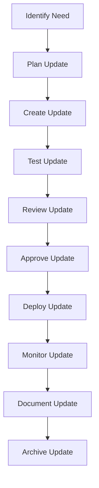

# Documentation Update Procedures

## Overview

This document provides comprehensive documentation update procedures for MCP (Model Context Protocol) servers within the KiloCode ecosystem. The procedures follow the **Simple, Robust, Secure** approach and ensure proper management of documentation updates.

## Update Philosophy

### Key Principles
1. **Simplicity**: Use straightforward update processes
2. **Robustness**: Implement comprehensive testing and validation
3. **Security**: Secure update process with proper access controls
4. **Consistency**: Maintain consistent update procedures across all documentation
5. **Traceability**: Ensure all updates are traceable and auditable

### Update Goals
- **Controlled Updates**: All documentation updates follow defined procedures
- **Quality Assurance**: Updates maintain documentation quality standards
- **Minimal Disruption**: Updates cause minimal disruption to users
- **Version Control**: All updates are properly versioned and tracked
- **Collaboration**: Support for multiple contributors to documentation updates

## Update Process Overview

### 1. Update Lifecycle



### 2. Update Types

#### 2.1 Emergency Updates
- **Priority**: Critical
- **Timeline**: Immediate (within 1 hour)
- **Approval**: Technical Lead + Security Team
- **Testing**: Basic validation only
- **Deployment**: Direct to production

#### 2.2 High Priority Updates
- **Priority**: High
- **Timeline**: Same day (within 8 hours)
- **Approval**: Documentation Team Lead
- **Testing**: Automated testing
- **Deployment**: Staging then production

#### 2.3 Medium Priority Updates
- **Priority**: Medium
- **Timeline**: Within 3 days
- **Approval**: Documentation Team
- **Testing**: Full testing suite
- **Deployment**: Staging then production

#### 2.4 Low Priority Updates
- **Priority**: Low
- **Timeline**: Within 2 weeks
- **Approval**: Documentation Team
- **Testing**: Full testing suite
- **Deployment**: Staging then production

## Update Planning Procedures

### 1. Update Request Process

#### 1.1 Update Request Template
```markdown
# Documentation Update Request

## Update Description
[Brief description of the update needed]

## Update Type
- [ ] Emergency Update (Critical security/bug fix)
- [ ] High Priority Update (Important feature/improvement)
- [ ] Medium Priority Update (Regular update/maintenance)
- [ ] Low Priority Update (Minor improvement/cleanup)

## Affected Documentation
- [ ] MCP Server Details
- [ ] User Guides
- [ ] Technical Documentation
- [ ] Installation Guides
- [ ] Configuration Procedures
- [ ] Troubleshooting Guides
- [ ] API Documentation
- [ ] Database Schema
- [ ] Architecture Diagrams

## Impact Assessment
- [ ] Low Impact (Minor changes, no breaking changes)
- [ ] Medium Impact (Significant changes, some breaking changes)
- [ ] High Impact (Major changes, many breaking changes)

## Testing Requirements
- [ ] Build Test
- [ ] Link Validation Test
- [ ] Example Verification Test
- [ ] Integration Test
- [ ] Performance Test
- [ ] Security Test

## Approval Required
- [ ] Documentation Team
- [ ] Technical Lead
- [ ] Security Team
- [ ] Product Manager
- [ ] Operations Team

## Timeline
- Request Date: [Date]
- Target Completion: [Date]
- Review Deadline: [Date]
- Deployment Date: [Date]

## Additional Information
[Any additional context, requirements, or constraints]

## Related Issues
- [ ] Issue #123
- [ ] Issue #456
- [ ] Issue #789
```

#### 1.2 Update Request Workflow
```bash
# Submit update request
# 1. Fill out update request template
# 2. Submit to documentation team
# 3. Get initial assessment
# 4. Determine priority and timeline
# 5. Assign to documentation team member
# 6. Schedule update work
# 7. Communicate timeline to stakeholders
```

### 2. Update Planning

#### 2.1 Update Planning Checklist
```markdown
# Update Planning Checklist

## Pre-Planning
- [ ] Understand the update requirements
- [ ] Assess impact on existing documentation
- [ ] Identify affected files and sections
- [ ] Determine testing requirements
- [ ] Plan rollback procedures
- [ ] Schedule deployment window

## Resource Planning
- [ ] Assign documentation team member
- [ ] Allocate testing resources
- [ ] Schedule review time
- [ ] Plan deployment resources
- [ ] Allocate monitoring resources

## Risk Assessment
- [ ] Identify potential risks
- [ ] Plan mitigation strategies
- [ ] Prepare rollback procedures
- [ ] Plan communication strategy
- [ ] Identify stakeholders

## Timeline Planning
- [ ] Create detailed timeline
- [ ] Set milestones and deadlines
- [ ] Plan for dependencies
- [ ] Schedule reviews and approvals
- [ ] Plan deployment timing
```

#### 2.2 Update Risk Assessment
```markdown
# Update Risk Assessment Template

## Risk Categories
1. **Technical Risk**: Risk of technical issues during update
2. **Business Risk**: Risk of business disruption
3. **Security Risk**: Risk of security vulnerabilities
4. **User Experience Risk**: Risk of poor user experience
5. **Compliance Risk**: Risk of compliance issues

## Risk Assessment Matrix
| Risk | Likelihood | Impact | Mitigation Strategy |
|------|------------|---------|-------------------|
| Broken links | Medium | High | Test all links before deployment |
| Build failures | Low | High | Automated build and test pipeline |
| Performance issues | Low | Medium | Performance testing and monitoring |
| Security issues | Low | Critical | Security scanning and review |
| User confusion | Medium | Medium | Clear communication and documentation |

## Risk Mitigation Strategies
- **Technical**: Automated testing, staged deployment, rollback procedures
- **Business**: Communication planning, stakeholder management, contingency planning
- **Security**: Security scanning, access controls, audit logging
- **User Experience**: User testing, clear documentation, support planning
- **Compliance**: Compliance review, audit trails, documentation updates
```

## Update Creation Procedures

### 1. Content Update Process

#### 1.1 Content Update Guidelines
```markdown
# Content Update Guidelines

## Update Principles
1. **Accuracy**: Ensure all information is accurate and up-to-date
2. **Clarity**: Write clear, concise, and easy-to-understand content
3. **Completeness**: Provide comprehensive information
4. **Consistency**: Maintain consistent terminology and formatting
5. **Relevance**: Focus on information that is relevant to users

## Content Standards
- Use active voice and clear language
- Follow established documentation templates
- Include examples where appropriate
- Provide step-by-step instructions
- Use consistent formatting and structure
- Include version information
- Update related content as needed

## Quality Checklist
- [ ] Content is accurate and verified
- [ ] Examples are tested and working
- [ ] Links are valid and accessible
- [ ] Formatting is consistent
- [ ] Terminology is consistent
- [ ] Version information is current
- [ ] Related content is updated
- [ ] Content follows templates and standards
```

#### 1.2 Content Update Process
```bash
# Content update workflow
# 1. Create feature branch for update
git checkout -b/update/update-description

# 2. Make content changes
# 3. Update affected files
# 4. Add examples and tests
# 5. Update version information
# 6. Update related content
# 7. Commit changes with descriptive message
git commit -m "docs: Update documentation content

- Update [specific content]
- Add [new examples]
- Fix [broken links]
- Update [version information]

Resolves #123"
```

### 2. Technical Update Process

#### 2.1 Technical Update Guidelines
```markdown
# Technical Update Guidelines

## Update Types
1. **Configuration Updates**: Update configuration files and examples
2. **Code Updates**: Update code examples and snippets
3. **API Updates**: Update API documentation and examples
4. **Database Updates**: Update database schema and examples
5. **Security Updates**: Update security procedures and examples

## Technical Standards
- Use current and supported technologies
- Follow coding standards and best practices
- Include working examples
- Provide clear explanations
- Update related technical content
- Test all technical examples

## Technical Checklist
- [ ] Code examples are tested and working
- [ ] Configuration examples are current
- [ ] API documentation is accurate
- [ ] Database schema is current
- [ ] Security procedures are up-to-date
- [ ] Technical examples follow best practices
- [ ] Related technical content is updated
- [ ] Technical requirements are documented
```

#### 2.2 Technical Update Process
```bash
# Technical update workflow
# 1. Create feature branch for technical update
git checkout -b/tech/update-technical-content

# 2. Update technical content
# 3. Update code examples
# 4. Update configuration examples
# 5. Update API documentation
# 6. Update database schema
# 7. Update security procedures
# 8. Test all technical examples
# 9. Commit changes
git commit -m "tech: Update technical documentation

- Update [technical content]
- Add [code examples]
- Fix [configuration issues]
- Update [API documentation]

Resolves #456"
```

## Update Testing Procedures

### 1. Testing Process Overview

#### 1.1 Testing Levels
```markdown
# Testing Levels for Documentation Updates

## Level 1: Basic Testing
- Build documentation successfully
- Check for broken links
- Validate markdown syntax
- Check for formatting issues
- Verify basic functionality

## Level 2: Functional Testing
- Test all examples and code snippets
- Verify configuration examples
- Test API endpoints and examples
- Validate database operations
- Test security procedures

## Level 3: Integration Testing
- Test documentation with actual systems
- Verify integration with other documentation
- Test cross-references and links
- Validate search functionality
- Test navigation and structure

## Level 4: Performance Testing
- Test documentation build performance
- Verify page load times
- Test search performance
- Validate documentation size
- Test resource usage

## Level 5: Security Testing
- Scan for security vulnerabilities
- Check for sensitive information
- Validate access controls
- Test authentication procedures
- Verify security compliance
```

#### 1.2 Testing Process
```bash
# Testing workflow
# 1. Basic testing
npm run build
npm run validate
npm run check-links

# 2. Functional testing
npm run test-examples
npm run test-configuration
npm run test-api
npm run test-database
npm run test-security

# 3. Integration testing
npm run test-integration
npm run test-cross-references
npm run test-navigation
npm run test-search

# 4. Performance testing
npm run test-performance
npm run test-build-time
npm run test-page-load

# 5. Security testing
npm run test-security
npm run test-sensitive-info
npm run test-access-controls
```

### 2. Automated Testing

#### 2.1 Automated Test Configuration
```yaml
# .github/workflows/test-docs.yml
name: Test Documentation Updates

on:
  pull_request:
    branches: [ main, develop ]

jobs:
  test:
    runs-on: ubuntu-latest
    
    steps:
    - uses: actions/checkout@v3
    
    - name: Setup Node.js
      uses: actions/setup-node@v3
      with:
        node-version: '18'
        cache: 'npm'
    
    - name: Install dependencies
      run: npm ci
    
    - name: Basic Testing
      run: |
        npm run build
        npm run validate
        npm run check-links
    
    - name: Functional Testing
      run: |
        npm run test-examples
        npm run test-configuration
        npm run test-api
        npm run test-database
        npm run test-security
    
    - name: Integration Testing
      run: |
        npm run test-integration
        npm run test-cross-references
        npm run test-navigation
        npm run test-search
    
    - name: Performance Testing
      run: |
        npm run test-performance
        npm run test-build-time
        npm run test-page-load
    
    - name: Security Testing
      run: |
        npm run test-security
        npm run test-sensitive-info
        npm run test-access-controls
    
    - name: Generate Test Report
      run: |
        npm run test-report
        npm run upload-test-results
```

#### 2.2 Test Results Analysis
```bash
# Test results analysis script
#!/bin/bash

# Analyze test results
echo "=== Test Results Analysis ==="

# Basic tests
echo "Basic Tests:"
echo "  Build: $(npm run build 2>&1 | grep -c "error" || echo "0") errors"
echo "  Validation: $(npm run validate 2>&1 | grep -c "error" || echo "0") errors"
echo "  Links: $(npm run check-links 2>&1 | grep -c "error" || echo "0") errors"

# Functional tests
echo "Functional Tests:"
echo "  Examples: $(npm run test-examples 2>&1 | grep -c "failed" || echo "0") failed"
echo "  Configuration: $(npm run test-configuration 2>&1 | grep -c "failed" || echo "0") failed"
echo "  API: $(npm run test-api 2>&1 | grep -c "failed" || echo "0") failed"
echo "  Database: $(npm run test-database 2>&1 | grep -c "failed" || echo "0") failed"
echo "  Security: $(npm run test-security 2>&1 | grep -c "failed" || echo "0") failed"

# Integration tests
echo "Integration Tests:"
echo "  Integration: $(npm run test-integration 2>&1 | grep -c "failed" || echo "0") failed"
echo "  Cross-references: $(npm run test-cross-references 2>&1 | grep -c "failed" || echo "0") failed"
echo "  Navigation: $(npm run test-navigation 2>&1 | grep -c "failed" || echo "0") failed"
echo "  Search: $(npm run test-search 2>&1 | grep -c "failed" || echo "0") failed"

# Performance tests
echo "Performance Tests:"
echo "  Build time: $(npm run test-build-time 2>&1 | grep -o "[0-9.]*" | head -1)s"
echo "  Page load: $(npm run test-page-load 2>&1 | grep -o "[0-9.]*" | head -1)s"
echo "  Memory usage: $(npm run test-performance 2>&1 | grep -o "[0-9.]*" | head -1)MB"

# Security tests
echo "Security Tests:"
echo "  Vulnerabilities: $(npm run test-security 2>&1 | grep -c "vulnerability" || echo "0") found"
echo "  Sensitive info: $(npm run test-sensitive-info 2>&1 | grep -c "found" || echo "0") found"
echo "  Access controls: $(npm run test-access-controls 2>&1 | grep -c "failed" || echo "0") failed"

# Overall assessment
TOTAL_ERRORS=$(($(npm run build 2>&1 | grep -c "error" || echo "0") + $(npm run validate 2>&1 | grep -c "error" || echo "0") + $(npm run check-links 2>&1 | grep -c "error" || echo "0")))
TOTAL_FAILED=$(($(npm run test-examples 2>&1 | grep -c "failed" || echo "0") + $(npm run test-configuration 2>&1 | grep -c "failed" || echo "0") + $(npm run test-api 2>&1 | grep -c "failed" || echo "0") + $(npm run test-database 2>&1 | grep -c "failed" || echo "0") + $(npm run test-security 2>&1 | grep -c "failed" || echo "0")))

echo "Overall Assessment:"
echo "  Total errors: $TOTAL_ERRORS"
echo "  Total failed: $TOTAL_FAILED"

if [ $TOTAL_ERRORS -eq 0 ] && [ $TOTAL_FAILED -eq 0 ]; then
    echo "  Status: PASSED"
    exit 0
else
    echo "  Status: FAILED"
    exit 1
fi
```

## Update Review Procedures

### 1. Review Process Overview

#### 1.1 Review Levels
```markdown
# Review Levels for Documentation Updates

## Level 1: Peer Review
- Reviewed by: Documentation team member
- Focus: Content accuracy, clarity, and completeness
- Criteria: Documentation standards, writing guidelines
- Timeframe: 24 hours

## Level 2: Technical Review
- Reviewed by: Technical lead or subject matter expert
- Focus: Technical accuracy, examples, and procedures
- Criteria: Technical standards, best practices
- Timeframe: 48 hours

## Level 3: Security Review
- Reviewed by: Security team member
- Focus: Security procedures, sensitive information
- Criteria: Security standards, compliance requirements
- Timeframe: 24 hours

## Level 4: Final Review
- Reviewed by: Documentation team lead
- Focus: Overall quality, consistency, and completeness
- Criteria: Quality standards, release criteria
- Timeframe: 24 hours
```

#### 1.2 Review Process
```bash
# Review workflow
# 1. Submit for peer review
# 2. Peer review and feedback
# 3. Address peer review comments
# 4. Submit for technical review
# 5. Technical review and feedback
# 6. Address technical review comments
# 7. Submit for security review
# 8. Security review and feedback
# 9. Address security review comments
# 10. Submit for final review
# 11. Final review and approval
# 12. Prepare for deployment
```

### 2. Review Checklist

#### 2.1 Content Review Checklist
```markdown
# Content Review Checklist

## Content Quality
- [ ] Content is accurate and up-to-date
- [ ] Information is clear and concise
- [ ] Examples are relevant and helpful
- [ ] Instructions are step-by-step and clear
- [ ] Terminology is consistent throughout
- [ ] Content follows established templates

## Structure and Organization
- [ ] Document has clear structure and hierarchy
- [ ] Table of contents is complete and accurate
- [ ] Navigation is logical and intuitive
- [ ] Cross-references are correct and helpful
- [ ] Version information is current
- [ ] Related content is properly linked

## Formatting and Style
- [ ] Markdown syntax is correct
- [ ] Formatting is consistent and professional
- [ ] Code blocks are properly formatted
- [ ] Tables are clear and well-structured
- [ ] Images are properly sized and captioned
- [ ] Overall appearance is clean and readable

## Completeness
- [ ] All required sections are present
- [ ] Examples are complete and tested
- [ ] Procedures are fully documented
- [ ] Troubleshooting information is included
- [ ] Related content is updated
- [ ] Outdated information is removed or updated
```

#### 2.2 Technical Review Checklist
```markdown
# Technical Review Checklist

## Technical Accuracy
- [ ] Technical information is accurate and current
- [ ] Code examples are tested and working
- [ ] Configuration examples are correct
- [ ] API documentation is accurate
- [ ] Database schema is current
- [ ] Security procedures are up-to-date

## Technical Standards
- [ ] Code follows established standards
- [ ] Configuration follows best practices
- [ ] API usage is documented correctly
- [ ] Database operations are efficient
- [ ] Security practices are followed
- [ ] Performance considerations are included

## Technical Examples
- [ ] Code examples are complete and runnable
- [ ] Configuration examples are tested
- [ ] API examples are current and working
- [ ] Database examples are accurate
- [ ] Security examples are practical
- [ ] Performance examples are measurable

## Technical Documentation
- [ ] Technical requirements are documented
- [ ] Technical limitations are documented
- [ ] Technical dependencies are documented
- [ ] Technical alternatives are documented
- [ ] Technical troubleshooting is included
- [ ] Technical support information is current
```

## Update Approval Procedures

### 1. Approval Process

#### 1.1 Approval Levels
```markdown
# Approval Levels for Documentation Updates

## Emergency Updates
- Required Approvals: Technical Lead + Security Team
- Approval Process: Immediate approval required
- Documentation: Minimal documentation required
- Deployment: Direct to production

## High Priority Updates
- Required Approvals: Documentation Team Lead + Technical Lead
- Approval Process: Expedited approval process
- Documentation: Basic documentation required
- Deployment: Staging then production

## Medium Priority Updates
- Required Approvals: Documentation Team Lead
- Approval Process: Standard approval process
- Documentation: Full documentation required
- Deployment: Staging then production

## Low Priority Updates
- Required Approvals: Documentation Team
- Approval Process: Standard approval process
- Documentation: Full documentation required
- Deployment: Staging then production
```

#### 1.2 Approval Workflow
```bash
# Approval workflow
# 1. Update completed and tested
# 2. Submit for approval
# 3. Approval review
# 4. Approval decision
# 5. Address approval comments (if any)
# 6. Final approval
# 7. Prepare for deployment
# 8. Deploy update
```

### 2. Approval Templates

#### 2.1 Approval Request Template
```markdown
# Documentation Update Approval Request

## Update Summary
- **Update ID**: [Update ID]
- **Title**: [Update Title]
- **Type**: [Emergency/High/Medium/Low Priority]
- **Requester**: [Name]
- **Date**: [Date]

## Update Description
[Brief description of the update]

## Changes Made
[List of changes made to documentation]

## Testing Results
- [ ] Build successful
- [ ] Link validation passed
- [ ] Examples tested
- [ ] Integration tests passed
- [ ] Performance tests passed
- [ ] Security tests passed

## Review Results
- [ ] Peer review completed
- [ ] Technical review completed
- [ ] Security review completed
- [ ] Final review completed

## Approval Request
- [ ] Emergency Update: Request approval from Technical Lead and Security Team
- [ ] High Priority Update: Request approval from Documentation Team Lead and Technical Lead
- [ ] Medium Priority Update: Request approval from Documentation Team Lead
- [ ] Low Priority Update: Request approval from Documentation Team

## Deployment Plan
- [ ] Deployment date: [Date]
- [ ] Deployment window: [Time]
- [ ] Rollback plan: [Description]
- [ ] Communication plan: [Description]

## Additional Information
[Any additional information or concerns]
```

#### 2.2 Approval Decision Template
```markdown
# Documentation Update Approval Decision

## Update Information
- **Update ID**: [Update ID]
- **Title**: [Update Title]
- **Requester**: [Name]
- **Date**: [Date]

## Approval Decision
- **Decision**: [Approved/Rejected/Requires Changes]
- **Approver**: [Name]
- **Date**: [Date]
- **Reason**: [Reason for decision]

## Approved Updates
- [ ] Update meets all requirements
- [ ] Testing results are satisfactory
- [ ] Review comments are addressed
- [ ] Deployment plan is adequate
- [ ] Risk assessment is complete

## Rejected Updates
- [ ] Update does not meet requirements
- [ ] Testing results are unsatisfactory
- [ ] Review comments are not addressed
- [ ] Deployment plan is inadequate
- [ ] Risk assessment is incomplete

## Required Changes
- [ ] Change 1: [Description]
- [ ] Change 2: [Description]
- [ ] Change 3: [Description]

## Next Steps
- [ ] Approved: Schedule deployment
- [ ] Rejected: Notify requester and close
- [ ] Requires Changes: Request changes and resubmit
```

## Update Deployment Procedures

### 1. Deployment Process

#### 1.1 Deployment Levels
```markdown
# Deployment Levels for Documentation Updates

## Emergency Deployment
- **Environment**: Production only
- **Process**: Direct deployment
- **Testing**: Basic validation only
- **Monitoring**: Continuous monitoring
- **Rollback**: Immediate rollback available

## High Priority Deployment
- **Environment**: Staging → Production
- **Process**: Staged deployment
- **Testing**: Automated testing
- **Monitoring**: Enhanced monitoring
- **Rollback**: Planned rollback available

## Medium Priority Deployment
- **Environment**: Staging → Production
- **Process**: Staged deployment
- **Testing**: Full testing suite
- **Monitoring**: Standard monitoring
- **Rollback**: Planned rollback available

## Low Priority Deployment
- **Environment**: Staging → Production
- **Process**: Staged deployment
- **Testing**: Full testing suite
- **Monitoring**: Standard monitoring
- **Rollback**: Planned rollback available
```

#### 1.2 Deployment Process
```bash
# Deployment workflow
# 1. Prepare for deployment
# 2. Deploy to staging environment
# 3. Test staging deployment
# 4. Deploy to production environment
# 5. Test production deployment
# 6. Monitor deployment
# 7. Document deployment
# 8. Notify stakeholders
```

### 2. Deployment Scripts

#### 2.1 Staging Deployment Script
```bash
#!/bin/bash

# Staging deployment script
# Usage: ./deploy-staging.sh [update-id]

set -e

# Configuration
STAGING_DIR="/var/www/staging/docs"
REPO_DIR="/var/repos/kilocode-docs"
LOG_FILE="/var/log/docs-deploy-staging.log"

# Update ID
UPDATE_ID=$1

if [ -z "$UPDATE_ID" ]; then
    echo "Error: Update ID is required"
    exit 1
fi

# Logging function
log() {
    echo "[$(date '+%Y-%m-%d %H:%M:%S')] $1" | tee -a "$LOG_FILE"
}

# Start deployment
log "Starting staging deployment for update: $UPDATE_ID"

# Check if update exists
if [ ! -d "$REPO_DIR/updates/$UPDATE_ID" ]; then
    log "Error: Update $UPDATE_ID not found"
    exit 1
fi

# Deploy to staging
log "Deploying to staging environment"
cd "$STAGING_DIR"
rm -rf *
cp -r "$REPO_DIR/updates/$UPDATE_ID"/* .

# Update permissions
log "Setting permissions"
chown -R www-data:www-data .
chmod -R 755 .

# Build documentation
log "Building documentation"
npm run build

# Test deployment
log "Testing deployment"
npm run test-deployment

# Verify deployment
log "Verifying deployment"
curl -s -o /dev/null -w "%{http_code}" http://staging.docs.kilocode.com/ | grep -q "200"

log "Staging deployment completed successfully"
```

#### 2.2 Production Deployment Script
```bash
#!/bin/bash

# Production deployment script
# Usage: ./deploy-production.sh [update-id]

set -e

# Configuration
PROD_DIR="/var/www/docs"
STAGING_DIR="/var/www/staging/docs"
BACKUP_DIR="/backups/docs"
REPO_DIR="/var/repos/kilocode-docs"
LOG_FILE="/var/log/docs-deploy-production.log"

# Update ID
UPDATE_ID=$1

if [ -z "$UPDATE_ID" ]; then
    echo "Error: Update ID is required"
    exit 1
fi

# Logging function
log() {
    echo "[$(date '+%Y-%m-%d %H:%M:%S')] $1" | tee -a "$LOG_FILE"
}

# Start deployment
log "Starting production deployment for update: $UPDATE_ID"

# Create backup
log "Creating backup of current production"
cd "$PROD_DIR"
tar -czf "$BACKUP_DIR/prod_backup_$(date +%Y%m%d_%H%M%S).tar.gz" .

# Deploy to production
log "Deploying to production environment"
cd "$PROD_DIR"
rm -rf *
cp -r "$STAGING_DIR"/* .

# Update permissions
log "Setting permissions"
chown -R www-data:www-data .
chmod -R 755 .

# Build documentation
log "Building documentation"
npm run build

# Test deployment
log "Testing deployment"
npm run test-deployment

# Verify deployment
log "Verifying deployment"
curl -s -o /dev/null -w "%{http_code}" https://docs.kilocode.com/ | grep -q "200"

# Monitor deployment
log "Starting deployment monitoring"
npm run monitor-deployment

# Notify stakeholders
log "Notifying stakeholders"
./notify-stakeholders.sh "$UPDATE_ID"

log "Production deployment completed successfully"
```

## Update Monitoring and Validation

### 1. Monitoring Process

#### 1.1 Monitoring Levels
```markdown
# Monitoring Levels for Documentation Updates

## Basic Monitoring
- **Metrics**: Build status, deployment status
- **Frequency**: Continuous
- **Alerting**: Critical errors only
- **Response Time**: Immediate

## Standard Monitoring
- **Metrics**: Page load times, error rates, user feedback
- **Frequency**: Hourly
- **Alerting**: Errors and warnings
- **Response Time**: Within 1 hour

## Enhanced Monitoring
- **Metrics**: Performance metrics, user engagement, search usage
- **Frequency**: Real-time
- **Alerting**: All issues
- **Response Time**: Within 15 minutes

## Security Monitoring
- **Metrics**: Security events, access patterns, compliance
- **Frequency**: Real-time
- **Alerting**: Security events
- **Response Time**: Immediate
```

#### 1.2 Monitoring Process
```bash
# Monitoring workflow
# 1. Deploy update
# 2. Start monitoring
# 3. Collect metrics
# 4. Analyze results
# 5. Identify issues
# 6. Address issues
# 7. Validate resolution
# 8. Complete monitoring
```

### 2. Validation Procedures

#### 2.1 Validation Checklist
```markdown
# Validation Checklist for Documentation Updates

## Basic Validation
- [ ] Documentation builds successfully
- [ ] All pages load correctly
- [ ] Navigation works properly
- [ ] Search functionality works
- [ ] Links are valid and accessible

## Functional Validation
- [ ] All examples work correctly
- [ ] Configuration examples are valid
- [ ] API examples return expected results
- [ ] Database operations work
- [ ] Security procedures function correctly

## Performance Validation
- [ ] Page load times are acceptable
- [ ] Search performance is adequate
- [ ] Build times are reasonable
- [ ] Resource usage is within limits
- [ ] Scalability is maintained

## User Experience Validation
- [ ] Content is easy to understand
- [ ] Navigation is intuitive
- [ ] Examples are helpful
- [ ] Troubleshooting is effective
- [ ] Overall user satisfaction is high

## Security Validation
- [ ] No security vulnerabilities
- [ ] Sensitive information is protected
- [ ] Access controls work correctly
- [ ] Authentication procedures function
- [ ] Compliance requirements are met
```

#### 2.2 Validation Process
```bash
# Validation workflow
# 1. Deploy update
# 2. Run basic validation
# 3. Run functional validation
# 4. Run performance validation
# 5. Run user experience validation
# 6. Run security validation
# 7. Analyze validation results
# 8. Address any issues
# 9. Re-validate if needed
# 10. Complete validation
```

## Update Documentation and Archiving

### 1. Update Documentation

#### 1.1 Update Documentation Template
```markdown
# Update Documentation

## Update Information
- **Update ID**: [Update ID]
- **Title**: [Update Title]
- **Type**: [Emergency/High/Medium/Low Priority]
- **Requester**: [Name]
- **Date**: [Date]
- **Deployment Date**: [Date]

## Summary
[Brief summary of the update]

## Changes Made
- [ ] Updated [specific content]
- [ ] Added [new examples]
- [ ] Fixed [broken links]
- [ ] Updated [version information]
- [ ] Removed [outdated content]

## Testing Results
- [ ] Build successful
- [ ] Link validation passed
- [ ] Examples tested
- [ ] Integration tests passed
- [ ] Performance tests passed
- [ ] Security tests passed

## Deployment Results
- [ ] Staging deployment successful
- [ ] Production deployment successful
- [ ] Monitoring results satisfactory
- [ ] User feedback positive
- [ ] No issues reported

## Impact Assessment
- [ ] User impact: [Minimal/Moderate/Significant]
- [ ] System impact: [Minimal/Moderate/Significant]
- [ ] Business impact: [Minimal/Moderate/Significant]
- [ ] Security impact: [Minimal/Moderate/Significant]

## Lessons Learned
[What was learned from this update]

## Future Improvements
[Suggestions for future improvements]

## Related Updates
[List of related updates]

## Approval Information
- **Approver**: [Name]
- **Approval Date**: [Date]
- **Approval Decision**: [Approved/Rejected]
```

#### 1.2 Update Documentation Process
```bash
# Update documentation workflow
# 1. Complete update deployment
# 2. Document update details
# 3. Update change log
# 4. Update version information
# 5. Archive update files
# 6. Notify stakeholders
# 7. Close update request
```

### 2. Update Archiving

#### 2.1 Archiving Process
```bash
# Archiving workflow
# 1. Create archive of update files
# 2. Store archive in backup system
# 3. Update archive index
# 4. Verify archive integrity
# 5. Document archive location
# 6. Set retention policy
```

#### 2.2 Archive Management
```bash
# Archive management script
#!/bin/bash

# Archive management script
# Usage: ./manage-archive.sh [action] [update-id]

ACTION=$1
UPDATE_ID=$2

case $ACTION in
    "create")
        # Create archive
        tar -czf "/archives/docs_update_$UPDATE_ID.tar.gz" "/updates/$UPDATE_ID"
        echo "Archive created: /archives/docs_update_$UPDATE_ID.tar.gz"
        ;;
    "verify")
        # Verify archive
        if [ -f "/archives/docs_update_$UPDATE_ID.tar.gz" ]; then
            tar -tzf "/archives/docs_update_$UPDATE_ID.tar.gz" > /dev/null
            echo "Archive verified: /archives/docs_update_$UPDATE_ID.tar.gz"
        else
            echo "Archive not found: /archives/docs_update_$UPDATE_ID.tar.gz"
            exit 1
        fi
        ;;
    "restore")
        # Restore archive
        if [ -f "/archives/docs_update_$UPDATE_ID.tar.gz" ]; then
            tar -xzf "/archives/docs_update_$UPDATE_ID.tar.gz" -C "/tmp"
            echo "Archive restored: /archives/docs_update_$UPDATE_ID.tar.gz"
        else
            echo "Archive not found: /archives/docs_update_$UPDATE_ID.tar.gz"
            exit 1
        fi
        ;;
    "list")
        # List archives
        ls -la /archives/docs_update_*.tar.gz
        ;;
    "cleanup")
        # Clean up old archives
        find /archives -name "docs_update_*.tar.gz" -mtime +365 -delete
        echo "Cleaned up old archives"
        ;;
    *)
        echo "Usage: $0 [create|verify|restore|list|cleanup] [update-id]"
        exit 1
        ;;
esac
```

## Support and Contact Information

### Technical Support
- **Email**: support@kilocode.com
- **Phone**: +1 (555) 123-4567
- **Hours**: 24/7 for production support

### Documentation Support
- **Documentation Team**: docs@kilocode.com
- **Update Management**: updates@kilocode.com
- **Deployment Support**: deployment@kilocode.com

### Training and Support
- **Training Coordinator**: training@kilocode.com
- **Documentation Help**: docs-help@kilocode.com
- **Update Support**: update-support@kilocode.com

---

*This documentation update procedures guide is part of the KiloCode MCP Setup and Configuration Architecture Plan and should be reviewed and updated regularly to reflect changes in update requirements and best practices.*