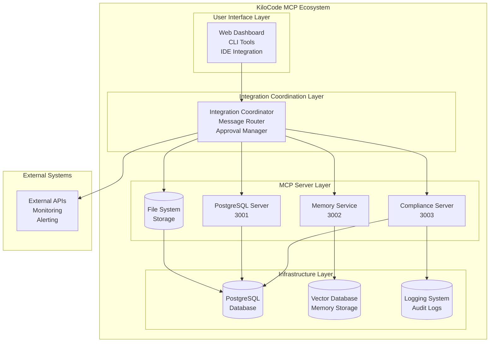
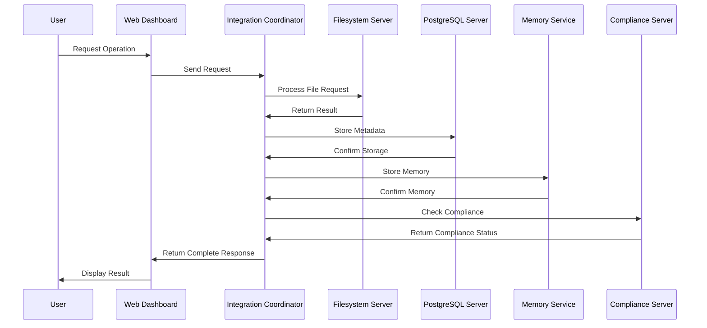
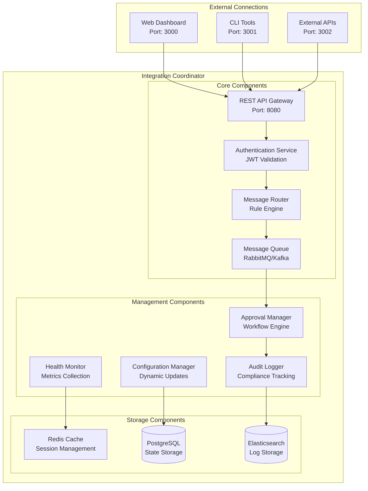
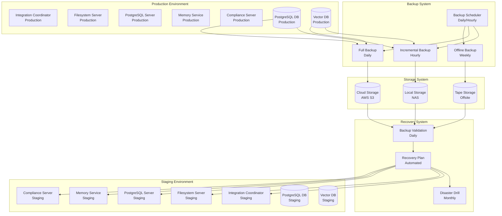
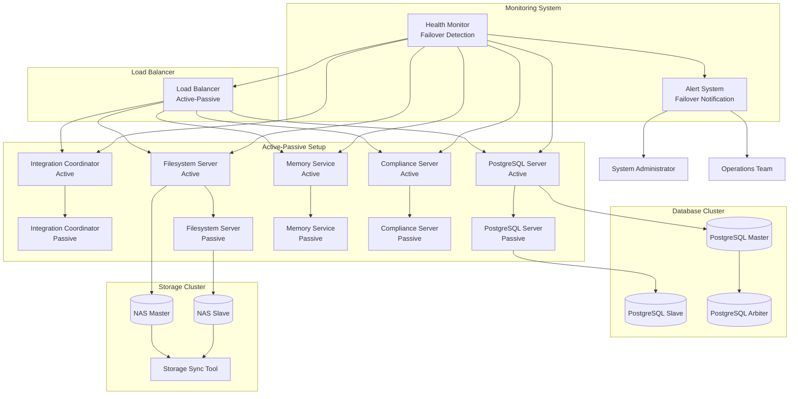
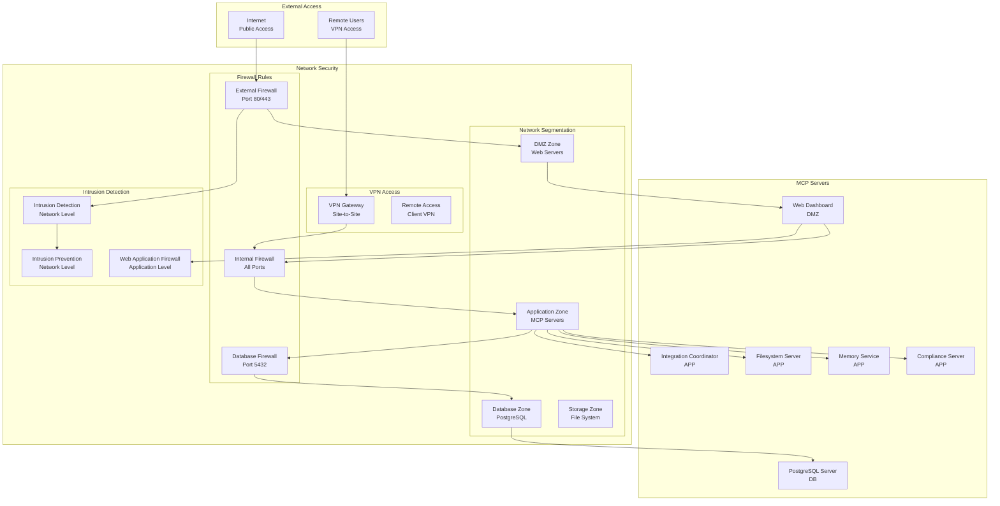
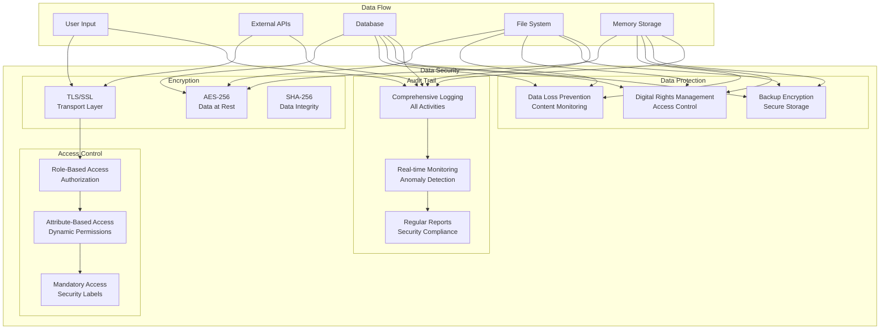
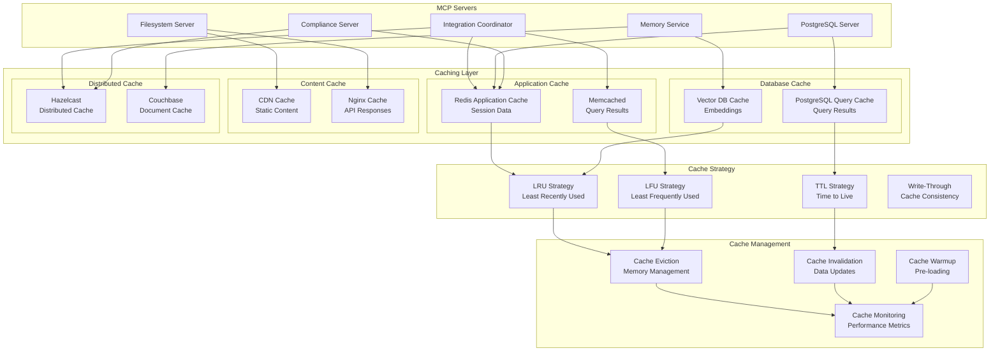
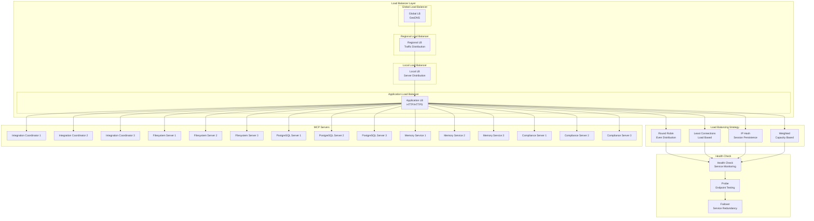

# Integration Architecture Diagrams

## Overview

This document provides comprehensive integration architecture diagrams for MCP (Model Context Protocol) servers within the KiloCode ecosystem. The architecture follows the **Simple, Robust, Secure** approach and ensures proper integration between MCP servers while maintaining independence.

## Architecture Philosophy

### Key Principles
1. **Simplicity**: Focus on essential integration patterns only
2. **Robustness**: Build resilient integration with proper error handling
3. **Security**: Secure integration by default with authentication and authorization
4. **Independence**: Maintain server independence while enabling coordination
5. **Human Oversight**: Ensure human control over critical operations

### Integration Goals
- **Server Independence**: Each MCP server operates independently
- **Loose Coupling**: Integration occurs through well-defined APIs
- **Secure Communication**: All server-to-server communication is encrypted
- **Human Oversight**: Critical operations require human approval
- **Scalability**: Architecture scales with KiloCode growth

## High-Level Architecture

### 1. System Architecture Overview



### 2. Integration Flow Architecture



## Detailed Architecture Diagrams

### 1. Integration Coordinator Architecture



### 2. MCP Server Integration Architecture

```mermaid
graph TB
    subgraph "MCP Server Integration"
        subgraph "Filesystem Server"
            FS_API[REST API<br/>Port: 3000]
            FS_AUTH[Authentication<br/>JWT Validation]
            FS_RATE[Rate Limiting<br/>Throttling]
            FS_LOG[Logging<br/>Audit Trail]
        end
        
        subgraph "PostgreSQL Server"
            PG_API[REST API<br/>Port: 3001]
            PG_AUTH[Authentication<br/>JWT Validation]
            PG_POOL[Connection Pool<br/>20 connections]
            PG_LOG[Logging<br/>Query Audit]
        end
        
        subgraph "Memory Service"
            MS_API[REST API<br/>Port: 3002]
            MS_AUTH[Authentication<br/>JWT Validation]
            MS_VECTOR[Vector DB<br/>Embedding Search]
            MS_CACHE[Redis Cache<br/>Memory Management]
        end
        
        subgraph "Compliance Server"
            CS_API[REST API<br/>Port: 3003]
            CS_AUTH[Authentication<br<arg_value>
### 2. Auto-scaling Architecture

```mermaid
graph TB
    subgraph "Auto-scaling Controller"
        HPA[Horizontal Pod Autoscaler<br/>CPU/Memory Metrics]
        VPA[Vertical Pod Autoscaler<br/>Resource Requests]
        CA[Cluster Autoscaler<br/>Node Scaling]
    end
    
    subgraph "Monitoring Metrics"
        PROMETHEUS[Prometheus<br/>Metrics Collection]
        GRAFANA[Grafana<br/>Dashboard]
        ALERTS[Alert Manager<br/>Threshold Alerts]
    end
    
    subgraph "Kubernetes Cluster"
        NODE1[Node 1<br/>4 Cores/8GB RAM]
        NODE2[Node 2<br/>4 Cores/8GB RAM]
        NODE3[Node 3<br/>4 Cores/8GB RAM]
    end
    
    subgraph "MCP Services"
        IC_PODS[Integration Coordinator<br/>3 Pods]
        FS_PODS[Filesystem Server<br/>3 Pods]
        PG_PODS[PostgreSQL Server<br/>3 Pods]
        MS_PODS[Memory Service<br/>3 Pods]
        CS_PODS[Compliance Server<br/>3 Pods]
    end
    
    subgraph "Database Cluster"
        PG_CLUSTER[(PostgreSQL Cluster<br/>3 Nodes)]
        VDB_CLUSTER[(Vector DB Cluster<br/>3 Nodes)]
        CACHE_CLUSTER[(Redis Cluster<br/>3 Nodes)]
    end
    
    HPA --> PROMETHEUS
    VPA --> PROMETHEUS
    CA --> PROMETHEUS
    
    PROMETHEUS --> GRAFANA
    PROMETHEUS --> ALERTS
    
    HPA --> IC_PODS
    HPA --> FS_PODS
    HPA --> PG_PODS
    HPA --> MS_PODS
    HPA --> CS_PODS
    
    VPA --> IC_PODS
    VPA --> FS_PODS
    VPA --> PG_PODS
    VPA --> MS_PODS
    VPA --> CS_PODS
    
    CA --> NODE1
    CA --> NODE2
    CA --> NODE3
    
    IC_PODS --> NODE1
    IC_PODS --> NODE2
    IC_PODS --> NODE3
    
    FS_PODS --> NODE1
    FS_PODS --> NODE2
    FS_PODS --> NODE3
    
    PG_PODS --> NODE1
    PG_PODS --> NODE2
    PG_PODS --> NODE3
    
    MS_PODS --> NODE1
    MS_PODS --> NODE2
    MS_PODS --> NODE3
    
    CS_PODS --> NODE1
    CS_PODS --> NODE2
    CS_PODS --> NODE3
    
    PG_PODS --> PG_CLUSTER
    MS_PODS --> VDB_CLUSTER
    IC_PODS --> CACHE_CLUSTER
```

## Disaster Recovery Architecture

### 1. Backup and Recovery Architecture



### 2. High Availability Architecture



## Security Architecture Details

### 1. Network Security Architecture



### 2. Data Security Architecture



## Performance Architecture

### 1. Caching Architecture



### 2. Load Balancing Architecture



## Documentation Standards

### 1. Diagram Creation Standards

#### 1.1 Mermaid Diagram Guidelines
- Use consistent styling and colors
- Include clear labels and descriptions
- Follow standard flowchart conventions
- Ensure diagrams are readable at different sizes
- Use appropriate diagram types for different scenarios

#### 1.2 Diagram Maintenance
- Update diagrams when architecture changes
- Version control diagram files
- Review diagrams regularly for accuracy
- Use automated tools for diagram generation where possible
- Maintain diagram documentation alongside code

### 2. Architecture Documentation Standards

#### 2.1 Documentation Structure
- Overview section with high-level architecture
- Detailed component descriptions
- Interaction flow diagrams
- Deployment architecture
- Security architecture
- Performance architecture
- Disaster recovery architecture

#### 2.2 Documentation Maintenance
- Regular reviews and updates
- Version control integration
- Automated documentation generation
- Cross-referencing between components
- Change tracking and history

## Support and Contact Information

### Technical Support
- **Email**: support@kilocode.com
- **Phone**: +1 (555) 123-4567
- **Hours**: 24/7 for production support

### Documentation
- **Main Documentation**: [KiloCode Documentation](https://docs.kilocode.com/mcp)
- **GitHub Issues**: [KiloCode GitHub](https://github.com/kilocode/kilocode/issues)
- **Community Forum**: [KiloCode Community](https://community.kilocode.com)

### Architecture Support
- **Architecture Support**: architecture@kilocode.com
- **Security Architecture**: security@kilocode.com
- **Performance Architecture**: performance@kilocode.com

---

*This integration architecture diagrams guide is part of the KiloCode MCP Setup and Configuration Architecture Plan and should be reviewed and updated regularly to reflect changes in architecture and best practices.*