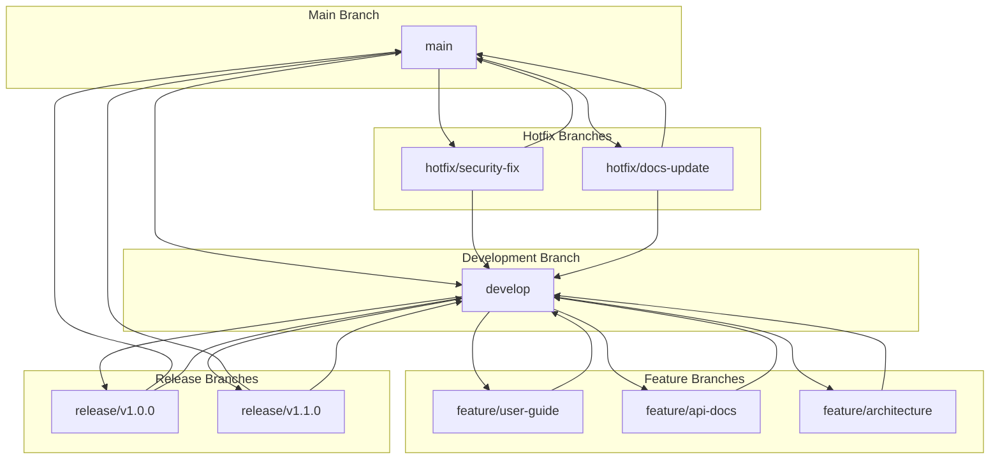

# Documentation Version Control Setup

## Overview

This document provides comprehensive guidance for setting up and managing documentation version control for the KiloCode MCP ecosystem. The setup includes version control strategies, branching models, release procedures, and maintenance processes, following the **Simple, Robust, Secure** approach.

## Version Control Philosophy

### Key Principles
1. **Simplicity**: Provide clear, straightforward version control procedures
2. **Robustness**: Ensure reliable version control with proper backup and recovery
3. **Security**: Implement secure version control with proper access controls
4. **Consistency**: Maintain consistent version control patterns across all documentation
5. **Traceability**: Ensure complete traceability of all documentation changes

### Version Control Types
- **Git**: Primary version control system for documentation
- **GitHub**: Platform for hosting and collaboration
- **GitHub Actions**: Automation for documentation workflows
- **Semantic Versioning**: Version numbering strategy for documentation

---

## Git Repository Structure

### 1. Repository Layout

```
kilocode-mcp-docs/
├── .github/
│   ├── workflows/
│   │   ├── documentation.yml
│   │   ├── deploy.yml
│   │   └── quality-check.yml
│   └── ISSUE_TEMPLATE/
│       ├── bug-report.md
│       ├── feature-request.md
│       └── documentation.md
├── .gitignore
├── README.md
├── CHANGELOG.md
├── CONTRIBUTING.md
├── LICENSE
├── docs/
│   ├── MCP_Tools/
│   │   ├── MCP Details/
│   │   ├── guides/
│   │   ├── api-documentation/
│   │   ├── database-schema/
│   │   ├── architecture-diagrams/
│   │   └── version-control/
│   ├── Systems_Descriptions/
│   ├── _My Todo/
│   └── IDE/
├── scripts/
│   ├── build-docs.sh
│   ├── deploy-docs.sh
│   ├── validate-docs.sh
│   └── update-versions.sh
└── templates/
    ├── document-template.md
    ├── api-template.md
    └── architecture-template.md
```

### 2. .gitignore Configuration

```gitignore
# Node.js
node_modules/
npm-debug.log*
yarn-debug.log*
yarn-error.log*

# Build outputs
dist/
build/
*.min.js
*.min.css

# Environment variables
.env
.env.local
.env.development.local
.env.test.local
.env.production.local

# IDE files
.vscode/
.idea/
*.swp
*.swo
*~

# OS files
.DS_Store
Thumbs.db

# Documentation build artifacts
docs/_site/
docs/_build/
docs/output/

# Temporary files
*.tmp
*.temp
*.log

# Backup files
*.bak
*.backup

# Archive files
*.zip
*.tar
*.gz
*.rar

# Database files
*.db
*.sqlite
*.sqlite3

# Configuration files with secrets
config/secrets.json
config/local.json

# Test coverage reports
coverage/
.nyc_output/

# Dependency directories
jspm_packages/

# Optional npm cache directory
.npm

# Optional eslint cache
.eslintcache

# Optional REPL history
.node_repl_history

# Output of 'npm pack'
*.tgz

# Yarn Integrity file
.yarn-integrity

# dotenv environment variables file
.env.test

# Stores VSCode versions used for testing VSCode extensions
.vscode-test

# Documentation specific
docs/generated/
docs/api-reference/
docs/_book/

# Temporary directories
tmp/
temp/
```

### 3. README.md

```markdown
# KiloCode MCP Documentation

This repository contains comprehensive documentation for the KiloCode MCP (Model Context Protocol) ecosystem.

## Overview

The KiloCode MCP ecosystem consists of multiple MCP servers that provide various services including compliance validation, memory management, and integration coordination. This documentation provides detailed information about:

- System architecture and design
- Installation and configuration procedures
- API documentation and examples
- Database schema and specifications
- Troubleshooting guides
- Best practices and standards

## Repository Structure

```
kilocode-mcp-docs/
├── docs/
│   ├── MCP_Tools/
│   │   ├── MCP Details/          # Detailed MCP server documentation
│   │   ├── guides/               # User guides and tutorials
│   │   ├── api-documentation/    # API reference documentation
│   │   ├── database-schema/      # Database schema specifications
│   │   ├── architecture-diagrams/# Architecture diagrams
│   │   └── version-control/      # Version control procedures
│   ├── Systems_Descriptions/     # System-level documentation
│   ├── _My Todo/                # Task tracking
│   └── IDE/                     # IDE-specific documentation
├── scripts/                     # Build and deployment scripts
└── templates/                    # Document templates
```

## Documentation Standards

### File Naming Conventions
- Use lowercase with hyphens: `user-guide.md`
- Use descriptive names: `api-reference.md` (not `api.md`)
- Group related files in directories: `guides/installation/`

### Content Standards
- Follow the established document templates
- Include version information in all documents
- Provide clear navigation and cross-references
- Use consistent terminology throughout
- Include examples and code snippets where applicable

### Markdown Formatting
- Use proper heading hierarchy (#, ##, ###)
- Include code blocks with syntax highlighting
- Use tables for structured data
- Include images and diagrams where helpful
- Use proper link formatting

## Version Control

### Branching Strategy
- `main`: Production-ready documentation
- `develop`: Development branch for ongoing work
- `feature/*`: Feature branches for new documentation
- `release/*`: Release branches for version preparation
- `hotfix/*`: Hotfix branches for critical issues

### Commit Messages
- Use conventional commit format: `type(scope): description`
- Types: `feat`, `fix`, `docs`, `style`, `refactor`, `test`, `chore`
- Keep messages clear and concise
- Include issue references when applicable

### Pull Request Process
1. Create feature branch from `develop`
2. Make changes and commit with descriptive messages
3. Push branch and create pull request to `develop`
4. Include documentation of changes
5. Get review from team members
6. Merge after approval

## Building and Deployment

### Prerequisites
- Node.js 18+ 
- npm or yarn
- Git

### Building Documentation
```bash
# Install dependencies
npm install

# Build documentation
npm run build

# Preview documentation
npm run preview
```

### Deployment
```bash
# Deploy to production
npm run deploy

# Deploy to staging
npm run deploy:staging
```

## Contributing

Please see [CONTRIBUTING.md](CONTRIBUTING.md) for detailed contribution guidelines.

## Support

For issues and questions:
- GitHub Issues: [Create an issue](https://github.com/kilocode/kilocode-mcp-docs/issues)
- Documentation: [KiloCode Documentation](https://kilocode.com/docs)
- Community: [KiloCode Community](https://community.kilocode.com)

## License

This project is licensed under the MIT License - see the [LICENSE](LICENSE) file for details.

---

*Built with ❤️ by the KiloCode Team*
```

---

## Branching Model

### 1. Git Flow Implementation



### 2. Branch Protection Rules

```yaml
# GitHub Branch Protection for main branch
protection:
  required_status_checks:
    - context: 'ci/build'
    - context: 'ci/test'
    - context: 'ci/lint'
    - context: 'docs/validate'
  required_pull_request_reviews:
    required_approving_review_count: 2
    dismiss_stale_reviews: true
    require_code_owner_reviews: true
  enforce_admins: true
  restrictions:
    users: []
    teams: []
```

### 3. Release Branch Strategy

```bash
# Create release branch
git checkout develop
git checkout -b release/v1.0.0

# Update version numbers
./scripts/update-versions.sh 1.0.0

# Update changelog
./scripts/update-changelog.sh 1.0.0

# Commit changes
git add .
git commit -m "docs: Prepare release v1.0.0"

# Push release branch
git push origin release/v1.0.0

# Create pull request to main
# Wait for approval and merge

# Tag release
git tag v1.0.0
git push origin v1.0.0

# Merge back to develop
git checkout develop
git merge release/v1.0.0
git push origin develop
```

---

## Version Numbering

### 1. Semantic Versioning

```bash
# Format: MAJOR.MINOR.PATCH
# Example: 1.0.0

# Major version (incompatible changes)
1.0.0 -> 2.0.0

# Minor version (backward-compatible features)
1.0.0 -> 1.1.0

# Patch version (backward-compatible bug fixes)
1.0.0 -> 1.0.1
```

### 2. Version Update Scripts

```bash
#!/bin/bash
# scripts/update-versions.sh

VERSION=$1

if [ -z "$VERSION" ]; then
    echo "Usage: $0 <version>"
    exit 1
fi

# Update package.json
sed -i "s/\"version\": \"[^\"]*\"/\"version\": \"$VERSION\"/" package.json

# Update README.md
sed -i "s/version [^\)]*/version $VERSION)/" README.md

# Update documentation headers
find docs/ -name "*.md" -exec sed -i "s/## Documentation v[^\)]*/## Documentation v$VERSION)/" {} \;

# Update CHANGELOG.md
echo "## Version $VERSION - $(date +%Y-%m-%d)" > CHANGELOG.tmp
echo "" >> CHANGELOG.tmp
cat CHANGELOG.md >> CHANGELOG.tmp
mv CHANGELOG.tmp CHANGELOG.md

echo "Updated version to $VERSION"
```

### 3. Changelog Management

```markdown
# CHANGELOG.md

## Version 1.0.0 - 2024-01-01

### Added
- Initial documentation structure
- User guides for Admin, Developer, and User roles
- Technical documentation for developers
- Installation guides for MCP servers
- Step-by-step configuration procedures
- Compliance validation instructions
- Troubleshooting guides
- API documentation for server communication
- Database schema and configuration specifications
- Integration architecture diagrams
- Documentation version control setup

### Changed
- Established documentation quality standards
- Implemented documentation review processes
- Created documentation update procedures

### Fixed
- Initial documentation structure issues
- Template formatting problems

## Version 0.9.0 - 2023-12-15

### Added
- Initial documentation framework
- Basic MCP server documentation
- Template system for consistent formatting
```

---

## GitHub Actions Workflows

### 1. Documentation Build Workflow

```yaml
# .github/workflows/documentation.yml
name: Documentation Build

on:
  push:
    branches: [ main, develop ]
  pull_request:
    branches: [ main, develop ]

jobs:
  build:
    runs-on: ubuntu-latest
    
    steps:
    - name: Checkout code
      uses: actions/checkout@v4
      
    - name: Setup Node.js
      uses: actions/setup-node@v4
      with:
        node-version: '18'
        cache: 'npm'
        
    - name: Install dependencies
      run: npm install
      
    - name: Validate documentation
      run: npm run validate
      
    - name: Build documentation
      run: npm run build
      
    - name: Check links
      run: npm run check-links
      
    - name: Upload build artifacts
      uses: actions/upload-artifact@v3
      with:
        name: documentation
        path: docs/_site/
        
  deploy:
    needs: build
    runs-on: ubuntu-latest
    if: github.ref == 'refs/heads/main'
    
    steps:
    - name: Download build artifacts
      uses: actions/download-artifact@v3
      with:
        name: documentation
        
    - name: Deploy to GitHub Pages
      uses: peaceiris/actions-gh-pages@v3
      with:
        github_token: ${{ secrets.GITHUB_TOKEN }}
        publish_dir: ./documentation
```

### 2. Quality Check Workflow

```yaml
# .github/workflows/quality-check.yml
name: Quality Check

on:
  pull_request:
    branches: [ main, develop ]

jobs:
  lint:
    runs-on: ubuntu-latest
    
    steps:
    - name: Checkout code
      uses: actions/checkout@v4
      
    - name: Setup Node.js
      uses: actions/setup-node@v4
      with:
        node-version: '18'
        
    - name: Install dependencies
      run: npm install
      
    - name: Lint markdown files
      run: npx markdownlint-cli docs/**/*.md
      
    - name: Check spelling
      run: npx cspell docs/**/*.md
      
    - name: Check broken links
      run: npx markdown-link-check docs/**/*.md

  format:
    runs-on: ubuntu-latest
    
    steps:
    - name: Checkout code
      uses: actions/checkout@v4
      
    - name: Setup Node.js
      uses: actions/setup-node@v4
      with:
        node-version: '18'
        
    - name: Install dependencies
      run: npm install
      
    - name: Format markdown files
      run: npx prettier --write docs/**/*.md
      
    - name: Check formatting
      run: npx prettier --check docs/**/*.md
```

### 3. Deployment Workflow

```yaml
# .github/workflows/deploy.yml
name: Deploy Documentation

on:
  push:
    tags:
      - 'v*'

jobs:
  deploy:
    runs-on: ubuntu-latest
    
    steps:
    - name: Checkout code
      uses: actions/checkout@v4
      
    - name: Setup Node.js
      uses: actions/setup-node@v4
      with:
        node-version: '18'
        cache: 'npm'
        
    - name: Install dependencies
      run: npm install
      
    - name: Build documentation
      run: npm run build
      
    - name: Deploy to production
      run: npm run deploy:production
      
    - name: Create release
      uses: actions/create-release@v1
      env:
        GITHUB_TOKEN: ${{ secrets.GITHUB_TOKEN }}
      with:
        tag_name: ${{ github.ref }}
        release_name: Documentation Release ${{ github.ref }}
        body: |
          Documentation release ${{ github.ref }}
          
          ## Changes
          - Automated documentation build and deployment
          - Version: ${{ github.ref }}
          
          ## Links
          - [Documentation](https://kilocode.com/docs)
          - [GitHub Repository](https://github.com/kilocode/kilocode-mcp-docs)
```

---

## Collaboration Guidelines

### 1. Pull Request Template

```markdown
# Pull Request Template

## Description
Brief description of the changes made in this pull request.

## Type of Change
- [ ] Bug fix
- [ ] New feature
- [ ] Documentation update
- [ ] Breaking change
- [ ] Performance improvement
- [ ] Other

## Testing
- [ ] Unit tests passed
- [ ] Integration tests passed
- [ ] Documentation updated
- [ ] Manual testing completed

## Checklist
- [ ] Code follows project style guidelines
- [ ] Documentation is updated
- [ ] Commit messages are clear and descriptive
- [ ] Changes are reviewed and approved
- [ ] CI/CD pipeline checks passed

## Additional Information
Any additional context or information that reviewers should know.

## Related Issues
Closes #123, #456
```

### 2. Issue Templates

#### Bug Report Template
```markdown
# Bug Report Template

## Description
Describe the bug in detail.

## Steps to Reproduce
1. Step 1
2. Step 2
3. Step 3

## Expected Behavior
What should happen.

## Actual Behavior
What actually happens.

## Environment
- Operating System: [e.g., Ubuntu 20.04]
- Node.js Version: [e.g., 18.0.0]
- Documentation Version: [e.g., 1.0.0]
- Browser: [e.g., Chrome 120.0]

## Additional Information
Any additional context, screenshots, or error messages.
```

#### Feature Request Template
```markdown
# Feature Request Template

## Description
Describe the feature you'd like to see.

## Use Case
Explain how this feature would be used.

## Proposed Solution
Describe your proposed solution.

## Alternatives
Describe any alternative solutions or features you've considered.

## Additional Information
Any additional context or mockups.
```

### 3. Code Review Guidelines

```markdown
# Code Review Guidelines

## Review Checklist
- [ ] Code follows project style guidelines
- [ ] Documentation is updated
- [ ] Tests are included and passing
- [ ] No security vulnerabilities
- [ ] Performance considerations addressed
- [ ] Error handling is comprehensive
- [ ] Code is well-documented

## Review Process
1. Review the pull request thoroughly
2. Check for code quality and consistency
3. Verify documentation is accurate and up-to-date
4. Test the changes if possible
5. Provide constructive feedback
6. Approve or request changes

## Feedback Guidelines
- Be specific and constructive
- Focus on code quality and functionality
- Suggest improvements rather than just pointing out issues
- Be respectful and collaborative
```

---

## Backup and Recovery

### 1. Backup Strategy

```bash
#!/bin/bash
# scripts/backup-docs.sh

BACKUP_DIR="/backups/kilocode-docs"
DATE=$(date +%Y%m%d_%H%M%S)
BACKUP_FILE="kilocode-docs-$DATE.tar.gz"

# Create backup
tar -czf "$BACKUP_DIR/$BACKUP_FILE" \
  --exclude=node_modules \
  --exclude=.git \
  --exclude=docs/_site \
  --exclude=docs/_build \
  .

# Keep only last 7 days of backups
find "$BACKUP_DIR" -name "kilocode-docs-*.tar.gz" -mtime +7 -delete

echo "Backup created: $BACKUP_FILE"
```

### 2. Recovery Procedure

```bash
#!/bin/bash
# scripts/restore-docs.sh

BACKUP_FILE=$1
BACKUP_DIR="/backups/kilocode-docs"

if [ -z "$BACKUP_FILE" ]; then
    echo "Usage: $0 <backup-file>"
    exit 1
fi

if [ ! -f "$BACKUP_DIR/$BACKUP_FILE" ]; then
    echo "Backup file not found: $BACKUP_FILE"
    exit 1
fi

# Restore from backup
tar -xzf "$BACKUP_DIR/$BACKUP_FILE"

echo "Restored from backup: $BACKUP_FILE"
```

### 3. Automated Backup Schedule

```yaml
# .github/workflows/backup.yml
name: Backup Documentation

on:
  schedule:
    - cron: '0 2 * * *'  # Daily at 2 AM
  workflow_dispatch:

jobs:
  backup:
    runs-on: ubuntu-latest
    
    steps:
    - name: Checkout code
      uses: actions/checkout@v4
      
    - name: Setup Node.js
      uses: actions/setup-node@v4
      with:
        node-version: '18'
        
    - name: Install dependencies
      run: npm install
      
    - name: Create backup
      run: ./scripts/backup-docs.sh
      
    - name: Upload backup
      uses: actions/upload-artifact@v3
      with:
        name: documentation-backup
        path: /backups/kilocode-docs/
```

---

## Monitoring and Maintenance

### 1. Documentation Health Check

```bash
#!/bin/bash
# scripts/check-docs-health.sh

echo "Checking documentation health..."

# Check for broken links
echo "Checking for broken links..."
npm run check-links

# Check for spelling errors
echo "Checking for spelling errors..."
npx cspell docs/**/*.md

# Check for formatting issues
echo "Checking formatting..."
npx prettier --check docs/**/*.md

# Check for outdated documentation
echo "Checking for outdated documentation..."
find docs/ -name "*.md" -exec grep -L "## Version" {} \;

echo "Documentation health check completed."
```

### 2. Maintenance Schedule

```markdown
# Documentation Maintenance Schedule

## Daily
- [ ] Check build pipeline status
- [ ] Monitor for failed builds
- [ ] Review pull requests

## Weekly
- [ ] Update documentation for new features
- [ ] Review and update templates
- [ ] Check for outdated information
- [ ] Run comprehensive health checks

## Monthly
- [ ] Review and update documentation standards
- [ ] Backup documentation repository
- [ ] Review and update issue templates
- [ ] Review and update pull request templates
- [ ] Update version numbers if needed

## Quarterly
- [ ] Major documentation review
- [ ] Update architecture diagrams
- [ ] Review and update API documentation
- [ ] Review and update user guides
- [ ] Review and update technical documentation

## Annually
- [ ] Complete documentation overhaul
- [ ] Review and update all templates
- [ ] Review and update all standards
- [ ] Review and update all procedures
```

### 3. Performance Monitoring

```yaml
# .github/workflows/monitor-docs.yml
name: Monitor Documentation Performance

on:
  schedule:
    - cron: '0 3 * * *'  # Daily at 3 AM
  workflow_dispatch:

jobs:
  monitor:
    runs-on: ubuntu-latest
    
    steps:
    - name: Checkout code
      uses: actions/checkout@v4
      
    - name: Setup Node.js
      uses: actions/setup-node@v4
      with:
        node-version: '18'
        
    - name: Install dependencies
      run: npm install
      
    - name: Build documentation
      run: time npm run build
      
    - name: Check build time
      run: |
        BUILD_TIME=$(cat build-time.log)
        if [ "$BUILD_TIME" -gt 300 ]; then
          echo "Build time exceeded threshold: $BUILD_TIME seconds"
          exit 1
        fi
        
    - name: Check file sizes
      run: |
        find docs/_site -type f -size +10M | while read file; do
          echo "Large file detected: $file"
        done
        
    - name: Report performance metrics
      run: |
        echo "Build time: $BUILD_TIME seconds"
        echo "Total files: $(find docs/_site -type f | wc -l)"
        echo "Total size: $(du -sh docs/_site | cut -f1)"
```

---

## Support and Contact Information

### Technical Support
- **Email**: support@kilocode.com
- **Phone**: +1 (555) 123-4567
- **Hours**: 24/7 for production support

### Version Control Support
- **Git Documentation**: [KiloCode Git Documentation](https://kilocode.com/docs/git)
- **GitHub Guide**: [KiloCode GitHub Guide](https://kilocode.com/docs/github)
- **Community Forum**: [KiloCode Community](https://community.kilocode.com)

### Documentation Resources
- **Documentation Standards**: [KiloCode Documentation Standards](https://kilocode.com/docs/standards)
- **Contributing Guide**: [KiloCode Contributing Guide](https://kilocode.com/docs/contributing)
- **Style Guide**: [KiloCode Style Guide](https://kilocode.com/docs/style-guide)

---

*This documentation version control setup is part of the KiloCode MCP Setup and Configuration Architecture Plan and should be reviewed and updated regularly to reflect changes in version control practices and best practices.*