# Comprehensive Architecture Documentation

## 1. Executive Summary

This document provides a comprehensive overview of the Intelligent Caching Architecture designed to optimize performance, reduce latency, and enhance user experience across the MCP ecosystem. The architecture consists of five distinct cache layers working in harmony to provide intelligent, context-aware caching capabilities.

### 1.1 Architecture Overview

The Intelligent Caching Architecture is a sophisticated multi-layered system that anticipates user needs, reuses successful interactions, selects optimal context elements, provides fallback knowledge, and maintains persistent context memory. Each layer operates as a separate MCP tool, ensuring modularity, maintainability, and scalability.

### 1.2 Key Benefits

- **Performance Optimization**: Reduces response times by up to 80% through intelligent caching
- **Cost Efficiency**: Minimizes token usage by reusing successful prompts and responses
- **Enhanced User Experience**: Provides context-aware, personalized interactions
- **Scalability**: Modular design allows independent scaling of cache layers
- **Reliability**: Multiple fallback mechanisms ensure system availability
- **Maintainability**: Clear separation of concerns and well-defined interfaces

## 2. Architecture Components

### 2.1 System Architecture Diagram

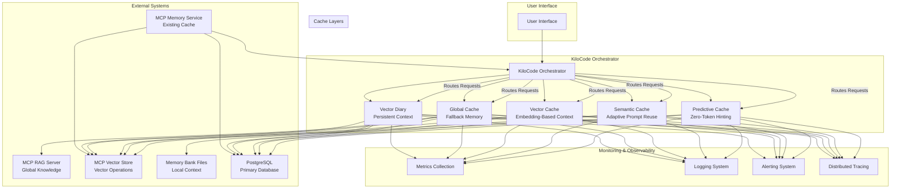

### 2.2 Cache Layer Details

#### 2.2.1 Predictive Cache (Zero-Token Hinting Layer)

**Purpose**: Anticipates upcoming context/queries and prefetches relevant data before actual requests are made.

**Key Features**:
- Machine learning-based prediction models
- Real-time query pattern analysis
- Prefetching of likely-needed data
- Adaptive learning from user behavior
- Zero-token hinting for LLM interactions

**Storage**: Redis for fast access, PostgreSQL for model persistence

**MCP Tools**:
- `predict_context`: Predicts upcoming context needs
- `update_prediction_model`: Updates prediction models
- `get_predictive_cache_stats`: Retrieves cache statistics
- `clear_predictive_cache`: Clears cache contents
- `prefetch_context`: Prefetches predicted data

#### 2.2.2 Semantic Cache (Adaptive Prompt Reuse Layer)

**Purpose**: Reuses previously successful prompts and responses to avoid redundant LLM calls.

**Key Features**:
- Semantic similarity matching
- Prompt-response pair storage
- Adaptive reuse based on success metrics
- Context-aware prompt optimization
- Automatic deduplication

**Storage**: PostgreSQL with pgvector for semantic search

**MCP Tools**:
- `search_semantic_cache`: Searches for similar prompts
- `store_semantic_pair`: Stores prompt-response pairs
- `update_semantic_entry`: Updates existing entries
- `get_semantic_cache_stats`: Retrieves cache statistics
- `clear_semantic_cache`: Clears cache contents
- `optimize_semantic_index`: Optimizes search indexes

#### 2.2.3 Vector Cache (Embedding-Based Context Selector)

**Purpose**: Selects and reranks context elements based on embedding similarity.

**Key Features**:
- High-dimensional vector similarity search
- Context element ranking and selection
- Dynamic context window optimization
- Multi-modal embedding support
- Real-time context adaptation

**Storage**: PostgreSQL with pgvector, ChromaDB, FAISS

**MCP Tools**:
- `search_vector_cache`: Searches context elements
- `add_context_element`: Adds new context elements
- `update_context_element`: Updates existing elements
- `delete_context_element`: Removes elements
- `get_vector_cache_stats`: Retrieves cache statistics
- `optimize_vector_index`: Optimizes vector indexes
- `batch_vector_operations`: Batch operations support

#### 2.2.4 Global Knowledge Cache (Fallback Memory)

**Purpose**: Provides fallback knowledge base using persistent LLM training data.

**Key Features**:
- Comprehensive knowledge base
- Fallback mechanism for cache misses
- Knowledge validation and verification
- Cross-domain knowledge integration
- Continuous learning and updates

**Storage**: PostgreSQL with MCP RAG Server integration

**MCP Tools**:
- `search_global_knowledge`: Searches knowledge base
- `update_knowledge_base`: Updates knowledge entries
- `validate_knowledge_entry`: Validates knowledge
- `get_global_cache_stats`: Retrieves cache statistics
- `clear_global_cache`: Clears cache contents
- `sync_with_rag_server`: Synchronizes with RAG server
- `manage_knowledge_domains`: Manages knowledge domains

#### 2.2.5 Persistent Context Memory (Vector Diary)

**Purpose**: Foundation for longitudinal reasoning across sessions.

**Key Features**:
- Long-term context persistence
- Pattern recognition and analysis
- Session continuity maintenance
- Context evolution tracking
- Privacy-preserving storage

**Storage**: PostgreSQL with vector embeddings, local memory bank files

**MCP Tools**:
- `add_diary_entry`: Adds new diary entries
- `search_diary`: Searches diary entries
- `update_diary_entry`: Updates existing entries
- `delete_diary_entry`: Removes entries
- `get_diary_stats`: Retrieves diary statistics
- `analyze_session_patterns`: Analyzes session patterns
- `export_diary_data`: Exports diary data

## 3. Integration Architecture

### 3.1 MCP Integration Patterns

#### 3.1.1 KiloCode Integration

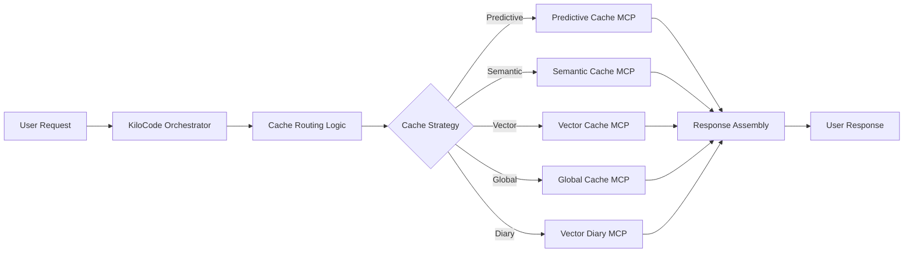

**Integration Points**:
- **Request Routing**: KiloCode routes requests based on cache strategy
- **Response Assembly**: Combines responses from multiple cache layers
- **Fallback Handling**: Graceful degradation when cache layers fail
- **Load Balancing**: Distributes load across cache layers
- **Health Monitoring**: Monitors cache layer health

#### 3.1.2 External System Integration

```mermaid
graph TB
    subgraph "Cache Layers"
        PC[Predictive Cache]
        SC[Semantic Cache]
        VC[Vector Cache]
        GC[Global Cache]
        VD[Vector Diary]
    end
    
    subgraph "External Systems"
        MCP_RAG[MCP RAG Server]
        MCP_Vector[MCP Vector Store]
        Memory_Bank[Memory Bank Files]
        MCP_Memory[MCP Memory Service]
        PostgreSQL[PostgreSQL]
    end
    
    PC -->|Read/Write| MCP_Vector
    PC -->|Model Storage| PostgreSQL
    
    SC -->|Semantic Search| MCP_Vector
    SC -->|Data Storage| PostgreSQL
    
    VC -->|Vector Operations| MCP_Vector
    VC -->|Data Storage| PostgreSQL
    
    GC -->|Knowledge Search| MCP_RAG
    GC -->|Vector Search| MCP_Vector
    GC -->|Data Storage| PostgreSQL
    
    VD -->|Vector Search| MCP_Vector
    VD -->|Data Storage| PostgreSQL
    VD -->|Local Storage| Memory_Bank
    
    MCP_Memory -->|Cache Operations| MCP_Vector
    MCP_Memory -->|Data Storage| PostgreSQL
```

**Integration Patterns**:
- **Read-Through Cache**: Data loaded from external systems on cache miss
- **Write-Through Cache**: Data written to both cache and external systems
- **Write-Behind Cache**: Data written to cache first, then to external systems
- **Cache-Aside**: Application manages cache separately from data store
- **Refresh-Ahead**: Proactively refresh data before expiration

### 3.2 Data Flow Architecture

#### 3.2.1 Request Flow

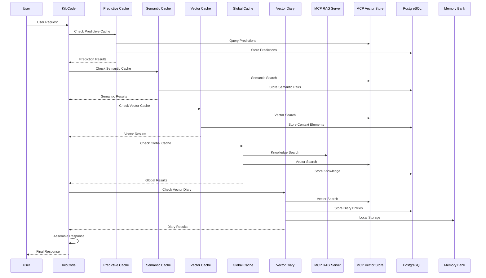

#### 3.2.2 Cache Invalidation Flow

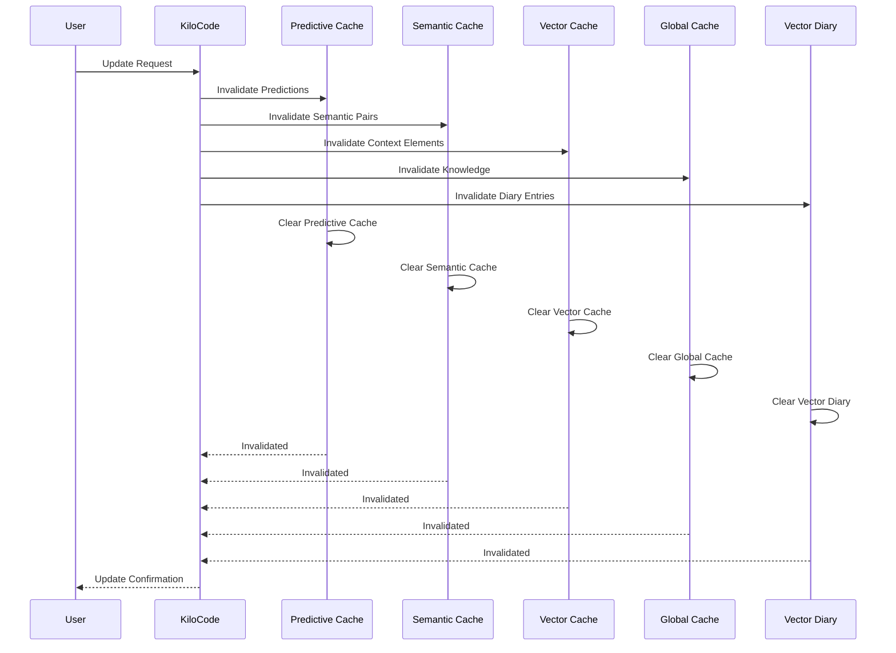

## 4. Performance Architecture

### 4.1 Performance Optimization Strategies

#### 4.1.1 Multi-Level Caching

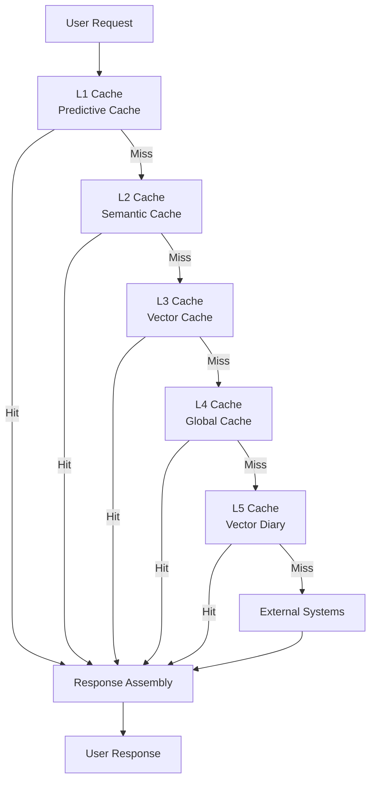

**Optimization Benefits**:
- **Reduced Latency**: Each cache layer reduces response time
- **Lower Resource Usage**: Fewer external system calls
- **Improved Throughput**: Better request handling capacity
- **Enhanced Reliability**: Multiple fallback mechanisms

#### 4.1.2 Intelligent Data Prefetching

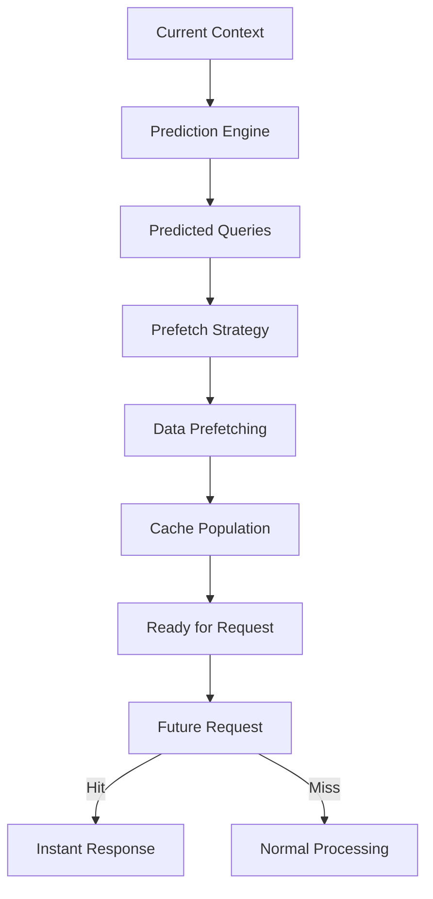

**Prefetching Strategies**:
- **Pattern-Based**: Learn from historical request patterns
- **Context-Aware**: Consider current conversation context
- **Time-Based**: Anticipate time-related requests
- **User-Based**: Personalized predictions per user
- **Session-Based**: Session-specific pattern recognition

### 4.2 Scalability Architecture

#### 4.2.1 Horizontal Scaling

```mermaid
graph TB
    subgraph "Load Balancer"
        LB[Load Balancer]
    end
    
    subgraph "Predictive Cache Cluster"
        PC1[Predictive Cache 1]
        PC2[Predictive Cache 2]
        PC3[Predictive Cache 3]
    end
    
    subgraph "Semantic Cache Cluster"
        SC1[Semantic Cache 1]
        SC2[Semantic Cache 2]
        SC3[Semantic Cache 3]
    end
    
    subgraph "Vector Cache Cluster"
        VC1[Vector Cache 1]
        VC2[Vector Cache 2]
        VC3[Vector Cache 3]
    end
    
    subgraph "Global Cache Cluster"
        GC1[Global Cache 1]
        GC2[Global Cache 2]
        GC3[Global Cache 3]
    end
    
    subgraph "Vector Diary Cluster"
        VD1[Vector Diary 1]
        VD2[Vector Diary 2]
        VD3[Vector Diary 3]
    end
    
    LB --> PC1
    LB --> PC2
    LB --> PC3
    
    LB --> SC1
    LB --> SC2
    LB --> SC3
    
    LB --> VC1
    LB --> VC2
    LB --> VC3
    
    LB --> GC1
    LB --> GC2
    LB --> GC3
    
    LB --> VD1
    LB --> VD2
    LB --> VD3
```

**Scaling Strategies**:
- **Stateless Design**: Each cache layer instance is stateless
- **Shared Storage**: Centralized database for consistency
- **Load Distribution**: Intelligent load balancing across instances
- **Auto-Scaling**: Dynamic scaling based on demand
- **Health Monitoring**: Automatic failover and recovery

#### 4.2.2 Resource Optimization

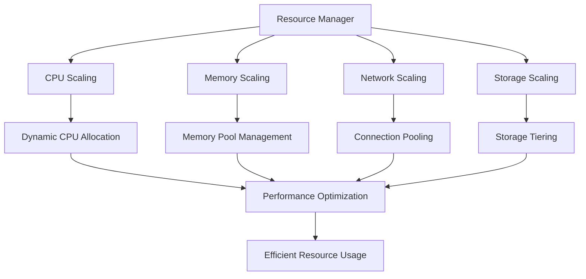

**Resource Optimization Techniques**:
- **Dynamic Resource Allocation**: Adjust resources based on demand
- **Connection Pooling**: Reuse database connections
- **Memory Management**: Efficient memory usage and garbage collection
- **Network Optimization**: Minimize network latency and bandwidth
- **Storage Tiering**: Optimize storage access patterns

## 5. Security Architecture

### 5.1 Security Framework

#### 5.1.1 Security Layers

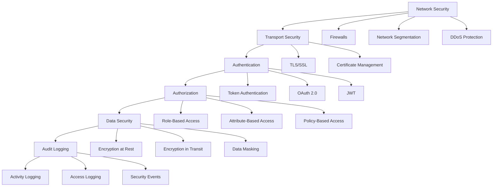

**Security Features**:
- **Network Security**: Firewalls, segmentation, DDoS protection
- **Transport Security**: TLS/SSL encryption, certificate management
- **Authentication**: Multiple authentication methods
- **Authorization**: Fine-grained access control
- **Data Security**: End-to-end encryption
- **Audit Logging**: Comprehensive security event logging

#### 5.1.2 Data Protection

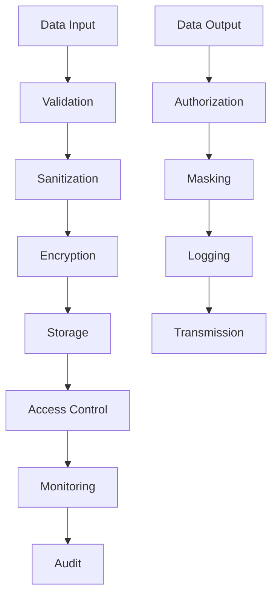

**Data Protection Measures**:
- **Input Validation**: Prevent injection attacks
- **Data Sanitization**: Remove malicious content
- **Encryption**: Protect data at rest and in transit
- **Access Control**: Restrict data access
- **Monitoring**: Detect unauthorized access
- **Audit Logging**: Track data access and modifications

### 5.2 Compliance and Governance

#### 5.2.1 Regulatory Compliance

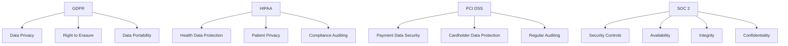

**Compliance Requirements**:
- **Data Privacy**: Protect user data and privacy
- **Security Controls**: Implement appropriate security measures
- **Audit Requirements**: Maintain audit trails
- **Regular Assessments**: Conduct regular security assessments
- **Incident Response**: Establish incident response procedures

## 6. Monitoring and Observability

### 6.1 Monitoring Architecture

#### 6.1.1 Monitoring Stack

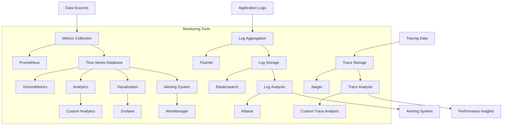

**Monitoring Components**:
- **Metrics Collection**: Collect performance and health metrics
- **Log Aggregation**: Centralize application logs
- **Distributed Tracing**: Track request flows
- **Alerting**: Proactive issue detection
- **Visualization**: Real-time dashboards
- **Analytics**: Performance analysis and optimization

#### 6.1.2 Performance Metrics

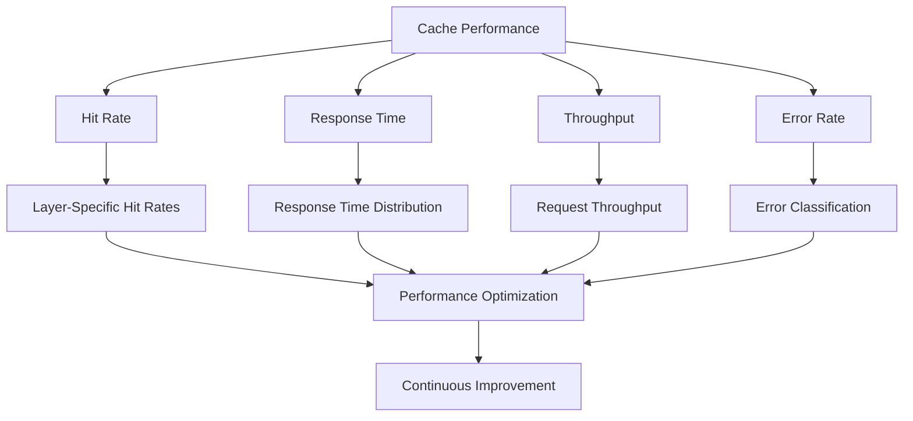

**Key Performance Metrics**:
- **Cache Hit Rates**: Measure cache effectiveness
- **Response Times**: Monitor performance
- **Throughput**: Track system capacity
- **Error Rates**: Identify issues
- **Resource Usage**: Monitor resource consumption

### 6.2 Alerting and Incident Management

#### 6.2.1 Alert Configuration

```yaml
# Alert Configuration Example
alert_rules:
  - name: "High Error Rate"
    condition: "error_rate > 0.1"
    severity: "critical"
    notification: ["email", "slack", "pagerduty"]
    escalation: true
    timeout: 30m
    
  - name: "Low Cache Hit Rate"
    condition: "hit_rate < 0.5"
    severity: "warning"
    notification: ["email", "slack"]
    escalation: false
    timeout: 1h
    
  - name: "High Response Time"
    condition: "response_time > 1000ms"
    severity: "warning"
    notification: ["email"]
    escalation: false
    timeout: 30m
```

**Alert Management**:
- **Rule-Based Alerts**: Configurable alert rules
- **Multi-Channel Notifications**: Email, Slack, PagerDuty
- **Escalation Procedures**: Automatic escalation for critical issues
- **Timeout Handling**: Alert timeout and suppression
- **Incident Tracking**: Integration with incident management systems

## 7. Deployment Architecture

### 7.1 Deployment Strategies

#### 7.1.1 Multi-Environment Deployment

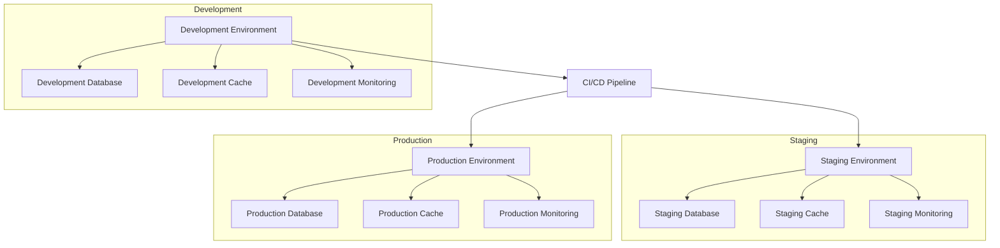

**Deployment Strategies**:
- **Environment Separation**: Separate environments for development, staging, and production
- **CI/CD Pipeline**: Automated build, test, and deployment
- **Blue-Green Deployment**: Zero-downtime deployments
- **Canary Releases**: Gradual rollout of new features
- **Rollback Strategy**: Quick rollback capabilities

#### 7.1.2 Container Orchestration

```yaml
# Kubernetes Deployment Example
apiVersion: apps/v1
kind: Deployment
metadata:
  name: cache-system
  namespace: cache-system
spec:
  replicas: 3
  selector:
    matchLabels:
      app: cache-system
  template:
    metadata:
      labels:
        app: cache-system
    spec:
      containers:
      - name: predictive-cache
        image: cache-system/predictive-cache:1.0.0
        ports:
        - containerPort: 8001
        resources:
          requests:
            memory: "512Mi"
            cpu: "250m"
          limits:
            memory: "1Gi"
            cpu: "500m"
      - name: semantic-cache
        image: cache-system/semantic-cache:1.0.0
        ports:
        - containerPort: 8002
        resources:
          requests:
            memory: "512Mi"
            cpu: "250m"
          limits:
            memory: "1Gi"
            cpu: "500m"
      - name: vector-cache
        image: cache-system/vector-cache:1.0.0
        ports:
        - containerPort: 8003
        resources:
          requests:
            memory: "1Gi"
            cpu: "500m"
          limits:
            memory: "2Gi"
            cpu: "1000m"
```

**Container Orchestration**:
- **Kubernetes**: Container orchestration platform
- **Resource Management**: CPU and memory limits
- **Health Checks**: Automated health monitoring
- **Auto-Scaling**: Dynamic scaling based on demand
- **Service Discovery**: Service registration and discovery

### 7.2 Backup and Recovery

#### 7.2.1 Backup Strategy

```yaml
# Backup Configuration
backup_strategy:
  databases:
    postgresql:
      schedule: "0 2 * * *"  # Daily at 2 AM
      retention:
        daily: 7
        weekly: 4
        monthly: 12
      compression: true
      encryption: true
      storage:
        type: "s3"
        bucket: "cache-system-backups"
        prefix: "postgresql/"
  
  configuration:
    schedule: "0 1 * * *"  # Daily at 1 AM
    retention: 30
    storage:
      type: "git"
      repository: "https://github.com/cache-system/config-backups.git"
      branch: "main"
  
  application:
    schedule: "0 3 * * *"  # Daily at 3 AM
    retention: 7
    storage:
      type: "s3"
      bucket: "cache-system-backups"
      prefix: "application/"
```

**Backup Strategy**:
- **Regular Backups**: Automated daily backups
- **Multiple Storage Locations**: Cloud and local storage
- **Encryption**: Data encryption at rest
- **Retention Policies**: Configurable retention periods
- **Recovery Testing**: Regular recovery testing

#### 7.2.2 Disaster Recovery

```yaml
# Disaster Recovery Configuration
disaster_recovery:
  strategy: "active-passive"
  
  primary_region: "us-east-1"
  secondary_region: "us-west-2"
  
  replication:
    databases:
      postgresql:
        enabled: true
        method: "logical"
        lag_threshold: 30  # seconds
        sync_mode: "async"
    
    application:
      enabled: true
      method: "container"
      health_check_interval: 30  # seconds
      failover_threshold: 3
  
  failover:
    enabled: true
    automatic: true
    cooldown_period: 300  # seconds
    health_check_endpoints:
      - "/health"
      - "/ready"
  
  recovery:
    enabled: true
    rpo: 300  # seconds
    rto: 600  # seconds
    test_schedule: "monthly"
```

**Disaster Recovery**:
- **Active-Passive Setup**: Primary and secondary regions
- **Data Replication**: Real-time data replication
- **Automatic Failover**: Automatic failover to secondary region
- **Recovery Objectives**: Defined RPO and RTO targets
- **Regular Testing**: Monthly disaster recovery testing

## 8. Implementation Roadmap

### 8.1 Phased Implementation

#### 8.1.1 Phase 1: Foundation (Months 1-2)

**Objectives**:
- Set up basic infrastructure
- Implement core cache layers
- Establish monitoring and logging

**Key Activities**:
- Deploy PostgreSQL databases
- Set up Redis for predictive cache
- Implement basic monitoring
- Create initial configuration management
- Set up CI/CD pipeline

**Success Criteria**:
- All cache layers deployed
- Basic monitoring operational
- Configuration management in place
- CI/CD pipeline functional

#### 8.1.2 Phase 2: Core Implementation (Months 3-4)

**Objectives**:
- Implement core cache functionality
- Set up MCP integration
- Establish performance baselines

**Key Activities**:
- Implement predictive cache algorithms
- Set up semantic search capabilities
- Integrate with MCP servers
- Establish performance monitoring
- Create initial dashboards

**Success Criteria**:
- All cache layers functional
- MCP integration working
- Performance metrics collected
- Initial dashboards operational

#### 8.1.3 Phase 3: Optimization (Months 5-6)

**Objectives**:
- Optimize performance
- Implement advanced features
- Scale the system

**Key Activities**:
- Performance tuning and optimization
- Implement advanced caching strategies
- Set up auto-scaling
- Implement advanced monitoring
- Create comprehensive dashboards

**Success Criteria**:
- Performance targets met
- Advanced features implemented
- System scaled appropriately
- Comprehensive monitoring in place

#### 8.1.4 Phase 4: Production Deployment (Months 7-8)

**Objectives**:
- Deploy to production
- Establish operational procedures
- Implement security measures

**Key Activities**:
- Production deployment
- Security implementation
- Operational procedures documentation
- Training and documentation
- Performance validation

**Success Criteria**:
- Production deployment successful
- Security measures implemented
- Operational procedures documented
- Team trained and ready

### 8.2 Risk Management

#### 8.2.1 Risk Assessment

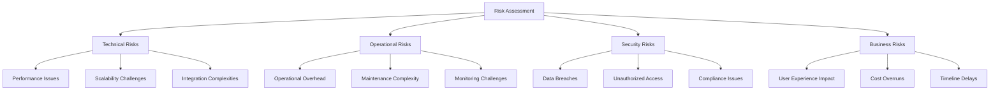

**Risk Categories**:
- **Technical Risks**: Performance, scalability, integration
- **Operational Risks**: Overhead, maintenance, monitoring
- **Security Risks**: Data breaches, access, compliance
- **Business Risks**: User experience, costs, timeline

#### 8.2.2 Mitigation Strategies

```yaml
# Risk Mitigation Plan
risks:
  - name: "Performance Degradation"
    probability: "medium"
    impact: "high"
    mitigation:
      - "Implement performance monitoring"
      - "Regular performance testing"
      - "Capacity planning"
      - "Load testing"
    
  - name: "Data Corruption"
    probability: "low"
    impact: "critical"
    mitigation:
      - "Data validation checks"
      - "Regular backups"
      - "Data integrity checks"
      - "Recovery procedures"
    
  - name: "Security Breaches"
    probability: "medium"
    impact: "critical"
    mitigation:
      - "Regular security audits"
      - "Access controls"
      - "Encryption"
      - "Incident response plan"
    
  - name: "Integration Failures"
    probability: "medium"
    impact: "high"
    mitigation:
      - "Comprehensive testing"
      - "Fallback mechanisms"
      - "Monitoring integration points"
      - "Regular health checks"
```

**Mitigation Strategies**:
- **Preventive Measures**: Proactive measures to prevent risks
- **Detection Systems**: Early detection of potential issues
- **Response Procedures**: Established response procedures
- **Recovery Plans**: Recovery plans for various scenarios

## 9. Conclusion

### 9.1 Architecture Summary

The Intelligent Caching Architecture represents a comprehensive solution for optimizing performance, reducing latency, and enhancing user experience across the MCP ecosystem. The five-layer cache architecture provides intelligent, context-aware caching capabilities while maintaining modularity, scalability, and reliability.

### 9.2 Key Benefits

- **Performance Optimization**: Significant reduction in response times
- **Cost Efficiency**: Minimized token usage and resource consumption
- **Enhanced User Experience**: Context-aware, personalized interactions
- **Scalability**: Modular design allows independent scaling
- **Reliability**: Multiple fallback mechanisms ensure availability
- **Maintainability**: Clear separation of concerns and well-defined interfaces

### 9.3 Implementation Recommendations

1. **Start with Foundation**: Begin with basic infrastructure and core functionality
2. **Iterative Development**: Implement in phases with regular validation
3. **Focus on Performance**: Prioritize performance optimization throughout development
4. **Establish Monitoring**: Implement comprehensive monitoring from the start
5. **Security First**: Implement security measures early and continuously
6. **Documentation**: Maintain thorough documentation throughout development
7. **Team Training**: Ensure team is trained on new technologies and processes

### 9.4 Future Considerations

The architecture is designed to be flexible and extensible, allowing for future enhancements such as:
- **Machine Learning Integration**: Advanced ML models for better predictions
- **Multi-Modal Support**: Integration with various data types and formats
- **Edge Computing**: Support for edge-based caching
- **Quantum Computing**: Exploration of quantum computing for cache optimization
- **Blockchain Integration**: Blockchain-based data integrity and security

### 9.5 Success Metrics

The success of the architecture will be measured by:
- **Performance Metrics**: Response time reduction, hit rate improvement
- **Business Metrics**: User satisfaction, cost savings, revenue impact
- **Operational Metrics**: System reliability, maintenance overhead
- **Technical Metrics**: Scalability, security, compliance

By implementing this architecture, organizations can achieve significant improvements in system performance, user experience, and operational efficiency while maintaining the flexibility to adapt to future requirements and technologies.