# Data Flow Patterns for Intelligent Caching Architecture

## 1. Overview

This document details the data flow patterns between cache layers and external systems in the Intelligent Caching Architecture. The design ensures efficient data movement, proper cache coordination, and optimal performance across all components.

## 2. System Architecture Overview

### 2.1 Core Components

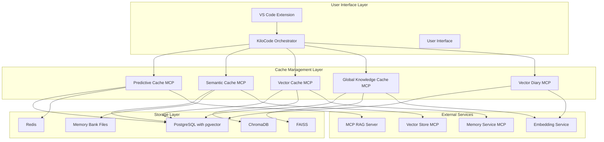
```mermaid
graph TB
    subgraph "User Interface Layer"
        A[VS Code Extension]
        B[KiloCode Orchestrator]
        C[User Interface]
    end
    
    subgraph "Cache Management Layer"
        D[Predictive Cache MCP]
        E[Semantic Cache MCP]
        F[Vector Cache MCP]
        G[Global Knowledge Cache MCP]
        H[Vector Diary MCP]
    end
    
    subgraph "Storage Layer"
        I[PostgreSQL with pgvector]
        J[Redis]
        K[Memory Bank Files]
        L[ChromaDB]
        M[FAISS]
    end
    
    subgraph "External Services"
        N[MCP RAG Server]
        O[Vector Store MCP]
        P[Memory Service MCP]
        Q[Embedding Service]
    end
    
    A --> B
    B --> D
    B --> E
    B --> F
    B --> G
    B --> H
    
    D --> I
    E --> I
    F --> I
    G --> I
    H --> I
    
    D --> J
    E --> K
    F --> L
    G --> M
    
    D --> N
    E --> O
    F --> P
    G --> Q
    H --> Q
```

## 3. Request Flow Patterns

### 3.1 Primary Request Flow

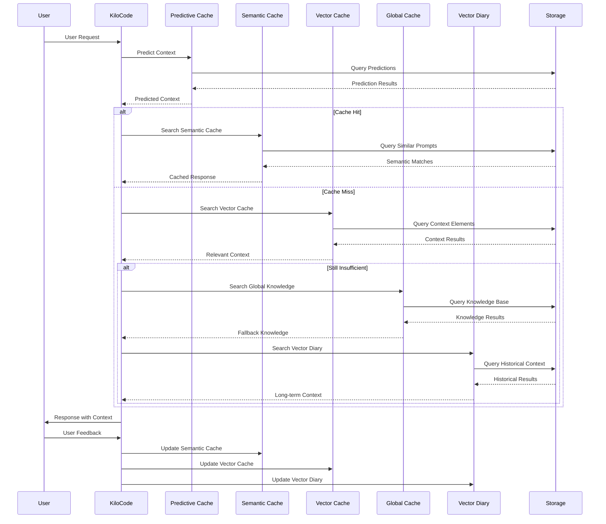
```mermaid
sequenceDiagram
    participant U as User
    participant K as KiloCode
    participant PC as Predictive Cache
    participant SC as Semantic Cache
    participant VC as Vector Cache
    participant GC as Global Cache
    participant VD as Vector Diary
    participant S as Storage
    
    U->>K: User Request
    K->>PC: Predict Context
    PC->>S: Query Predictions
    S-->>PC: Prediction Results
    PC-->>K: Predicted Context
    
    alt Cache Hit
        K->>SC: Search Semantic Cache
        SC->>S: Query Similar Prompts
        S-->>SC: Semantic Matches
        SC-->>K: Cached Response
    else Cache Miss
        K->>VC: Search Vector Cache
        VC->>S: Query Context Elements
        S-->>VC: Context Results
        VC-->>K: Relevant Context
        
        alt Still Insufficient
            K->>GC: Search Global Knowledge
            GC->>S: Query Knowledge Base
            S-->>GC: Knowledge Results
            GC-->>K: Fallback Knowledge
            
            K->>VD: Search Vector Diary
            VD->>S: Query Historical Context
            S-->>VD: Historical Results
            VD-->>K: Long-term Context
        end
    end
    
    K->>U: Response with Context
    U->>K: User Feedback
    K->>SC: Update Semantic Cache
    K->>VC: Update Vector Cache
    K->>VD: Update Vector Diary
```

### 3.2 Cache Invalidation Flow

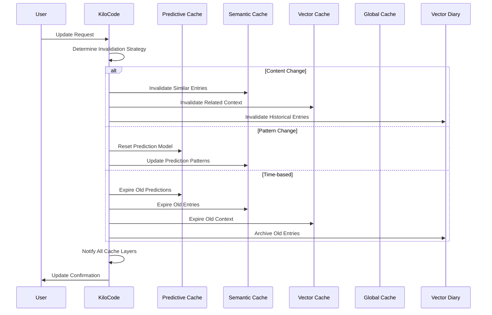
```mermaid
sequenceDiagram
    participant U as User
    participant K as KiloCode
    participant PC as Predictive Cache
    participant SC as Semantic Cache
    participant VC as Vector Cache
    participant GC as Global Cache
    participant VD as Vector Diary
    
    U->>K: Update Request
    K->>K: Determine Invalidation Strategy
    
    alt Content Change
        K->>SC: Invalidate Similar Entries
        K->>VC: Invalidate Related Context
        K->>VD: Invalidate Historical Entries
    else Pattern Change
        K->>PC: Reset Prediction Model
        K->>SC: Update Prediction Patterns
    else Time-based
        K->>PC: Expire Old Predictions
        K->>SC: Expire Old Entries
        K->>VC: Expire Old Context
        K->>VD: Archive Old Entries
    end
    
    K->>K: Notify All Cache Layers
    K->>U: Update Confirmation
```

## 4. Data Flow Patterns

### 4.1 Predictive Cache Data Flow

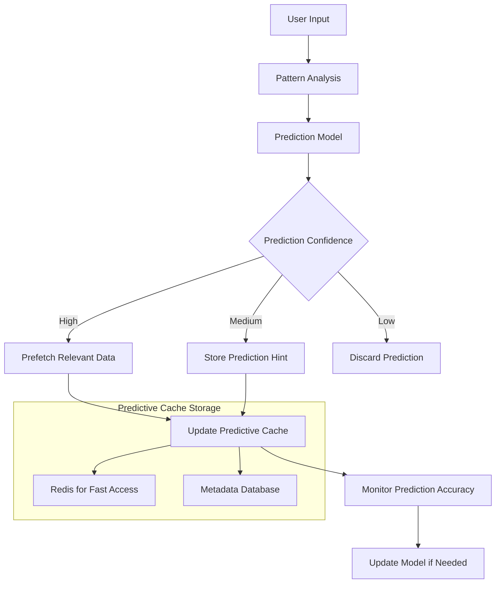
```mermaid
flowchart TD
    A[User Input] --> B[Pattern Analysis]
    B --> C[Prediction Model]
    C --> D{Prediction Confidence}
    
    D -->|High| E[Prefetch Relevant Data]
    D -->|Medium| F[Store Prediction Hint]
    D -->|Low| G[Discard Prediction]
    
    E --> H[Update Predictive Cache]
    F --> H
    H --> I[Monitor Prediction Accuracy]
    I --> J[Update Model if Needed]
    
    subgraph "Predictive Cache Storage"
        H --> K[Redis for Fast Access]
        H --> L[Metadata Database]
    end
```

### 4.2 Semantic Cache Data Flow

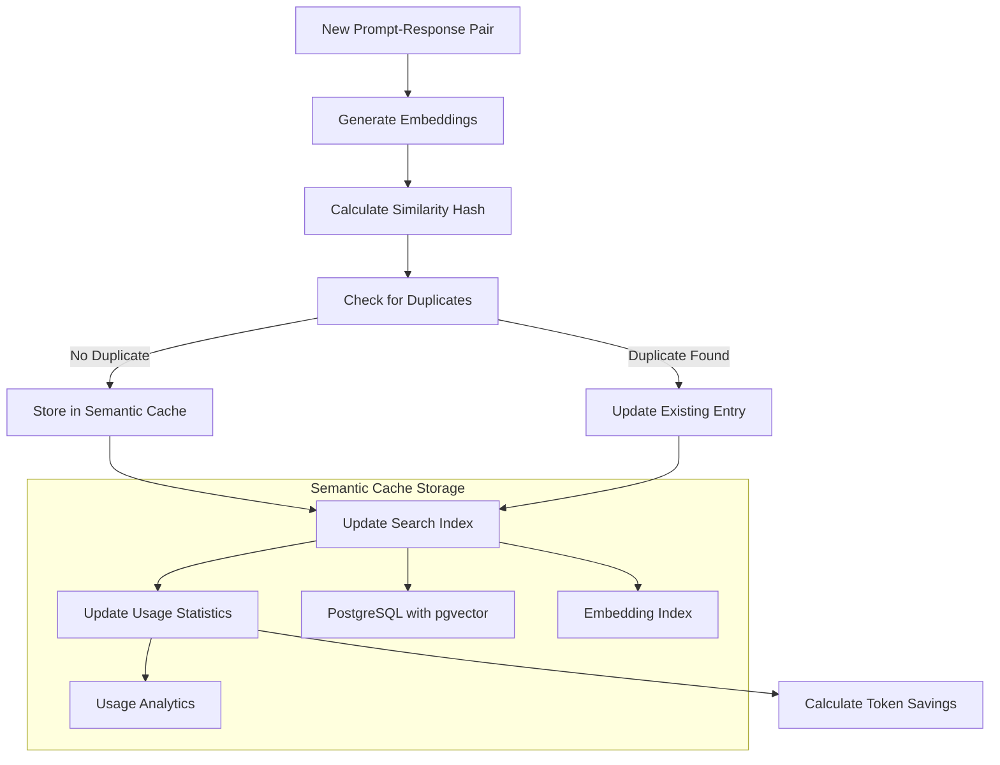
```mermaid
flowchart TD
    A[New Prompt-Response Pair] --> B[Generate Embeddings]
    B --> C[Calculate Similarity Hash]
    C --> D[Check for Duplicates]
    
    D -->|No Duplicate| E[Store in Semantic Cache]
    D -->|Duplicate Found| F[Update Existing Entry]
    
    E --> G[Update Search Index]
    F --> G
    G --> H[Update Usage Statistics]
    H --> I[Calculate Token Savings]
    
    subgraph "Semantic Cache Storage"
        G --> J[PostgreSQL with pgvector]
        G --> K[Embedding Index]
        H --> L[Usage Analytics]
    end
```

### 4.3 Vector Cache Data Flow

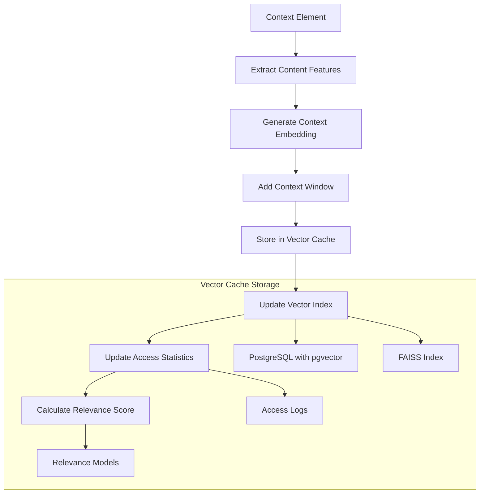
```mermaid
flowchart TD
    A[Context Element] --> B[Extract Content Features]
    B --> C[Generate Context Embedding]
    C --> D[Add Context Window]
    D --> E[Store in Vector Cache]
    
    E --> F[Update Vector Index]
    F --> G[Update Access Statistics]
    G --> H[Calculate Relevance Score]
    
    subgraph "Vector Cache Storage"
        F --> I[PostgreSQL with pgvector]
        F --> J[FAISS Index]
        G --> K[Access Logs]
        H --> L[Relevance Models]
    end
```

### 4.4 Global Knowledge Cache Data Flow

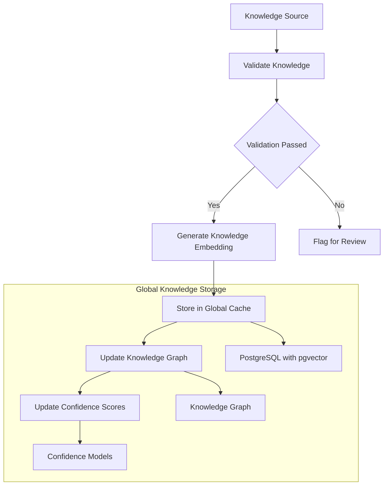
```mermaid
flowchart TD
    A[Knowledge Source] --> B[Validate Knowledge]
    B --> C{Validation Passed}
    
    C -->|Yes| D[Generate Knowledge Embedding]
    C -->|No| E[Flag for Review]
    
    D --> F[Store in Global Cache]
    F --> G[Update Knowledge Graph]
    G --> H[Update Confidence Scores]
    
    subgraph "Global Knowledge Storage"
        F --> I[PostgreSQL with pgvector]
        G --> J[Knowledge Graph]
        H --> K[Confidence Models]
    end
```

### 4.5 Vector Diary Data Flow

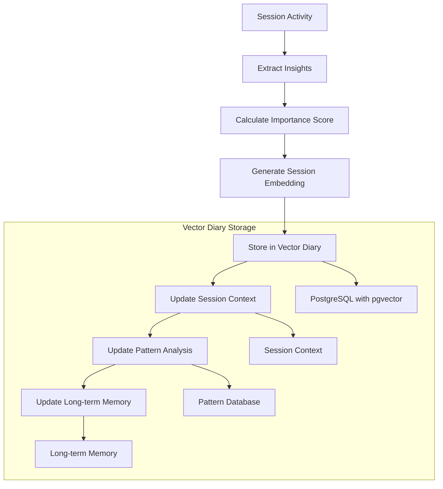
```mermaid
flowchart TD
    A[Session Activity] --> B[Extract Insights]
    B --> C[Calculate Importance Score]
    C --> D[Generate Session Embedding]
    D --> E[Store in Vector Diary]
    
    E --> F[Update Session Context]
    F --> G[Update Pattern Analysis]
    G --> H[Update Long-term Memory]
    
    subgraph "Vector Diary Storage"
        E --> I[PostgreSQL with pgvector]
        F --> J[Session Context]
        G --> K[Pattern Database]
        H --> L[Long-term Memory]
    end
```

## 5. Cache Coordination Patterns

### 5.1 Hierarchical Cache Access

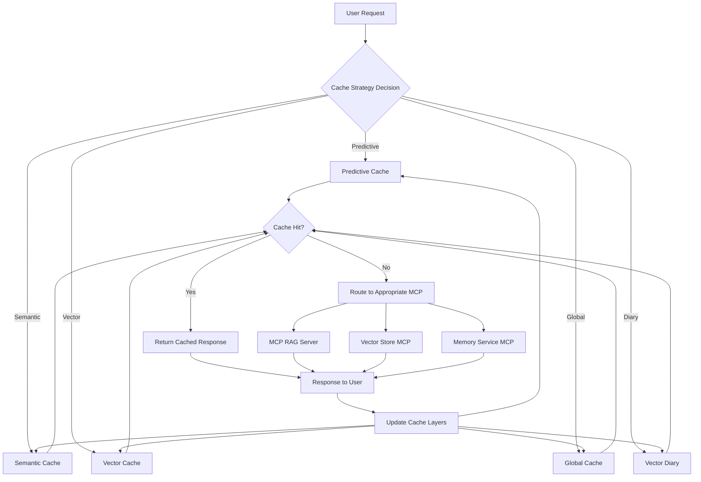
```mermaid
flowchart TD
    A[User Request] --> B{Cache Strategy Decision}
    
    B -->|Predictive| C[Predictive Cache]
    B -->|Semantic| D[Semantic Cache]
    B -->|Vector| E[Vector Cache]
    B -->|Global| F[Global Cache]
    B -->|Diary| G[Vector Diary]
    
    C --> H{Cache Hit?}
    D --> H
    E --> H
    F --> H
    G --> H
    
    H -->|Yes| I[Return Cached Response]
    H -->|No| J[Route to Appropriate MCP]
    
    J --> K[MCP RAG Server]
    J --> L[Vector Store MCP]
    J --> M[Memory Service MCP]
    
    I --> N[Response to User]
    K --> N
    L --> N
    M --> N
    
    N --> O[Update Cache Layers]
    O --> C
    O --> D
    O --> E
    O --> F
    O --> G
```

### 5.2 Cache Fallback Pattern

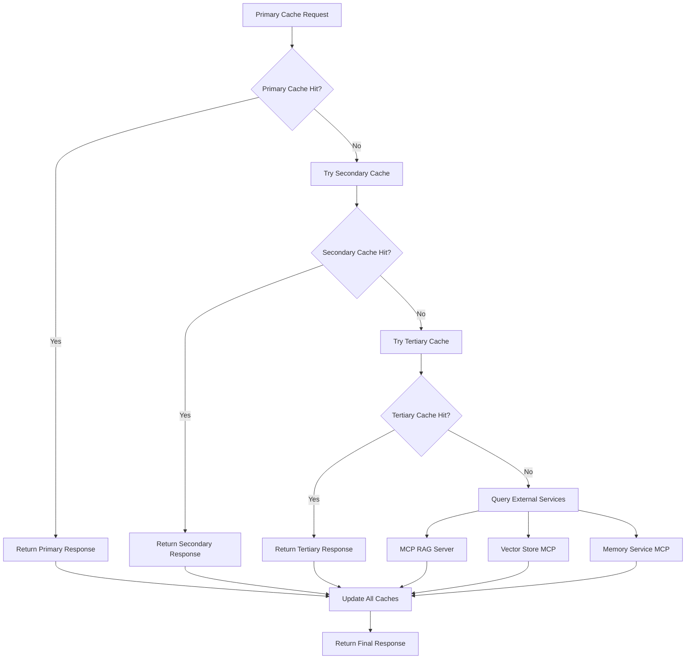
```mermaid
flowchart TD
    A[Primary Cache Request] --> B{Primary Cache Hit?}
    
    B -->|Yes| C[Return Primary Response]
    B -->|No| D[Try Secondary Cache]
    
    D --> E{Secondary Cache Hit?}
    E -->|Yes| F[Return Secondary Response]
    E -->|No| G[Try Tertiary Cache]
    
    G --> H{Tertiary Cache Hit?}
    H -->|Yes| I[Return Tertiary Response]
    H -->|No| J[Query External Services]
    
    J --> K[MCP RAG Server]
    J --> L[Vector Store MCP]
    J --> M[Memory Service MCP]
    
    C --> N[Update All Caches]
    F --> N
    I --> N
    K --> N
    L --> N
    M --> N
    
    N --> O[Return Final Response]
```

### 5.3 Cache Invalidation Pattern

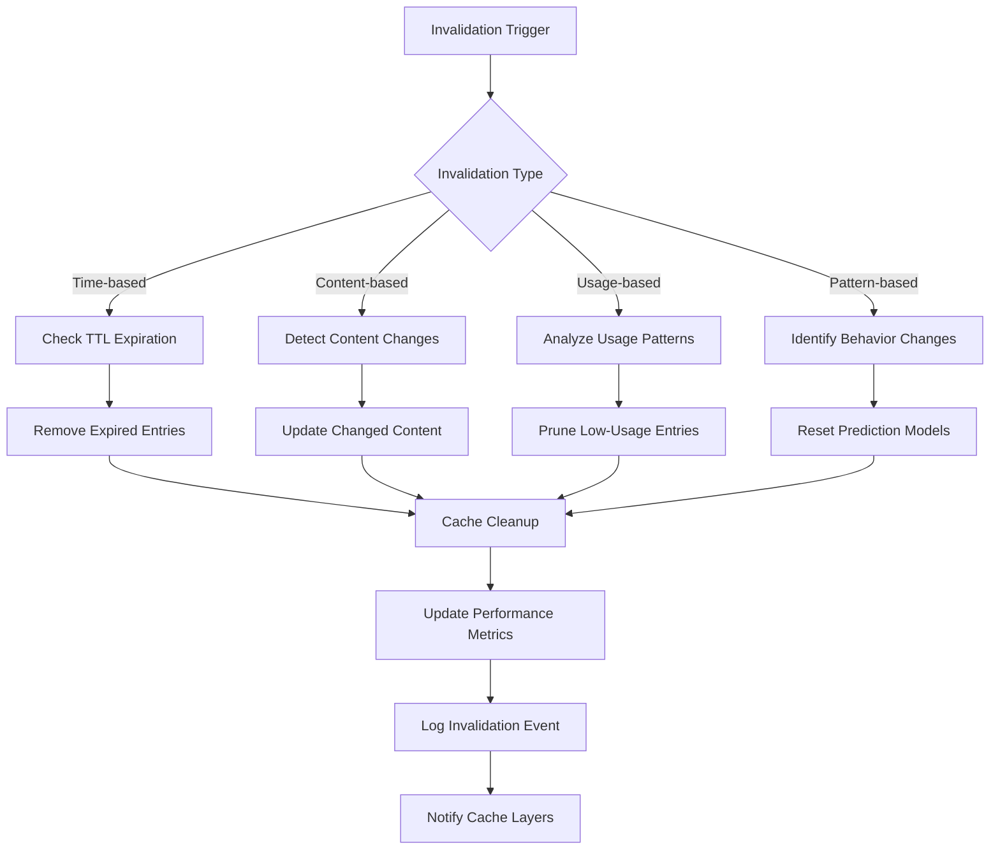
```mermaid
flowchart TD
    A[Invalidation Trigger] --> B{Invalidation Type}
    
    B -->|Time-based| C[Check TTL Expiration]
    B -->|Content-based| D[Detect Content Changes]
    B -->|Usage-based| E[Analyze Usage Patterns]
    B -->|Pattern-based| F[Identify Behavior Changes]
    
    C --> G[Remove Expired Entries]
    D --> H[Update Changed Content]
    E --> I[Prune Low-Usage Entries]
    F --> J[Reset Prediction Models]
    
    G --> K[Cache Cleanup]
    H --> K
    I --> K
    J --> K
    
    K --> L[Update Performance Metrics]
    L --> M[Log Invalidation Event]
    M --> N[Notify Cache Layers]
```

## 6. Performance Optimization Patterns

### 6.1 Batch Processing Pattern

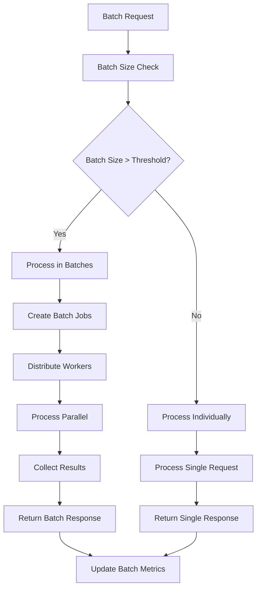
```mermaid
flowchart TD
    A[Batch Request] --> B[Batch Size Check]
    B --> C{Batch Size > Threshold?}
    
    C -->|Yes| D[Process in Batches]
    C -->|No| E[Process Individually]
    
    D --> F[Create Batch Jobs]
    F --> G[Distribute Workers]
    G --> H[Process Parallel]
    H --> I[Collect Results]
    I --> J[Return Batch Response]
    
    E --> K[Process Single Request]
    K --> L[Return Single Response]
    
    J --> M[Update Batch Metrics]
    L --> M
```

### 6.2 Prefetching Pattern

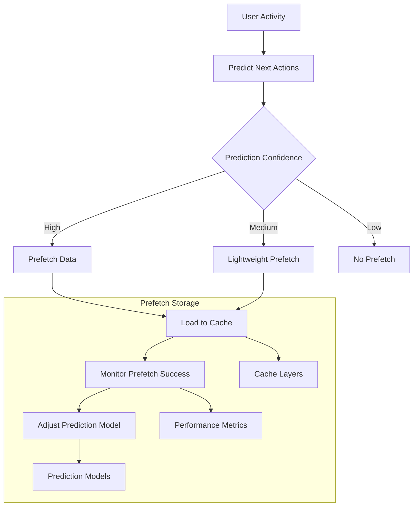
```mermaid
flowchart TD
    A[User Activity] --> B[Predict Next Actions]
    B --> C{Prediction Confidence}
    
    C -->|High| D[Prefetch Data]
    C -->|Medium| E[Lightweight Prefetch]
    C -->|Low| F[No Prefetch]
    
    D --> G[Load to Cache]
    E --> G
    G --> H[Monitor Prefetch Success]
    H --> I[Adjust Prediction Model]
    
    subgraph "Prefetch Storage"
        G --> J[Cache Layers]
        H --> K[Performance Metrics]
        I --> L[Prediction Models]
    end
```

### 6.3 Caching Hierarchy Pattern

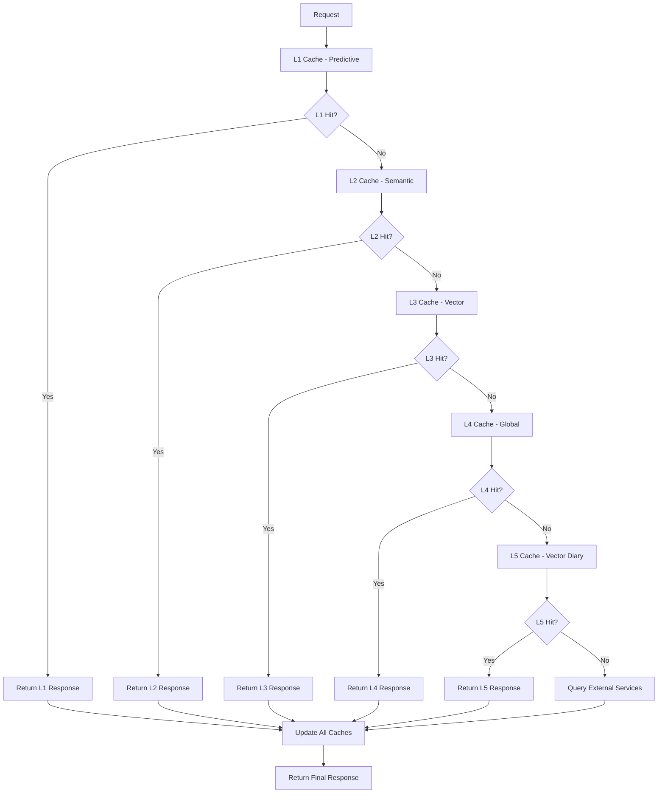
```mermaid
flowchart TD
    A[Request] --> B[L1 Cache - Predictive]
    B --> C{L1 Hit?}
    
    C -->|Yes| D[Return L1 Response]
    C -->|No| E[L2 Cache - Semantic]
    
    E --> F{L2 Hit?}
    F -->|Yes| G[Return L2 Response]
    F -->|No| H[L3 Cache - Vector]
    
    H --> I{L3 Hit?}
    I -->|Yes| J[Return L3 Response]
    I -->|No| K[L4 Cache - Global]
    
    K --> L{L4 Hit?}
    L -->|Yes| M[Return L4 Response]
    L -->|No| N[L5 Cache - Vector Diary]
    
    N --> O{L5 Hit?}
    O -->|Yes| P[Return L5 Response]
    O -->|No| Q[Query External Services]
    
    D --> R[Update All Caches]
    G --> R
    J --> R
    M --> R
    P --> R
    Q --> R
    
    R --> S[Return Final Response]
```

## 7. Error Handling Patterns

### 7.1 Cache Fallback Pattern

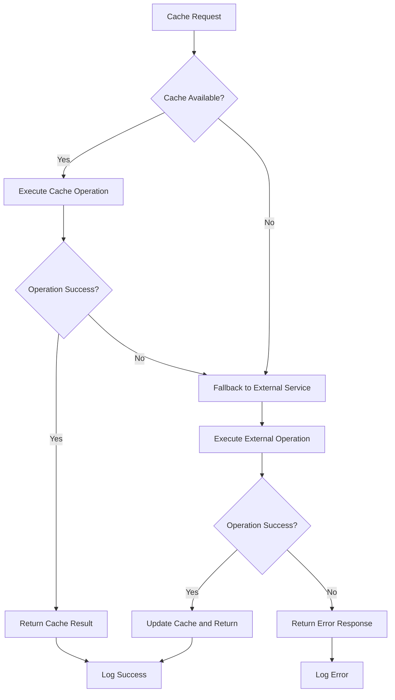
```mermaid
flowchart TD
    A[Cache Request] --> B{Cache Available?}
    
    B -->|Yes| C[Execute Cache Operation]
    B -->|No| D[Fallback to External Service]
    
    C --> E{Operation Success?}
    E -->|Yes| F[Return Cache Result]
    E -->|No| D
    
    D --> G[Execute External Operation]
    G --> H{Operation Success?}
    
    H -->|Yes| I[Update Cache and Return]
    H -->|No| J[Return Error Response]
    
    F --> K[Log Success]
    I --> K
    J --> L[Log Error]
```

### 7.2 Circuit Breaker Pattern

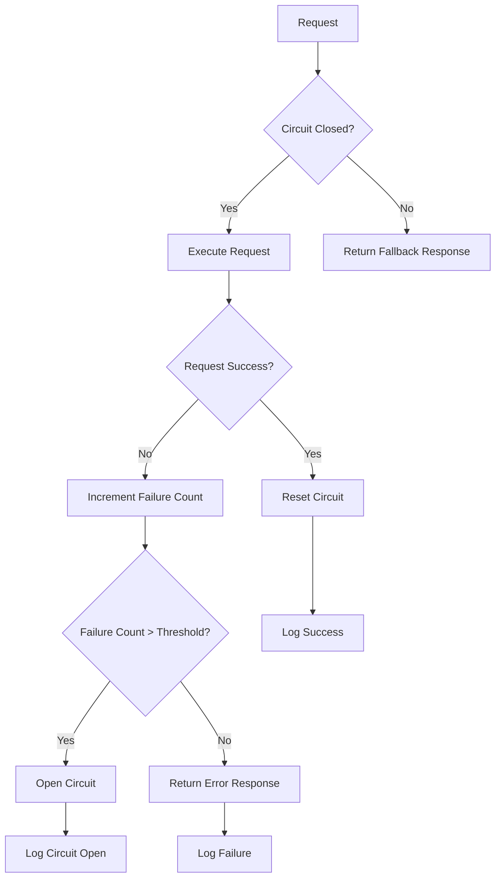
```mermaid
flowchart TD
    A[Request] --> B{Circuit Closed?}
    
    B -->|Yes| C[Execute Request]
    B -->|No| D[Return Fallback Response]
    
    C --> E{Request Success?}
    E -->|Yes| F[Reset Circuit]
    E -->|No| G[Increment Failure Count]
    
    G --> H{Failure Count > Threshold?}
    H -->|Yes| I[Open Circuit]
    H -->|No| J[Return Error Response]
    
    F --> K[Log Success]
    I --> L[Log Circuit Open]
    J --> M[Log Failure]
```

### 7.3 Retry Pattern

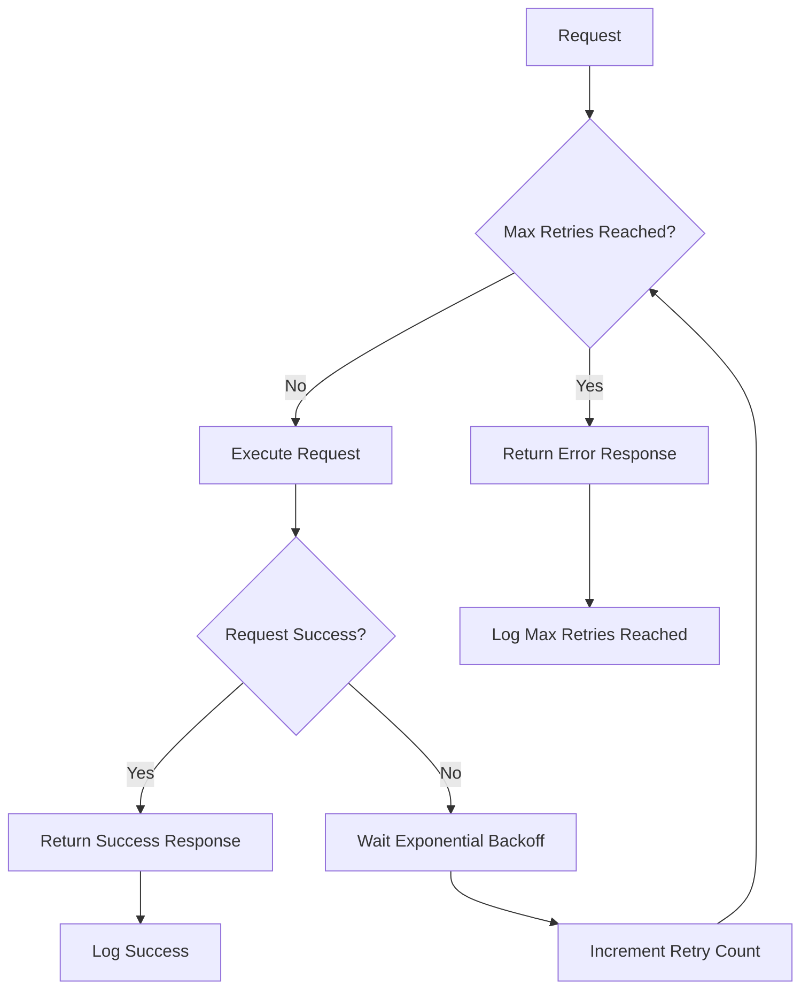
```mermaid
flowchart TD
    A[Request] --> B{Max Retries Reached?}
    
    B -->|No| C[Execute Request]
    B -->|Yes| D[Return Error Response]
    
    C --> E{Request Success?}
    E -->|Yes| F[Return Success Response]
    E -->|No| G[Wait Exponential Backoff]
    
    G --> H[Increment Retry Count]
    H --> B
    
    F --> I[Log Success]
    D --> J[Log Max Retries Reached]
```

## 8. Monitoring and Analytics Patterns

### 8.1 Metrics Collection Pattern

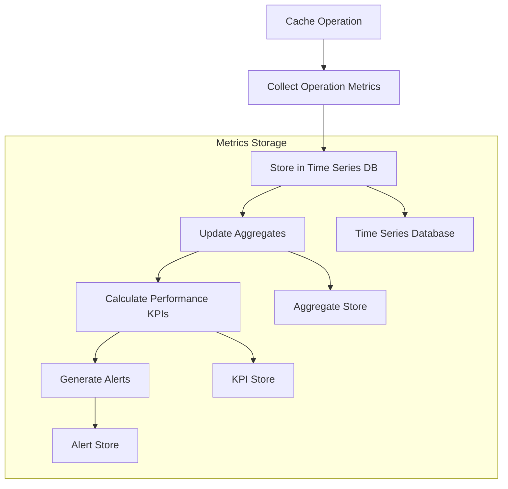
```mermaid
flowchart TD
    A[Cache Operation] --> B[Collect Operation Metrics]
    B --> C[Store in Time Series DB]
    C --> D[Update Aggregates]
    D --> E[Calculate Performance KPIs]
    E --> F[Generate Alerts]
    
    subgraph "Metrics Storage"
        C --> G[Time Series Database]
        D --> H[Aggregate Store]
        E --> I[KPI Store]
        F --> J[Alert Store]
    end
```

### 8.2 Health Check Pattern

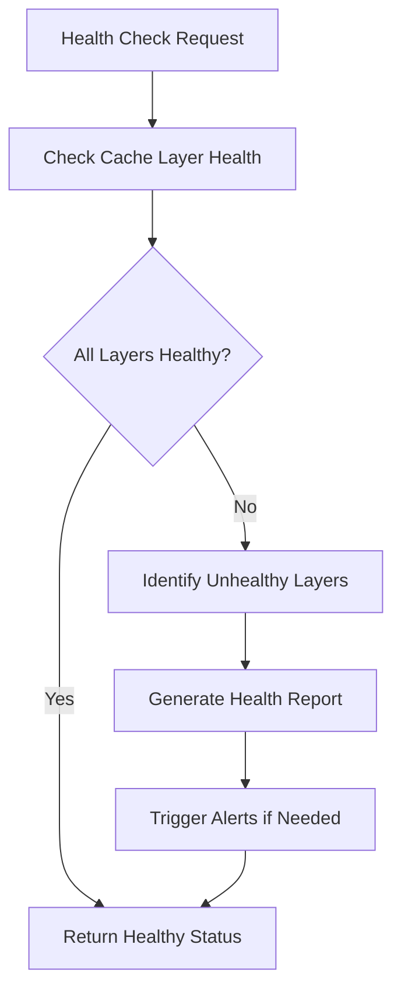
```mermaid
flowchart TD
    A[Health Check Request] --> B[Check Cache Layer Health]
    B --> C{All Layers Healthy?}
    
    C -->|Yes| D[Return Healthy Status]
    C -->|No| E[Identify Unhealthy Layers]
    E --> F[Generate Health Report]
    F --> G[Trigger Alerts if Needed]
    G --> D
```

### 8.3 Performance Analysis Pattern

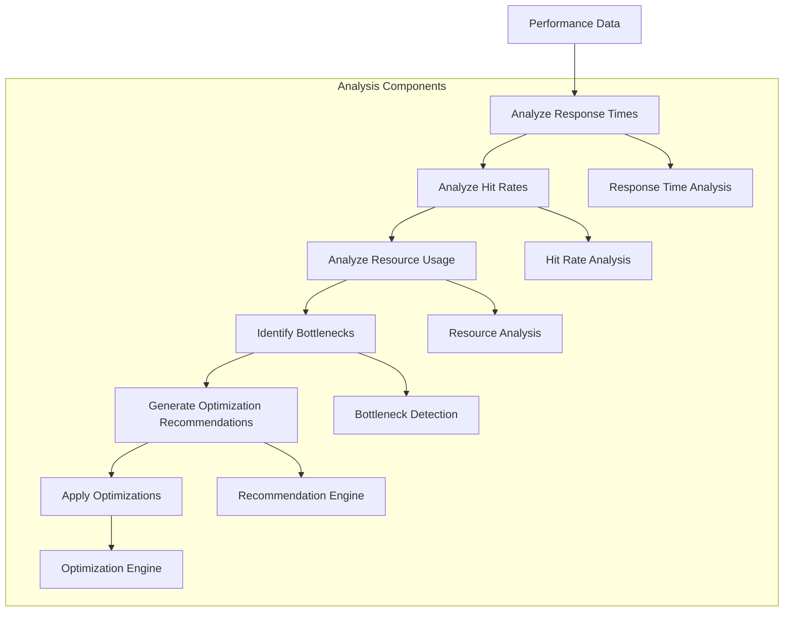
```mermaid
flowchart TD
    A[Performance Data] --> B[Analyze Response Times]
    B --> C[Analyze Hit Rates]
    C --> D[Analyze Resource Usage]
    D --> E[Identify Bottlenecks]
    E --> F[Generate Optimization Recommendations]
    F --> G[Apply Optimizations]
    
    subgraph "Analysis Components"
        B --> H[Response Time Analysis]
        C --> I[Hit Rate Analysis]
        D --> J[Resource Analysis]
        E --> K[Bottleneck Detection]
        F --> L[Recommendation Engine]
        G --> M[Optimization Engine]
    end
```

## 9. Data Synchronization Patterns

### 9.1 Event-Driven Synchronization

```mermaid
flowchart TD
    A[Data Change Event] --> B[Publish to Message Queue]
    B --> C[Subscribe Cache Layers]
    C --> D[Process Event]
    D --> E[Update Cache State]
    E --> F[Confirm Update]
    
    subgraph "Event System"
        B --> G[Message Queue]
        C --> H[Event Subscribers]
        F --> I[Confirmation System]
    end
```

### 9.2 Periodic Synchronization

```mermaid
flowchart TD
    A[Schedule Trigger] --> B[Check Sync Needed]
    B --> C{Sync Required?}
    
    C -->|Yes| D[Execute Sync Process]
    C -->|No| E[Wait Next Schedule]
    
    D --> F[Collect Changes]
    F --> G[Apply Changes]
    G --> H[Verify Consistency]
    H --> I[Log Sync Results]
    I --> E
    
    subgraph "Sync Components"
        F --> J[Change Detector]
        G --> K[Change Applier]
        H --> L[Consistency Checker]
        I --> M[Result Logger]
    end
```

### 9.3 Conflict Resolution Pattern

```mermaid
flowchart TD
    A[Concurrent Updates] --> B[Detect Conflicts]
    B --> C{Conflict Type}
    
    C -->|Write-Write| D[Apply Last Write Wins]
    C -->|Write-Read| E[Merge Changes]
    C -->|Read-Read| F[No Conflict Resolution Needed]
    
    D --> G[Resolve Conflict]
    E --> G
    G --> H[Update All Replicas]
    H --> I[Log Resolution]
    
    subgraph "Conflict Resolution"
        B --> J[Conflict Detector]
        G --> K[Resolution Engine]
        H --> L[Replica Manager]
        I --> M[Resolution Logger]
    end
```

## 10. Security Patterns

### 10.1 Data Encryption Pattern

```mermaid
flowchart TD
    A[Data to Store] --> B[Encrypt Data]
    B --> C[Store Encrypted Data]
    C --> D[Store Encryption Metadata]
    
    D --> E[Retrieve Data]
    E --> F[Decrypt Data]
    F --> G[Return Plaintext Data]
    
    subgraph "Encryption System"
        B --> H[Encryption Engine]
        F --> H
        D --> I[Metadata Store]
    end
```

### 10.2 Access Control Pattern

```mermaid
flowchart TD
    A[Access Request] --> B[Verify Authentication]
    B --> C{Authenticated?}
    
    C -->|Yes| D[Check Authorization]
    C -->|No| E[Deny Access]
    
    D --> F{Authorized?}
    F -->|Yes| G[Grant Access]
    F -->|No| E
    
    G --> H[Log Access]
    E --> I[Log Denial]
    
    subgraph "Access Control"
        B --> J[Authentication Service]
        D --> K[Authorization Service]
        H --> L[Access Logger]
        I --> L
    end
```

### 10.3 Audit Logging Pattern

```mermaid
flowchart TD
    A[Cache Operation] --> B[Capture Operation Details]
    B --> C[Generate Audit Event]
    C --> D[Store in Audit Log]
    D --> E[Index for Search]
    E --> F[Set Retention Policy]
    
    subgraph "Audit System"
        B --> G[Event Capture]
        C --> H[Event Generation]
        D --> I[Log Storage]
        E --> J[Search Index]
        F --> K[Retention Manager]
    end
```

## 11. Implementation Guidelines

### 11.1 Data Flow Optimization

1. **Minimize Cross-Service Calls**: Use batch operations to reduce network overhead
2. **Implement Connection Pooling**: Reuse database connections to avoid connection overhead
3. **Use Asynchronous Processing**: Non-blocking operations for better performance
4. **Implement Caching at Multiple Levels**: Cache frequently accessed data at various layers
5. **Optimize Data Serialization**: Use efficient serialization formats like Protocol Buffers

### 11.2 Error Handling Best Practices

1. **Implement Comprehensive Error Handling**: Handle all possible error scenarios
2. **Use Circuit Breakers**: Prevent cascading failures
3. **Implement Retry Logic**: Handle transient failures gracefully
4. **Provide Meaningful Error Messages**: Help with debugging and user feedback
5. **Monitor Error Rates**: Alert on unusual error patterns

### 11.3 Security Considerations

1. **Encrypt Sensitive Data**: Use strong encryption for all sensitive data
2. **Implement Proper Access Control**: Role-based access control for all operations
3. **Audit All Operations**: Comprehensive logging for security and compliance
4. **Validate All Inputs**: Prevent injection attacks and data corruption
5. **Regular Security Updates**: Keep all components updated with security patches

## 12. Conclusion

The data flow patterns outlined in this document provide a comprehensive framework for efficient data movement and cache coordination in the Intelligent Caching Architecture. By implementing these patterns, the system will achieve optimal performance, reliability, and scalability while maintaining data consistency and security.

The patterns are designed to be modular and can be implemented incrementally, allowing for phased deployment and continuous improvement of the caching system.