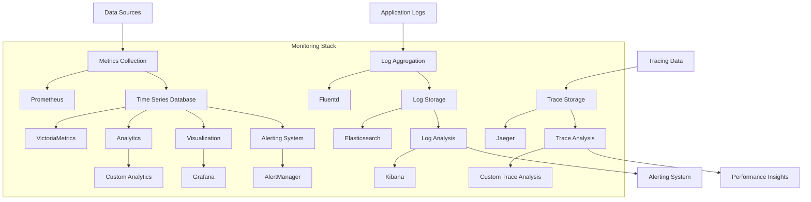
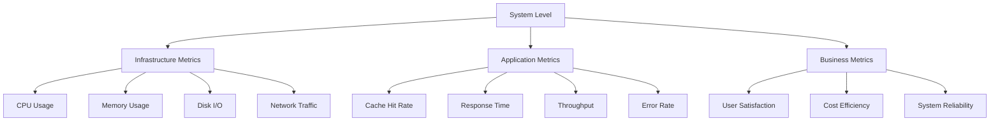

# Monitoring and Performance Tracking System

## 1. Overview

This document provides a comprehensive monitoring and performance tracking system design for the Intelligent Caching Architecture. The system is designed to provide real-time visibility into cache performance, health, and usage patterns while enabling proactive issue detection and optimization.

## 2. Monitoring Architecture

### 2.1 Monitoring Stack Overview



### 2.2 Monitoring Hierarchy



## 3. Metrics Collection

### 3.1 Cache Layer Metrics

#### 3.1.1 Predictive Cache Metrics

```python
# metrics/predictive_cache_metrics.py
from prometheus_client import Counter, Histogram, Gauge, Summary
import time

class PredictiveCacheMetrics:
    def __init__(self):
        # Request metrics
        self.request_count = Counter(
            'predictive_cache_requests_total',
            'Total number of predictive cache requests',
            ['cache_layer', 'status', 'operation']
        )
        
        self.request_duration = Histogram(
            'predictive_cache_request_duration_seconds',
            'Time spent processing predictive cache requests',
            ['cache_layer', 'operation']
        )
        
        self.request_size = Histogram(
            'predictive_cache_request_size_bytes',
            'Size of predictive cache requests',
            ['cache_layer']
        )
        
        self.response_size = Histogram(
            'predictive_cache_response_size_bytes',
            'Size of predictive cache responses',
            ['cache_layer']
        )
        
        # Cache metrics
        self.cache_hits = Counter(
            'predictive_cache_hits_total',
            'Total number of predictive cache hits',
            ['cache_layer']
        )
        
        self.cache_misses = Counter(
            'predictive_cache_misses_total',
            'Total number of predictive cache misses',
            ['cache_layer']
        )
        
        self.cache_size = Gauge(
            'predictive_cache_size_bytes',
            'Current size of predictive cache',
            ['cache_layer']
        )
        
        self.cache_evictions = Counter(
            'predictive_cache_evictions_total',
            'Total number of cache evictions',
            ['cache_layer', 'reason']
        )
        
        # Prediction metrics
        self.prediction_accuracy = Gauge(
            'predictive_cache_prediction_accuracy',
            'Accuracy of predictions',
            ['cache_layer']
        )
        
        self.prediction_latency = Histogram(
            'predictive_cache_prediction_latency_seconds',
            'Time spent making predictions',
            ['cache_layer']
        )
        
        self.prediction_confidence = Gauge(
            'predictive_cache_prediction_confidence',
            'Average confidence score of predictions',
            ['cache_layer']
        )
        
        # Model metrics
        self.model_load_time = Summary(
            'predictive_cache_model_load_seconds',
            'Time spent loading prediction models',
            ['cache_layer', 'model_name']
        )
        
        self.model_update_time = Summary(
            'predictive_cache_model_update_seconds',
            'Time spent updating prediction models',
            ['cache_layer', 'model_name']
        )
        
        self.model_version = Gauge(
            'predictive_cache_model_version',
            'Current version of prediction models',
            ['cache_layer', 'model_name']
        )
        
        # Performance metrics
        self.throughput = Gauge(
            'predictive_cache_throughput_requests_per_second',
            'Current request throughput',
            ['cache_layer']
        )
        
        self.error_rate = Gauge(
            'predictive_cache_error_rate',
            'Current error rate',
            ['cache_layer']
        )
        
        self.memory_usage = Gauge(
            'predictive_cache_memory_usage_bytes',
            'Current memory usage',
            ['cache_layer']
        )
        
        self.cpu_usage = Gauge(
            'predictive_cache_cpu_usage_percent',
            'Current CPU usage',
            ['cache_layer']
        )
```

#### 3.1.2 Semantic Cache Metrics

```python
# metrics/semantic_cache_metrics.py
class SemanticCacheMetrics:
    def __init__(self):
        # Request metrics
        self.semantic_search_requests = Counter(
            'semantic_cache_search_requests_total',
            'Total number of semantic search requests',
            ['cache_layer', 'status']
        )
        
        self.semantic_store_requests = Counter(
            'semantic_cache_store_requests_total',
            'Total number of semantic store requests',
            ['cache_layer', 'status']
        )
        
        self.semantic_update_requests = Counter(
            'semantic_cache_update_requests_total',
            'Total number of semantic update requests',
            ['cache_layer', 'status']
        )
        
        # Cache metrics
        self.semantic_cache_hits = Counter(
            'semantic_cache_hits_total',
            'Total number of semantic cache hits',
            ['cache_layer']
        )
        
        self.semantic_cache_misses = Counter(
            'semantic_cache_misses_total',
            'Total number of semantic cache misses',
            ['cache_layer']
        )
        
        self.semantic_cache_size = Gauge(
            'semantic_cache_size_bytes',
            'Current size of semantic cache',
            ['cache_layer']
        )
        
        # Similarity metrics
        self.similarity_score = Histogram(
            'semantic_cache_similarity_score',
            'Distribution of similarity scores',
            ['cache_layer']
        )
        
        self.similarity_threshold = Gauge(
            'semantic_cache_similarity_threshold',
            'Current similarity threshold',
            ['cache_layer']
        )
        
        # Embedding metrics
        self.embedding_generation_time = Histogram(
            'semantic_cache_embedding_generation_seconds',
            'Time spent generating embeddings',
            ['cache_layer', 'model_name']
        )
        
        self.embedding_batch_size = Gauge(
            'semantic_cache_embedding_batch_size',
            'Current batch size for embedding generation',
            ['cache_layer']
        )
        
        # Index metrics
        self.index_size = Gauge(
            'semantic_cache_index_size_bytes',
            'Current size of semantic index',
            ['cache_layer']
        )
        
        self.index_build_time = Summary(
            'semantic_cache_index_build_seconds',
            'Time spent building semantic index',
            ['cache_layer']
        )
        
        self.index_optimization_time = Summary(
            'semantic_cache_index_optimization_seconds',
            'Time spent optimizing semantic index',
            ['cache_layer']
        )
```

#### 3.1.3 Vector Cache Metrics

```python
# metrics/vector_cache_metrics.py
class VectorCacheMetrics:
    def __init__(self):
        # Request metrics
        self.vector_search_requests = Counter(
            'vector_cache_search_requests_total',
            'Total number of vector search requests',
            ['cache_layer', 'status']
        )
        
        self.vector_add_requests = Counter(
            'vector_cache_add_requests_total',
            'Total number of vector add requests',
            ['cache_layer', 'status']
        )
        
        self.vector_update_requests = Counter(
            'vector_cache_update_requests_total',
            'Total number of vector update requests',
            ['cache_layer', 'status']
        )
        
        self.vector_delete_requests = Counter(
            'vector_cache_delete_requests_total',
            'Total number of vector delete requests',
            ['cache_layer', 'status']
        )
        
        # Cache metrics
        self.vector_cache_hits = Counter(
            'vector_cache_hits_total',
            'Total number of vector cache hits',
            ['cache_layer']
        )
        
        self.vector_cache_misses = Counter(
            'vector_cache_misses_total',
            'Total number of vector cache misses',
            ['cache_layer']
        )
        
        self.vector_cache_size = Gauge(
            'vector_cache_size_bytes',
            'Current size of vector cache',
            ['cache_layer']
        )
        
        # Vector metrics
        self.vector_dimensionality = Gauge(
            'vector_cache_dimensionality',
            'Current vector dimensionality',
            ['cache_layer']
        )
        
        self.vector_similarity = Histogram(
            'vector_cache_similarity_score',
            'Distribution of vector similarity scores',
            ['cache_layer', 'metric']
        )
        
        # Index metrics
        self.index_type = Gauge(
            'vector_cache_index_type',
            'Current vector index type',
            ['cache_layer']
        )
        
        self.index_parameters = Gauge(
            'vector_cache_index_parameters',
            'Current vector index parameters',
            ['cache_layer', 'parameter']
        )
        
        self.index_build_time = Summary(
            'vector_cache_index_build_seconds',
            'Time spent building vector index',
            ['cache_layer']
        )
        
        # Performance metrics
        self.vector_search_latency = Histogram(
            'vector_cache_search_latency_seconds',
            'Time spent on vector search operations',
            ['cache_layer', 'index_type']
        )
        
        self.vector_batch_operations = Counter(
            'vector_cache_batch_operations_total',
            'Total number of vector batch operations',
            ['cache_layer', 'operation_type']
        )
```

#### 3.1.4 Global Cache Metrics

```python
# metrics/global_cache_metrics.py
class GlobalCacheMetrics:
    def __init__(self):
        # Request metrics
        self.global_search_requests = Counter(
            'global_cache_search_requests_total',
            'Total number of global search requests',
            ['cache_layer', 'status']
        )
        
        self.global_update_requests = Counter(
            'global_cache_update_requests_total',
            'Total number of global update requests',
            ['cache_layer', 'status']
        )
        
        self.global_sync_requests = Counter(
            'global_cache_sync_requests_total',
            'Total number of global sync requests',
            ['cache_layer', 'status']
        )
        
        # Cache metrics
        self.global_cache_hits = Counter(
            'global_cache_hits_total',
            'Total number of global cache hits',
            ['cache_layer']
        )
        
        self.global_cache_misses = Counter(
            'global_cache_misses_total',
            'Total number of global cache misses',
            ['cache_layer']
        )
        
        self.global_cache_size = Gauge(
            'global_cache_size_bytes',
            'Current size of global cache',
            ['cache_layer']
        )
        
        # Knowledge metrics
        self.knowledge_entries = Gauge(
            'global_cache_knowledge_entries',
            'Current number of knowledge entries',
            ['cache_layer']
        )
        
        self.knowledge_confidence = Histogram(
            'global_cache_knowledge_confidence',
            'Distribution of knowledge confidence scores',
            ['cache_layer']
        )
        
        # Sync metrics
        self.sync_latency = Histogram(
            'global_cache_sync_latency_seconds',
            'Time spent on sync operations',
            ['cache_layer']
        )
        
        self.sync_frequency = Gauge(
            'global_cache_sync_frequency_seconds',
            'Current sync frequency',
            ['cache_layer']
        )
        
        self.sync_success_rate = Gauge(
            'global_cache_sync_success_rate',
            'Current sync success rate',
            ['cache_layer']
        )
        
        # Validation metrics
        self.validation_requests = Counter(
            'global_cache_validation_requests_total',
            'Total number of validation requests',
            ['cache_layer', 'status']
        )
        
        self.validation_latency = Histogram(
            'global_cache_validation_latency_seconds',
            'Time spent on validation operations',
            ['cache_layer']
        )
```

#### 3.1.5 Vector Diary Metrics

```python
# metrics/vector_diary_metrics.py
class VectorDiaryMetrics:
    def __init__(self):
        # Request metrics
        self.diary_add_requests = Counter(
            'vector_diary_add_requests_total',
            'Total number of diary add requests',
            ['cache_layer', 'status']
        )
        
        self.diary_search_requests = Counter(
            'vector_diary_search_requests_total',
            'Total number of diary search requests',
            ['cache_layer', 'status']
        )
        
        self.diary_update_requests = Counter(
            'vector_diary_update_requests_total',
            'Total number of diary update requests',
            ['cache_layer', 'status']
        )
        
        self.diary_delete_requests = Counter(
            'vector_diary_delete_requests_total',
            'Total number of diary delete requests',
            ['cache_layer', 'status']
        )
        
        # Cache metrics
        self.diary_cache_size = Gauge(
            'vector_diary_cache_size_bytes',
            'Current size of vector diary',
            ['cache_layer']
        )
        
        self.diary_entries = Gauge(
            'vector_diary_entries',
            'Current number of diary entries',
            ['cache_layer']
        )
        
        # Pattern analysis metrics
        self.pattern_analysis_requests = Counter(
            'vector_diary_pattern_analysis_requests_total',
            'Total number of pattern analysis requests',
            ['cache_layer', 'status']
        )
        
        self.pattern_analysis_latency = Histogram(
            'vector_diary_pattern_analysis_latency_seconds',
            'Time spent on pattern analysis',
            ['cache_layer']
        )
        
        self.pattern_discoveries = Counter(
            'vector_diary_pattern_discoveries_total',
            'Total number of pattern discoveries',
            ['cache_layer', 'pattern_type']
        )
        
        # Importance metrics
        self.importance_scores = Histogram(
            'vector_diary_importance_scores',
            'Distribution of importance scores',
            ['cache_layer']
        )
        
        self.importance_threshold = Gauge(
            'vector_diary_importance_threshold',
            'Current importance threshold',
            ['cache_layer']
        )
        
        # Archive metrics
        self.archive_requests = Counter(
            'vector_diary_archive_requests_total',
            'Total number of archive requests',
            ['cache_layer', 'status']
        )
        
        self.archive_latency = Histogram(
            'vector_diary_archive_latency_seconds',
            'Time spent on archive operations',
            ['cache_layer']
        )
        
        self.archived_entries = Gauge(
            'vector_diary_archived_entries',
            'Current number of archived entries',
            ['cache_layer']
        )
```

### 3.2 System-Level Metrics

```python
# metrics/system_metrics.py
class SystemMetrics:
    def __init__(self):
        # Resource metrics
        self.cpu_usage = Gauge(
            'system_cpu_usage_percent',
            'Current CPU usage percentage',
            ['component']
        )
        
        self.memory_usage = Gauge(
            'system_memory_usage_bytes',
            'Current memory usage in bytes',
            ['component']
        )
        
        self.disk_usage = Gauge(
            'system_disk_usage_bytes',
            'Current disk usage in bytes',
            ['component', 'mount_point']
        )
        
        self.network_io = Counter(
            'system_network_io_bytes_total',
            'Total network I/O bytes',
            ['component', 'direction']
        )
        
        # Process metrics
        self.process_count = Gauge(
            'system_process_count',
            'Current number of processes',
            ['component']
        )
        
        self.process_cpu = Gauge(
            'system_process_cpu_percent',
            'Current process CPU usage percentage',
            ['component', 'process_name']
        )
        
        self.process_memory = Gauge(
            'system_process_memory_bytes',
            'Current process memory usage in bytes',
            ['component', 'process_name']
        )
        
        # Database metrics
        self.database_connections = Gauge(
            'system_database_connections',
            'Current number of database connections',
            ['component', 'database_type']
        )
        
        self.database_query_time = Histogram(
            'system_database_query_time_seconds',
            'Time spent on database queries',
            ['component', 'database_type', 'query_type']
        )
        
        self.database_errors = Counter(
            'system_database_errors_total',
            'Total number of database errors',
            ['component', 'database_type', 'error_type']
        )
        
        # Cache system metrics
        self.cache_system_throughput = Gauge(
            'cache_system_throughput_requests_per_second',
            'Current cache system throughput',
            ['cache_layer']
        )
        
        self.cache_system_error_rate = Gauge(
            'cache_system_error_rate',
            'Current cache system error rate',
            ['cache_layer']
        )
        
        self.cache_system_response_time = Histogram(
            'cache_system_response_time_seconds',
            'Cache system response time',
            ['cache_layer', 'operation']
        )
        
        # Health metrics
        self.health_status = Gauge(
            'system_health_status',
            'Current system health status',
            ['component', 'health_check']
        )
        
        self.health_check_latency = Histogram(
            'system_health_check_latency_seconds',
            'Time spent on health checks',
            ['component', 'health_check']
        )
```

## 4. Alerting System

### 4.1 Alert Configuration

```yaml
# monitoring/alerts/prometheus-alerts.yml
groups:
- name: cache-system-alerts
  rules:
  - alert: HighErrorRate
    expr: rate(cache_requests_total{status=~"error|failed"}[5m]) / rate(cache_requests_total[5m]) > 0.1
    for: 5m
    labels:
      severity: critical
      component: cache-system
    annotations:
      summary: "High error rate detected in cache system"
      description: "Error rate is {{ $value | printf "%.2f" }}% for cache layer {{ $labels.cache_layer }}"
      runbook_url: "https://runbook.example.com/cache-system/high-error-rate"
  
  - alert: HighCacheMissRate
    expr: rate(cache_misses_total[5m]) / (rate(cache_hits_total[5m]) + rate(cache_misses_total[5m])) > 0.8
    for: 10m
    labels:
      severity: warning
      component: cache-system
    annotations:
      summary: "High cache miss rate detected"
      description: "Cache miss rate is {{ $value | printf "%.2f" }}% for cache layer {{ $labels.cache_layer }}"
      runbook_url: "https://runbook.example.com/cache-system/high-cache-miss-rate"
  
  - alert: HighResponseTime
    expr: histogram_quantile(0.95, rate(cache_response_time_bucket[5m])) > 1
    for: 5m
    labels:
      severity: warning
      component: cache-system
    annotations:
      summary: "High response time detected"
      description: "95th percentile response time is {{ $value | printf "%.2f" }}s for cache layer {{ $labels.cache_layer }}"
      runbook_url: "https://runbook.example.com/cache-system/high-response-time"
  
  - alert: LowCacheHitRate
    expr: rate(cache_hits_total[5m]) / (rate(cache_hits_total[5m]) + rate(cache_misses_total[5m])) < 0.5
    for: 15m
    labels:
      severity: warning
      component: cache-system
    annotations:
      summary: "Low cache hit rate detected"
      description: "Cache hit rate is {{ $value | printf "%.2f" }}% for cache layer {{ $labels.cache_layer }}"
      runbook_url: "https://runbook.example.com/cache-system/low-cache-hit-rate"
  
  - alert: HighMemoryUsage
    expr: (process_resident_memory_bytes{job="cache-system"} / process_virtual_memory_bytes{job="cache-system"}) > 0.9
    for: 5m
    labels:
      severity: critical
      component: cache-system
    annotations:
      summary: "High memory usage detected"
      description: "Memory usage is {{ $value | printf "%.2f" }}% for cache layer {{ $labels.cache_layer }}"
      runbook_url: "https://runbook.example.com/cache-system/high-memory-usage"
  
  - alert: HighCPUUsage
    expr: rate(process_cpu_seconds_total{job="cache-system"}[5m]) * 100 > 90
    for: 5m
    labels:
      severity: warning
      component: cache-system
    annotations:
      summary: "High CPU usage detected"
      description: "CPU usage is {{ $value | printf "%.2f" }}% for cache layer {{ $labels.cache_layer }}"
      runbook_url: "https://runbook.example.com/cache-system/high-cpu-usage"
  
  - alert: DatabaseConnectionIssues
    expr: increase(database_errors_total{type="connection"}[5m]) > 5
    for: 3m
    labels:
      severity: critical
      component: cache-system
    annotations:
      summary: "Database connection issues detected"
      description: "Database connection errors increased by {{ $value }} in the last 5 minutes"
      runbook_url: "https://runbook.example.com/cache-system/database-connection-issues"
  
  - alert: CacheSizeExceeded
    expr: cache_size_bytes > 1073741824  # 1GB
    for: 5m
    labels:
      severity: warning
      component: cache-system
    annotations:
      summary: "Cache size exceeded"
      description: "Cache size is {{ $value | printf "%.2f" }}GB for cache layer {{ $labels.cache_layer }}"
      runbook_url: "https://runbook.example.com/cache-system/cache-size-exceeded"
  
  - alert: PredictionModelStale
    expr: time() - predictive_cache_model_update_timestamp_seconds > 86400  # 24 hours
    for: 1h
    labels:
      severity: warning
      component: cache-system
    annotations:
      summary: "Prediction model is stale"
      description: "Prediction model for cache layer {{ $labels.cache_layer }} was last updated {{ $value | printf "%.0f" }} seconds ago"
      runbook_url: "https://runbook.example.com/cache-system/prediction-model-stale"
```

### 4.2 Alert Manager Configuration

```yaml
# monitoring/alerts/alertmanager.yml
global:
  smtp_smarthost: 'localhost:587'
  smtp_from: 'alerts@example.com'
  smtp_auth_username: 'alerts@example.com'
  smtp_auth_password: 'password'

route:
  group_by: ['alertname', 'severity', 'component']
  group_wait: 10s
  group_interval: 10s
  repeat_interval: 12h
  receiver: 'web.hook'

receivers:
- name: 'web.hook'
  email_configs:
  - to: 'team@example.com'
    subject: 'Cache System Alert: {{ .GroupLabels.alertname }}'
    body: |
      {{ range .Alerts }}
      Alert: {{ .Annotations.summary }}
      Description: {{ .Annotations.description }}
      Severity: {{ .Labels.severity }}
      Component: {{ .Labels.component }}
      Timestamp: {{ .StartsAt }}
      {{ end }}
  
  slack_configs:
  - api_url: 'https://hooks.slack.com/services/YOUR/SLACK/WEBHOOK'
    channel: '#cache-system-alerts'
    title: 'Cache System Alert'
    text: |
      {{ range .Alerts }}
      *Alert:* {{ .Annotations.summary }}
      *Description:* {{ .Annotations.description }}
      *Severity:* {{ .Labels.severity }}
      *Component:* {{ .Labels.component }}
      *Timestamp:* {{ .StartsAt }}
      {{ end }}
  
  pagerduty_configs:
  - service_key: 'YOUR_PAGERDUTY_SERVICE_KEY'
    severity: 'critical'
    description: 'Cache System Alert: {{ .GroupLabels.alertname }}'
    client: 'Cache System'
    client_url: 'https://cache-system.example.com'
    details:
      component: '{{ .Labels.component }}'
      severity: '{{ .Labels.severity }}'
      summary: '{{ .Annotations.summary }}'
      description: '{{ .Annotations.description }}'

inhibit_rules:
  - source_match:
      severity: 'critical'
    target_match:
      severity: 'warning'
    equal: ['alertname', 'component']
```

## 5. Logging System

### 5.1 Log Configuration

```python
# logging/config.py
import logging
import logging.handlers
import json
from datetime import datetime

class CacheSystemLogger:
    def __init__(self, name: str, environment: str = "development"):
        self.name = name
        self.environment = environment
        self.logger = logging.getLogger(name)
        self.logger.setLevel(logging.INFO)
        
        # Create formatters
        json_formatter = self._get_json_formatter()
        text_formatter = self._get_text_formatter()
        
        # Add handlers
        if environment == "production":
            self._add_production_handlers(json_formatter)
        else:
            self._add_development_handlers(text_formatter)
    
    def _get_json_formatter(self):
        class JsonFormatter(logging.Formatter):
            def format(self, record):
                log_entry = {
                    "timestamp": datetime.fromtimestamp(record.created).isoformat(),
                    "level": record.levelname,
                    "logger": record.name,
                    "message": record.getMessage(),
                    "environment": self.environment,
                    "component": "cache-system"
                }
                
                if hasattr(record, 'cache_layer'):
                    log_entry["cache_layer"] = record.cache_layer
                
                if hasattr(record, 'operation'):
                    log_entry["operation"] = record.operation
                
                if hasattr(record, 'user_id'):
                    log_entry["user_id"] = record.user_id
                
                if hasattr(record, 'request_id'):
                    log_entry["request_id"] = record.request_id
                
                if hasattr(record, 'duration_ms'):
                    log_entry["duration_ms"] = record.duration_ms
                
                if hasattr(record, 'status'):
                    log_entry["status"] = record.status
                
                if hasattr(record, 'error'):
                    log_entry["error"] = record.error
                
                if record.exc_info:
                    log_entry["exception"] = self.formatException(record.exc_info)
                
                return json.dumps(log_entry)
        
        return JsonFormatter()
    
    def _get_text_formatter(self):
        return logging.Formatter(
            '%(asctime)s - %(name)s - %(levelname)s - %(message)s'
        )
    
    def _add_production_handlers(self, formatter):
        # File handler with rotation
        file_handler = logging.handlers.RotatingFileHandler(
            f'/var/log/cache-system/{self.name}.log',
            maxBytes=100*1024*1024,  # 100MB
            backupCount=10
        )
        file_handler.setFormatter(formatter)
        self.logger.addHandler(file_handler)
        
        # Syslog handler
        syslog_handler = logging.handlers.SysLogHandler(address='/dev/log')
        syslog_handler.setFormatter(formatter)
        self.logger.addHandler(syslog_handler)
    
    def _add_development_handlers(self, formatter):
        # Console handler
        console_handler = logging.StreamHandler()
        console_handler.setFormatter(formatter)
        self.logger.addHandler(console_handler)
    
    def log_cache_operation(self, cache_layer: str, operation: str, status: str, 
                          duration_ms: int = None, user_id: str = None, 
                          request_id: str = None, error: str = None):
        extra = {
            'cache_layer': cache_layer,
            'operation': operation,
            'status': status,
            'duration_ms': duration_ms,
            'user_id': user_id,
            'request_id': request_id,
            'error': error
        }
        
        if status == "error":
            self.logger.error(f"Cache operation failed: {operation}", extra=extra)
        elif status == "success":
            self.logger.info(f"Cache operation completed: {operation}", extra=extra)
        else:
            self.logger.warning(f"Cache operation warning: {operation}", extra=extra)
    
    def log_prediction_request(self, cache_layer: str, query: str, 
                             confidence: float, predictions: list):
        extra = {
            'cache_layer': cache_layer,
            'operation': 'prediction',
            'query_length': len(query),
            'confidence': confidence,
            'prediction_count': len(predictions)
        }
        
        self.logger.info(f"Prediction request processed", extra=extra)
    
    def log_cache_hit(self, cache_layer: str, key: str, size_bytes: int):
        extra = {
            'cache_layer': cache_layer,
            'operation': 'cache_hit',
            'key': key,
            'size_bytes': size_bytes
        }
        
        self.logger.debug(f"Cache hit", extra=extra)
    
    def log_cache_miss(self, cache_layer: str, key: str):
        extra = {
            'cache_layer': cache_layer,
            'operation': 'cache_miss',
            'key': key
        }
        
        self.logger.debug(f"Cache miss", extra=extra)
    
    def log_health_check(self, cache_layer: str, status: str, duration_ms: int):
        extra = {
            'cache_layer': cache_layer,
            'operation': 'health_check',
            'status': status,
            'duration_ms': duration_ms
        }
        
        self.logger.info(f"Health check completed", extra=extra)
```

### 5.2 Log Aggregation Configuration

```yaml
# monitoring/logging/fluentd.conf
<source>
  @type tail
  path /var/log/cache-system/*.log
  pos_file /var/log/cache-system/.fluentd.pos
  tag cache-system.*
  format json
  time_format %Y-%m-%dT%H:%M:%S.%NZ
</source>

<filter cache-system.**>
  @type record_transformer
  <record>
    hostname "#{Socket.gethostname}"
  </record>
</filter>

<match cache-system.**>
  @type elasticsearch
  host elasticsearch
  port 9200
  index_name cache-system-logs
  type_name _doc
  include_tag true
  tag_key @log_name
  flush_interval 5s
  flush_size 100
  retry_max_interval 30
  reload_on_failure true
  <buffer>
    flush_mode interval
    flush_interval 5s
    flush_at_shutdown true
    retry_max_interval 30
  </buffer>
</match>

<match cache-system.**>
  @type stdout
  <format>
    json
  </format>
</match>
```

## 6. Distributed Tracing

### 6.1 Tracing Configuration

```python
# tracing/tracer.py
import time
from opentelemetry import trace, metrics
from opentelemetry.exporter.jaeger.thrift import JaegerExporter
from opentelemetry.exporter.prometheus import PrometheusMetricReader
from opentelemetry.sdk.resources import SERVICE_NAME, Resource
from opentelemetry.sdk.trace import TracerProvider
from opentelemetry.sdk.trace.export import BatchSpanProcessor
from opentelemetry.sdk.metrics import MeterProvider
from opentelemetry.instrumentation.requests import RequestsInstrumentor

class CacheSystemTracer:
    def __init__(self, service_name: str, jaeger_endpoint: str = "http://jaeger:14268/api/traces"):
        self.service_name = service_name
        self.jaeger_endpoint = jaeger_endpoint
        
        # Initialize tracing
        self._init_tracing()
        
        # Initialize metrics
        self._init_metrics()
        
        # Instrument HTTP requests
        RequestsInstrumentor().instrument()
    
    def _init_tracing(self):
        # Set up tracer provider
        resource = Resource(attributes={
            SERVICE_NAME: self.service_name
        })
        
        tracer_provider = TracerProvider(resource=resource)
        trace.set_tracer_provider(tracer_provider)
        
        # Set up Jaeger exporter
        jaeger_exporter = JaegerExporter(
            agent_host_name="jaeger",
            agent_port=6831,
        )
        
        # Create span processor
        span_processor = BatchSpanProcessor(jaeger_exporter)
        tracer_provider.add_span_processor(span_processor)
        
        self.tracer = trace.get_tracer(__name__)
    
    def _init_metrics(self):
        # Set up meter provider
        resource = Resource(attributes={
            SERVICE_NAME: self.service_name
        })
        
        reader = PrometheusMetricReader()
        meter_provider = MeterProvider(resource=resource, metric_readers=[reader])
        metrics.set_meter_provider(meter_provider)
        
        self.meter = metrics.get_meter(__name__)
    
    def trace_cache_operation(self, cache_layer: str, operation: str):
        def decorator(func):
            def wrapper(*args, **kwargs):
                with self.tracer.start_as_current_span(
                    f"cache.{cache_layer}.{operation}",
                    attributes={
                        "cache.layer": cache_layer,
                        "cache.operation": operation,
                        "service.name": self.service_name
                    }
                ) as span:
                    start_time = time.time()
                    
                    try:
                        result = func(*args, **kwargs)
                        span.set_status(trace.Status(trace.StatusCode.OK))
                        return result
                    except Exception as e:
                        span.set_status(trace.Status(trace.StatusCode.ERROR))
                        span.record_exception(e)
                        raise
                    finally:
                        duration = time.time() - start_time
                        span.set_attribute("cache.duration_ms", int(duration * 1000))
                        
                        # Record metrics
                        self.meter.create_histogram(
                            f"cache.{cache_layer}.{operation}.duration"
                        ).record(duration)
            
            return wrapper
        return decorator
    
    def trace_prediction_request(self, cache_layer: str):
        def decorator(func):
            def wrapper(*args, **kwargs):
                with self.tracer.start_as_current_span(
                    f"prediction.{cache_layer}",
                    attributes={
                        "cache.layer": cache_layer,
                        "operation": "prediction",
                        "service.name": self.service_name
                    }
                ) as span:
                    start_time = time.time()
                    
                    try:
                        result = func(*args, **kwargs)
                        span.set_status(trace.Status(trace.StatusCode.OK))
                        
                        # Record prediction metrics
                        if hasattr(result, 'predictions'):
                            span.set_attribute("prediction.count", len(result.predictions))
                            if result.predictions:
                                span.set_attribute("prediction.confidence", 
                                                 max(p.get('confidence_score', 0) for p in result.predictions))
                        
                        return result
                    except Exception as e:
                        span.set_status(trace.Status(trace.StatusCode.ERROR))
                        span.record_exception(e)
                        raise
                    finally:
                        duration = time.time() - start_time
                        span.set_attribute("prediction.duration_ms", int(duration * 1000))
                        
                        # Record metrics
                        self.meter.create_histogram(
                            f"prediction.{cache_layer}.duration"
                        ).record(duration)
            
            return wrapper
        return decorator
```

### 6.2 Jaeger Configuration

```yaml
# monitoring/tracing/jaeger.yaml
apiVersion: apps/v1
kind: Deployment
metadata:
  name: jaeger
  namespace: monitoring
spec:
  replicas: 1
  selector:
    matchLabels:
      app: jaeger
  template:
    metadata:
      labels:
        app: jaeger
    spec:
      containers:
      - name: jaeger
        image: jaegertracing/all-in-one:latest
        ports:
        - containerPort: 16686
          name: ui
        - containerPort: 14268
          name: cthrift
        - containerPort: 14250
          name: grpc
        env:
        - name: COLLECTOR_ZIPKIN_HOST_PORT
          value: ":9411"
        - name: COLLECTOR_OTLP_ENABLED
          value: "true"
        - name: STORAGE
          value: "memory"
        resources:
          requests:
            memory: "1Gi"
            cpu: "500m"
          limits:
            memory: "2Gi"
            cpu: "1000m"
---
apiVersion: v1
kind: Service
metadata:
  name: jaeger
  namespace: monitoring
spec:
  selector:
    app: jaeger
  ports:
  - name: ui
    port: 16686
    targetPort: 16686
    protocol: TCP
  - name: cthrift
    port: 14268
    targetPort: 14268
    protocol: TCP
  - name: grpc
    port: 14250
    targetPort: 14250
    protocol: TCP
  type: ClusterIP
```

## 7. Performance Dashboard

### 7.1 Grafana Dashboard Configuration

```json
{
  "dashboard": {
    "id": null,
    "title": "Cache System Performance Dashboard",
    "tags": ["cache", "performance", "monitoring"],
    "timezone": "browser",
    "panels": [
      {
        "id": 1,
        "title": "Cache Hit Rate Overview",
        "type": "stat",
        targets: [
          {
            "expr": "sum(rate(cache_hits_total[5m])) by (cache_layer) / sum(rate(cache_hits_total[5m]) + rate(cache_misses_total[5m])) by (cache_layer)",
            "legendFormat": "{{cache_layer}}"
          }
        ],
        fieldConfig: {
          defaults: {
            thresholds: {
              steps: [
                { color: "red", value: 0 },
                { color: "yellow", value: 0.5 },
                { color: "green", value: 0.8 }
              ]
            },
            unit: "percentunit"
          }
        }
      },
      {
        "id": 2,
        "title": "Response Time Distribution",
        "type": "graph",
        targets: [
          {
            "expr": "histogram_quantile(0.95, rate(cache_response_time_bucket[5m])) by (cache_layer, le)",
            "legendFormat": "{{cache_layer}} P95"
          },
          {
            "expr": "histogram_quantile(0.50, rate(cache_response_time_bucket[5m])) by (cache_layer, le)",
            "legendFormat": "{{cache_layer}} P50"
          }
        ],
        yAxes: [
          {
            "label": "Response Time (ms)",
            "min": 0
          }
        ]
      },
      {
        "id": 3,
        "title": "Cache Size Usage",
        "type": "graph",
        targets: [
          {
            "expr": "cache_size_bytes by (cache_layer)",
            "legendFormat": "{{cache_layer}}"
          }
        ],
        yAxes: [
          {
            "label": "Size (bytes)",
            "min": 0
          }
        ]
      },
      {
        "id": 4,
        "title": "Request Throughput",
        "type": "graph",
        targets: [
          {
            "expr": "sum(rate(cache_requests_total[5m])) by (cache_layer)",
            "legendFormat": "{{cache_layer}}"
          }
        ],
        yAxes: [
          {
            "label": "Requests per Second",
            "min": 0
          }
        ]
      },
      {
        "id": 5,
        "title": "Error Rate by Cache Layer",
        "type": "graph",
        targets: [
          {
            "expr": "sum(rate(cache_requests_total{status=~\"error|failed\"}[5m])) by (cache_layer) / sum(rate(cache_requests_total[5m])) by (cache_layer)",
            "legendFormat": "{{cache_layer}}"
          }
        ],
        yAxes: [
          {
            "label": "Error Rate",
            "min": 0,
            "max": 1
          }
        ]
      },
      {
        "id": 6,
        "title": "Memory Usage by Component",
        "type": "piechart",
        targets: [
          {
            "expr": "process_resident_memory_bytes by (cache_layer)",
            "legendFormat": "{{cache_layer}}"
          }
        ]
      },
      {
        "id": 7,
        "title": "CPU Usage by Component",
        "type": "graph",
        targets: [
          {
            "expr": "rate(process_cpu_seconds_total[5m]) * 100 by (cache_layer)",
            "legendFormat": "{{cache_layer}}"
          }
        ],
        yAxes: [
          {
            "label": "CPU Usage (%)",
            "min": 0,
            "max": 100
          }
        ]
      },
      {
        "id": 8,
        "title": "Prediction Accuracy",
        "type": "stat",
        targets: [
          {
            "expr": "predictive_cache_prediction_accuracy",
            "legendFormat": "Accuracy"
          }
        ],
        fieldConfig: {
          defaults: {
            thresholds: {
              steps: [
                { color: "red", value: 0 },
                { color: "yellow", value: 0.7 },
                { color: "green", value: 0.9 }
              ]
            },
            unit: "percentunit"
          }
        }
      },
      {
        "id": 9,
        "title": "Database Query Performance",
        "type": "graph",
        targets: [
          {
            "expr": "histogram_quantile(0.95, rate(database_query_time_bucket[5m])) by (database_type, query_type)",
            "legendFormat": "{{database_type}} - {{query_type}}"
          }
        ],
        yAxes: [
          {
            "label": "Query Time (ms)",
            "min": 0
          }
        ]
      },
      {
        "id": 10,
        "title": "System Health Status",
        "type": "singlestat",
        targets: [
          {
            "expr": "count(system_health_status{status=\"healthy\"})",
            "legendFormat": "Healthy Services"
          }
        ],
        fieldConfig: {
          defaults: {
            thresholds: {
              steps: [
                { color: "red", value: 0 },
                { color: "yellow", value: 4 },
                { color: "green", value: 5 }
              ]
            },
            unit: "short"
          }
        }
      }
    ]
  }
}
```

### 7.2 Real-time Monitoring Dashboard

```json
{
  "dashboard": {
    "id": null,
    "title": "Cache System Real-time Monitoring",
    "tags": ["cache", "real-time", "monitoring"],
    "timezone": "browser",
    "panels": [
      {
        "id": 1,
        "title": "Current Request Rate",
        "type": "gauge",
        targets: [
          {
            "expr": "sum(rate(cache_requests_total[1m]))",
            "legendFormat": "Total Requests"
          }
        ],
        fieldConfig: {
          defaults: {
            thresholds: {
              steps: [
                { color: "green", value: 0 },
                { color: "yellow", value: 500 },
                { color: "red", value: 1000 }
              ]
            },
            unit: "reqps"
          }
        }
      },
      {
        "id": 2,
        "title": "Current Cache Hit Rate",
        "type": "gauge",
        targets: [
          {
            "expr": "sum(rate(cache_hits_total[1m])) / sum(rate(cache_hits_total[1m]) + rate(cache_misses_total[1m]))",
            "legendFormat": "Hit Rate"
          }
        ],
        fieldConfig: {
          defaults: {
            thresholds: {
              steps: [
                { color: "red", value: 0 },
                { color: "yellow", value: 0.5 },
                { color: "green", value: 0.8 }
              ]
            },
            unit: "percentunit"
          }
        }
      },
      {
        "id": 3,
        "title": "Current Response Time",
        "type": "gauge",
        targets: [
          {
            "expr": "histogram_quantile(0.95, rate(cache_response_time_bucket[1m]))",
            "legendFormat": "P95 Response Time"
          }
        ],
        fieldConfig: {
          defaults: {
            thresholds: {
              steps: [
                { color: "green", value: 0 },
                { color: "yellow", value: 100 },
                { color: "red", value: 1000 }
              ]
            },
            unit: "ms"
          }
        }
      },
      {
        "id": 4,
        "title": "Active Connections",
        "type": "stat",
        targets: [
          {
            "expr": "sum(database_connections)",
            "legendFormat": "Total Connections"
          }
        ]
      },
      {
        "id": 5,
        "title": "Memory Usage",
        "type": "gauge",
        targets: [
          {
            "expr": "process_resident_memory_bytes",
            "legendFormat": "Memory Usage"
          }
        ],
        fieldConfig: {
          defaults: {
            thresholds: {
              steps: [
                { color: "green", value: 0 },
                { color: "yellow", value: 5368709120 },
                { color: "red", value: 10737418240 }
              ]
            },
            unit: "bytes"
          }
        }
      },
      {
        "id": 6,
        "title": "CPU Usage",
        "type": "gauge",
        targets: [
          {
            "expr": "rate(process_cpu_seconds_total[1m]) * 100",
            "legendFormat": "CPU Usage"
          }
        ],
        fieldConfig: {
          defaults: {
            thresholds: {
              steps: [
                { color: "green", value: 0 },
                { color: "yellow", value: 70 },
                { color: "red", value: 90 }
              ]
            },
            unit: "percent"
          }
        }
      },
      {
        "id": 7,
        "title": "Recent Alerts",
        "type": "table",
        targets: [
          {
            "expr": "ALERTS{alertname!=\"\"}",
            "legendFormat": "{{alertname}}"
          }
        ],
        transformations: [
          {
            "id": "filterFieldsByName",
            "options": {
              "fields": ["alertname", "severity", "startsAt"]
            }
          }
        ]
      }
    ]
  }
}
```

## 8. Performance Analysis

### 8.1 Performance Profiling

```python
# profiling/performance_profiler.py
import time
import cProfile
import pstats
import io
from contextlib import contextmanager
from typing import Dict, Any, List

class PerformanceProfiler:
    def __init__(self):
        self.profiles: Dict[str, Any] = {}
        self.metrics: Dict[str, List[float]] = {}
    
    @contextmanager
    def profile(self, operation_name: str):
        """Context manager for profiling operations"""
        profiler = cProfile.Profile()
        profiler.enable()
        
        start_time = time.time()
        try:
            yield
        finally:
            profiler.disable()
            end_time = time.time()
            
            # Record metrics
            duration = end_time - start_time
            if operation_name not in self.metrics:
                self.metrics[operation_name] = []
            self.metrics[operation_name].append(duration)
            
            # Store profile
            profile_stats = io.StringIO()
            profiler_stats = pstats.Stats(profiler, stream=profile_stats)
            profiler_stats.sort_stats('cumulative')
            profiler_stats.print_stats()
            
            self.profiles[operation_name] = {
                'duration': duration,
                'profile': profile_stats.getvalue(),
                'timestamp': time.time()
            }
    
    def get_average_duration(self, operation_name: str) -> float:
        """Get average duration for an operation"""
        if operation_name not in self.metrics:
            return 0.0
        
        durations = self.metrics[operation_name]
        return sum(durations) / len(durations)
    
    def get_percentile_duration(self, operation_name: str, percentile: float) -> float:
        """Get percentile duration for an operation"""
        if operation_name not in self.metrics:
            return 0.0
        
        durations = sorted(self.metrics[operation_name])
        index = int(len(durations) * percentile / 100)
        return durations[index]
    
    def get_performance_report(self) -> Dict[str, Any]:
        """Generate performance report"""
        report = {
            'operation_metrics': {},
            'summary': {
                'total_operations': len(self.metrics),
                'average_durations': {},
                'percentile_durations': {}
            }
        }
        
        for operation_name in self.metrics:
            durations = self.metrics[operation_name]
            report['operation_metrics'][operation_name] = {
                'count': len(durations),
                'average': sum(durations) / len(durations),
                'min': min(durations),
                'max': max(durations),
                'p50': self.get_percentile_duration(operation_name, 50),
                'p95': self.get_percentile_duration(operation_name, 95),
                'p99': self.get_percentile_duration(operation_name, 99)
            }
            
            report['summary']['average_durations'][operation_name] = report['operation_metrics'][operation_name]['average']
            report['summary']['percentile_durations'][operation_name] = {
                'p50': report['operation_metrics'][operation_name]['p50'],
                'p95': report['operation_metrics'][operation_name]['p95'],
                'p99': report['operation_metrics'][operation_name]['p99']
            }
        
        return report
    
    def export_profile(self, operation_name: str, filename: str):
        """Export profile to file"""
        if operation_name not in self.profiles:
            raise ValueError(f"No profile found for operation: {operation_name}")
        
        with open(filename, 'w') as f:
            f.write(self.profiles[operation_name]['profile'])
```

### 8.2 Performance Testing

```python
# testing/performance_tester.py
import asyncio
import time
import statistics
from typing import List, Dict, Any, Callable
from concurrent.futures import ThreadPoolExecutor
import aiohttp
import json

class PerformanceTester:
    def __init__(self, base_url: str):
        self.base_url = base_url
        self.results: Dict[str, Any] = {}
    
    async def run_concurrent_requests(self, endpoint: str, method: str = "GET", 
                                   data: Dict = None, headers: Dict = None,
                                   concurrent_users: int = 10, duration: int = 60) -> Dict[str, Any]:
        """Run concurrent requests to test performance"""
        start_time = time.time()
        end_time = start_time + duration
        
        request_times = []
        response_codes = []
        errors = []
        
        async def make_request(session):
            nonlocal request_times, response_codes, errors
            
            while time.time() < end_time:
                request_start = time.time()
                
                try:
                    if method == "GET":
                        async with session.get(f"{self.base_url}{endpoint}") as response:
                            request_time = time.time() - request_start
                            request_times.append(request_time)
                            response_codes.append(response.status)
                            await response.text()
                    elif method == "POST":
                        async with session.post(f"{self.base_url}{endpoint}", 
                                              json=data, headers=headers) as response:
                            request_time = time.time() - request_start
                            request_times.append(request_time)
                            response_codes.append(response.status)
                            await response.text()
                    
                except Exception as e:
                    request_time = time.time() - request_start
                    request_times.append(request_time)
                    response_codes.append(0)
                    errors.append(str(e))
                
                await asyncio.sleep(0.1)  # Small delay between requests
        
        async with aiohttp.ClientSession() as session:
            tasks = [make_request(session) for _ in range(concurrent_users)]
            await asyncio.gather(*tasks)
        
        # Calculate statistics
        total_requests = len(request_times)
        successful_requests = len([code for code in response_codes if code < 400])
        failed_requests = total_requests - successful_requests
        
        stats = {
            'total_requests': total_requests,
            'successful_requests': successful_requests,
            'failed_requests': failed_requests,
            'error_rate': failed_requests / total_requests if total_requests > 0 else 0,
            'requests_per_second': total_requests / duration,
            'average_response_time': statistics.mean(request_times) if request_times else 0,
            'min_response_time': min(request_times) if request_times else 0,
            'max_response_time': max(request_times) if request_times else 0,
            'p50_response_time': statistics.median(request_times) if request_times else 0,
            'p95_response_time': statistics.quantiles(request_times, n=20)[18] if request_times else 0,
            'p99_response_time': statistics.quantiles(request_times, n=100)[98] if request_times else 0,
            'errors': errors
        }
        
        self.results[endpoint] = stats
        return stats
    
    def run_load_test(self, endpoint: str, max_users: int = 100, 
                     step_size: int = 10, duration_per_step: int = 30) -> Dict[str, Any]:
        """Run load test with increasing number of users"""
        results = {}
        
        for users in range(10, max_users + 1, step_size):
            print(f"Testing with {users} concurrent users...")
            
            loop = asyncio.new_event_loop()
            asyncio.set_event_loop(loop)
            stats = loop.run_until_complete(
                self.run_concurrent_requests(endpoint, concurrent_users=users, duration=duration_per_step)
            )
            
            results[users] = stats
            loop.close()
        
        return results
    
    def generate_report(self) -> Dict[str, Any]:
        """Generate comprehensive performance report"""
        report = {
            'summary': {
                'total_endpoints_tested': len(self.results),
                'total_requests': sum(result['total_requests'] for result in self.results.values()),
                'average_requests_per_second': statistics.mean([result['requests_per_second'] for result in self.results.values()]),
                'average_response_time': statistics.mean([result['average_response_time'] for result in self.results.values()]),
                'average_error_rate': statistics.mean([result['error_rate'] for result in self.results.values()])
            },
            'endpoint_results': self.results
        }
        
        return report
```

## 9. Health Monitoring

### 9.1 Health Check System

```python
# monitoring/health_monitor.py
import asyncio
import time
from typing import Dict, Any, List, Optional
from dataclasses import dataclass
from enum import Enum

class HealthStatus(Enum):
    HEALTHY = "healthy"
    WARNING = "warning"
    CRITICAL = "critical"
    UNKNOWN = "unknown"

@dataclass
class HealthCheckResult:
    name: str
    status: HealthStatus
    message: str
    timestamp: float
    duration_ms: float
    details: Dict[str, Any]

class HealthMonitor:
    def __init__(self):
        self.checks: Dict[str, callable] = {}
        self.results: Dict[str, HealthCheckResult] = {}
        self.last_check_time: float = 0
        self.check_interval: float = 30.0  # seconds
    
    def register_check(self, name: str, check_func: callable):
        """Register a health check function"""
        self.checks[name] = check_func
    
    async def run_checks(self) -> Dict[str, HealthCheckResult]:
        """Run all registered health checks"""
        results = {}
        
        for name, check_func in self.checks.items():
            try:
                start_time = time.time()
                result = await check_func()
                duration = (time.time() - start_time) * 1000
                
                if isinstance(result, dict):
                    status = HealthStatus(result.get('status', HealthStatus.UNKNOWN.value))
                    message = result.get('message', 'Health check completed')
                    details = result.get('details', {})
                else:
                    status = HealthStatus.HEALTHY if result else HealthStatus.CRITICAL
                    message = "Health check passed" if result else "Health check failed"
                    details = {}
                
                health_result = HealthCheckResult(
                    name=name,
                    status=status,
                    message=message,
                    timestamp=time.time(),
                    duration_ms=duration,
                    details=details
                )
                
                results[name] = health_result
                
            except Exception as e:
                results[name] = HealthCheckResult(
                    name=name,
                    status=HealthStatus.CRITICAL,
                    message=f"Health check failed: {str(e)}",
                    timestamp=time.time(),
                    duration_ms=0,
                    details={'error': str(e)}
                )
        
        self.results = results
        self.last_check_time = time.time()
        return results
    
    def get_overall_status(self) -> HealthStatus:
        """Get overall system health status"""
        if not self.results:
            return HealthStatus.UNKNOWN
        
        critical_count = sum(1 for result in self.results.values() if result.status == HealthStatus.CRITICAL)
        warning_count = sum(1 for result in self.results.values() if result.status == HealthStatus.WARNING)
        
        if critical_count > 0:
            return HealthStatus.CRITICAL
        elif warning_count > 0:
            return HealthStatus.WARNING
        else:
            return HealthStatus.HEALTHY
    
    def get_health_report(self) -> Dict[str, Any]:
        """Generate comprehensive health report"""
        overall_status = self.get_overall_status()
        
        report = {
            'overall_status': overall_status.value,
            'timestamp': time.time(),
            'last_check_time': self.last_check_time,
            'total_checks': len(self.results),
            'healthy_checks': sum(1 for result in self.results.values() if result.status == HealthStatus.HEALTHY),
            'warning_checks': sum(1 for result in self.results.values() if result.status == HealthStatus.WARNING),
            'critical_checks': sum(1 for result in self.results.values() if result.status == HealthStatus.CRITICAL),
            'check_results': {}
        }
        
        for name, result in self.results.items():
            report['check_results'][name] = {
                'status': result.status.value,
                'message': result.message,
                'timestamp': result.timestamp,
                'duration_ms': result.duration_ms,
                'details': result.details
            }
        
        return report
```

### 9.2 Cache Layer Health Checks

```python
# monitoring/cache_health_checks.py
import asyncio
import time
import redis
import psycopg2
from typing import Dict, Any, Optional
from .health_monitor import HealthMonitor, HealthStatus

class CacheHealthChecker:
    def __init__(self, health_monitor: HealthMonitor):
        self.health_monitor = health_monitor
        self.register_health_checks()
    
    def register_health_checks(self):
        """Register all cache layer health checks"""
        self.health_monitor.register_check("predictive_cache", self.check_predictive_cache)
        self.health_monitor.register_check("semantic_cache", self.check_semantic_cache)
        self.health_monitor.register_check("vector_cache", self.check_vector_cache)
        self.health_monitor.register_check("global_cache", self.check_global_cache)
        self.health_monitor.register_check("vector_diary", self.check_vector_diary)
        self.health_monitor.register_check("database_connections", self.check_database_connections)
        self.health_monitor.register_check("memory_usage", self.check_memory_usage)
        self.health_monitor.register_check("disk_usage", self.check_disk_usage)
    
    async def check_predictive_cache(self) -> Dict[str, Any]:
        """Check predictive cache health"""
        try:
            # Check Redis connection
            redis_client = redis.Redis(host='localhost', port=6379, db=0)
            redis_client.ping()
            
            # Check cache size
            cache_size = redis_client.dbsize()
            
            # Check memory usage
            memory_info = redis_client.info('memory')
            memory_usage = memory_info.get('used_memory', 0)
            
            # Check for slow operations
            slow_log = redis_client.slowlog_get(10)
            
            return {
                'status': HealthStatus.HEALTHY.value,
                'message': 'Predictive cache is healthy',
                'details': {
                    'cache_size': cache_size,
                    'memory_usage_bytes': memory_usage,
                    'memory_usage_mb': memory_usage / (1024 * 1024),
                    'slow_operations': len(slow_log)
                }
            }
            
        except Exception as e:
            return {
                'status': HealthStatus.CRITICAL.value,
                'message': f'Predictive cache health check failed: {str(e)}',
                'details': {'error': str(e)}
            }
    
    async def check_semantic_cache(self) -> Dict[str, Any]:
        """Check semantic cache health"""
        try:
            # Check PostgreSQL connection
            conn = psycopg2.connect(
                host='localhost',
                database='semantic_cache',
                user='cache_user',
                password='password'
            )
            
            # Check table existence
            with conn.cursor() as cursor:
                cursor.execute("""
                    SELECT COUNT(*) 
                    FROM information_schema.tables 
                    WHERE table_schema = 'public' 
                    AND table_name = 'semantic_cache'
                """)
                table_count = cursor.fetchone()[0]
                
                # Check record count
                cursor.execute("SELECT COUNT(*) FROM semantic_cache")
                record_count = cursor.fetchone()[0]
                
                # Check index status
                cursor.execute("""
                    SELECT indexname 
                    FROM pg_indexes 
                    WHERE tablename = 'semantic_cache'
                """)
                indexes = [row[0] for row in cursor.fetchall()]
            
            conn.close()
            
            return {
                'status': HealthStatus.HEALTHY.value,
                'message': 'Semantic cache is healthy',
                'details': {
                    'table_exists': table_count > 0,
                    'record_count': record_count,
                    'indexes': indexes
                }
            }
            
        except Exception as e:
            return {
                'status': HealthStatus.CRITICAL.value,
                'message': f'Semantic cache health check failed: {str(e)}',
                'details': {'error': str(e)}
            }
    
    async def check_vector_cache(self) -> Dict[str, Any]:
        """Check vector cache health"""
        try:
            # Check PostgreSQL connection
            conn = psycopg2.connect(
                host='localhost',
                database='vector_cache',
                user='cache_user',
                password='password'
            )
            
            # Check vector extension
            with conn.cursor() as cursor:
                cursor.execute("SELECT * FROM pg_extension WHERE extname = 'vector'")
                vector_extension = cursor.fetchone() is not None
                
                # Check table existence
                cursor.execute("""
                    SELECT COUNT(*) 
                    FROM information_schema.tables 
                    WHERE table_schema = 'public' 
                    AND table_name = 'vector_cache'
                """)
                table_count = cursor.fetchone()[0]
                
                # Check record count
                cursor.execute("SELECT COUNT(*) FROM vector_cache")
                record_count = cursor.fetchone()[0]
                
                # Check index status
                cursor.execute("""
                    SELECT indexname 
                    FROM pg_indexes 
                    WHERE tablename = 'vector_cache'
                """)
                indexes = [row[0] for row in cursor.fetchall()]
            
            conn.close()
            
            return {
                'status': HealthStatus.HEALTHY.value,
                'message': 'Vector cache is healthy',
                'details': {
                    'vector_extension': vector_extension,
                    'table_exists': table_count > 0,
                    'record_count': record_count,
                    'indexes': indexes
                }
            }
            
        except Exception as e:
            return {
                'status': HealthStatus.CRITICAL.value,
                'message': f'Vector cache health check failed: {str(e)}',
                'details': {'error': str(e)}
            }
    
    async def check_global_cache(self) -> Dict[str, Any]:
        """Check global cache health"""
        try:
            # Check PostgreSQL connection
            conn = psycopg2.connect(
                host='localhost',
                database='global_cache',
                user='cache_user',
                password='password'
            )
            
            # Check table existence
            with conn.cursor() as cursor:
                cursor.execute("""
                    SELECT COUNT(*) 
                    FROM information_schema.tables 
                    WHERE table_schema = 'public' 
                    AND table_name = 'global_cache'
                """)
                table_count = cursor.fetchone()[0]
                
                # Check record count
                cursor.execute("SELECT COUNT(*) FROM global_cache")
                record_count = cursor.fetchone()[0]
                
                # Check sync status
                cursor.execute("SELECT last_sync FROM cache_sync ORDER BY last_sync DESC LIMIT 1")
                sync_result = cursor.fetchone()
                last_sync = sync_result[0] if sync_result else None
            
            conn.close()
            
            return {
                'status': HealthStatus.HEALTHY.value,
                'message': 'Global cache is healthy',
                'details': {
                    'table_exists': table_count > 0,
                    'record_count': record_count,
                    'last_sync': last_sync
                }
            }
            
        except Exception as e:
            return {
                'status': HealthStatus.CRITICAL.value,
                'message': f'Global cache health check failed: {str(e)}',
                'details': {'error': str(e)}
            }
    
    async def check_vector_diary(self) -> Dict[str, Any]:
        """Check vector diary health"""
        try:
            # Check PostgreSQL connection
            conn = psycopg2.connect(
                host='localhost',
                database='vector_diary',
                user='cache_user',
                password='password'
            )
            
            # Check table existence
            with conn.cursor() as cursor:
                cursor.execute("""
                    SELECT COUNT(*) 
                    FROM information_schema.tables 
                    WHERE table_schema = 'public' 
                    AND table_name = 'vector_diary'
                """)
                table_count = cursor.fetchone()[0]
                
                # Check record count
                cursor.execute("SELECT COUNT(*) FROM vector_diary")
                record_count = cursor.fetchone()[0]
                
                # Check archive status
                cursor.execute("SELECT COUNT(*) FROM vector_diary_archive")
                archived_count = cursor.fetchone()[0]
            
            conn.close()
            
            return {
                'status': HealthStatus.HEALTHY.value,
                'message': 'Vector diary is healthy',
                'details': {
                    'table_exists': table_count > 0,
                    'record_count': record_count,
                    'archived_count': archived_count
                }
            }
            
        except Exception as e:
            return {
                'status': HealthStatus.CRITICAL.value,
                'message': f'Vector diary health check failed: {str(e)}',
                'details': {'error': str(e)}
            }
    
    async def check_database_connections(self) -> Dict[str, Any]:
        """Check database connection health"""
        try:
            databases = [
                ('predictive_cache', 'localhost', 'predictive_cache'),
                ('semantic_cache', 'localhost', 'semantic_cache'),
                ('vector_cache', 'localhost', 'vector_cache'),
                ('global_cache', 'localhost', 'global_cache'),
                ('vector_diary', 'localhost', 'vector_diary')
            ]
            
            healthy_connections = 0
            connection_details = {}
            
            for db_name, host, dbname in databases:
                try:
                    conn = psycopg2.connect(
                        host=host,
                        database=dbname,
                        user='cache_user',
                        password='password'
                    )
                    
                    with conn.cursor() as cursor:
                        cursor.execute("SELECT 1")
                        cursor.fetchone()
                    
                    conn.close()
                    healthy_connections += 1
                    connection_details[db_name] = 'healthy'
                    
                except Exception as e:
                    connection_details[db_name] = f'failed: {str(e)}'
            
            if healthy_connections == len(databases):
                return {
                    'status': HealthStatus.HEALTHY.value,
                    'message': f'All {healthy_connections} database connections are healthy',
                    'details': connection_details
                }
            else:
                return {
                    'status': HealthStatus.WARNING.value,
                    'message': f'{healthy_connections}/{len(databases)} database connections are healthy',
                    'details': connection_details
                }
            
        except Exception as e:
            return {
                'status': HealthStatus.CRITICAL.value,
                'message': f'Database connection health check failed: {str(e)}',
                'details': {'error': str(e)}
            }
    
    async def check_memory_usage(self) -> Dict[str, Any]:
        """Check memory usage"""
        try:
            import psutil
            
            # Get memory usage
            memory = psutil.virtual_memory()
            swap = psutil.swap_memory()
            
            memory_usage_percent = memory.percent
            swap_usage_percent = swap.percent
            
            if memory_usage_percent > 90:
                status = HealthStatus.CRITICAL
                message = f'High memory usage: {memory_usage_percent:.1f}%'
            elif memory_usage_percent > 80:
                status = HealthStatus.WARNING
                message = f'Elevated memory usage: {memory_usage_percent:.1f}%'
            else:
                status = HealthStatus.HEALTHY
                message = f'Memory usage is normal: {memory_usage_percent:.1f}%'
            
            return {
                'status': status.value,
                'message': message,
                'details': {
                    'memory_usage_percent': memory_usage_percent,
                    'memory_available_gb': memory.available / (1024**3),
                    'memory_total_gb': memory.total / (1024**3),
                    'swap_usage_percent': swap_usage_percent,
                    'swap_used_gb': swap.used / (1024**3),
                    'swap_total_gb': swap.total / (1024**3)
                }
            }
            
        except Exception as e:
            return {
                'status': HealthStatus.CRITICAL.value,
                'message': f'Memory usage check failed: {str(e)}',
                'details': {'error': str(e)}
            }
    
    async def check_disk_usage(self) -> Dict[str, Any]:
        """Check disk usage"""
        try:
            import psutil
            
            # Get disk usage for mount points
            disk_usage = {}
            for partition in psutil.disk_partitions():
                try:
                    usage = psutil.disk_usage(partition.mountpoint)
                    disk_usage[partition.mountpoint] = {
                        'total_gb': usage.total / (1024**3),
                        'used_gb': usage.used / (1024**3),
                        'free_gb': usage.free / (1024**3),
                        'usage_percent': usage.percent
                    }
                except PermissionError:
                    continue
            
            # Check for high usage
            high_usage_partitions = [
                mount for mount, info in disk_usage.items() 
                if info['usage_percent'] > 90
            ]
            
            if high_usage_partitions:
                status = HealthStatus.CRITICAL
                message = f'High disk usage on: {", ".join(high_usage_partitions)}'
            else:
                status = HealthStatus.HEALTHY
                message = 'Disk usage is normal'
            
            return {
                'status': status.value,
                'message': message,
                'details': disk_usage
            }
            
        except Exception as e:
            return {
                'status': HealthStatus.CRITICAL.value,
                'message': f'Disk usage check failed: {str(e)}',
                'details': {'error': str(e)}
            }
```

## 10. Conclusion

The monitoring and performance tracking system designed for the Intelligent Caching Architecture provides comprehensive visibility into system health, performance, and usage patterns. The system includes:

1. **Comprehensive Metrics Collection**: Detailed metrics for each cache layer and system component
2. **Advanced Alerting**: Configurable alerts with multiple notification channels
3. **Structured Logging**: JSON-formatted logs with structured data for easy analysis
4. **Distributed Tracing**: OpenTelemetry-based tracing for request correlation
5. **Real-time Dashboards**: Grafana dashboards for visual monitoring
6. **Performance Analysis**: Profiling and performance testing capabilities
7. **Health Monitoring**: Automated health checks with detailed reporting

This monitoring system ensures that the cache architecture operates efficiently, provides early warning of potential issues, and enables data-driven optimization decisions. The modular design allows for easy extension and customization as the system evolves.

By implementing this monitoring system, organizations can achieve:
- Proactive issue detection and resolution
- Performance optimization based on real data
- Improved system reliability and uptime
- Better capacity planning and resource allocation
- Enhanced user experience through faster response times