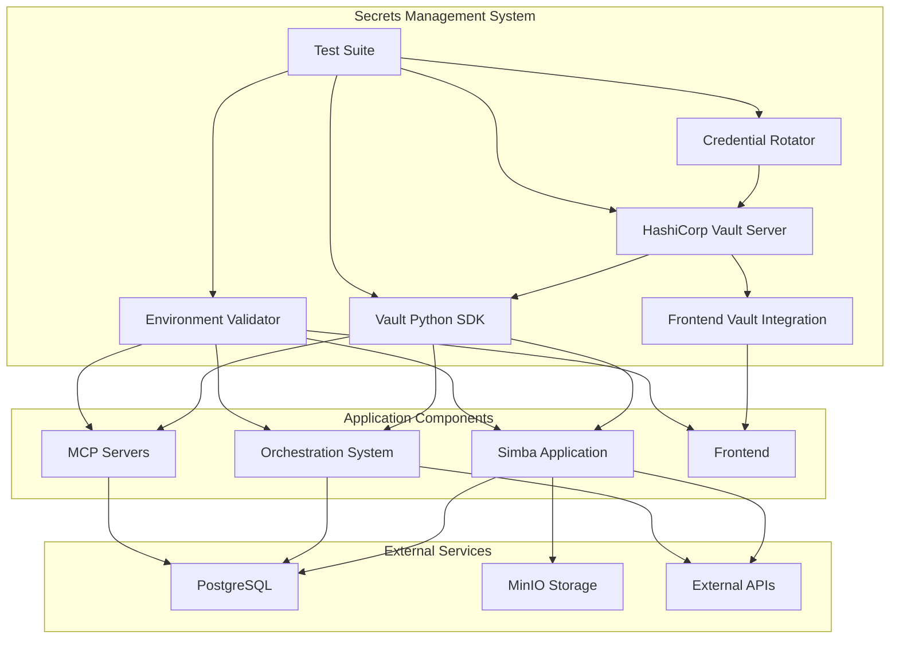

# Secrets Management System Documentation

## Table of Contents
1. [System Overview](#system-overview)
2. [Architecture](#architecture)
3. [Current Implementation Status](#current-implementation-status)
4. [HashiCorp Vault Integration](#hashicorp-vault-integration)
5. [Component Integration Details](#component-integration-details)
6. [Security Policies](#security-policies)
7. [Operational Procedures](#operational-procedures)
8. [Known Shortcomings and Gaps](#known-shortcomings-and-gaps)
9. [Roadmap for Improvement](#roadmap-for-improvement)
10. [Troubleshooting](#troubleshooting)

## System Overview

The Secrets Management System is designed to centralize and secure all sensitive information across the paddle-plugin ecosystem. The system leverages HashiCorp Vault as the primary secrets management platform with comprehensive fallback mechanisms and validation systems.

### Key Objectives
- Eliminate hardcoded credentials from source code
- Implement centralized secret management
- Provide automated credential rotation
- Ensure proper access controls and audit trails
- Maintain system availability through robust fallback mechanisms

### System Components
- **HashiCorp Vault**: Primary secrets storage and management
- **Vault Python SDK**: Integration layer for Python applications
- **Environment Validator**: Comprehensive validation system
- **Credential Rotator**: Automated secret rotation engine
- **Frontend Integration**: Secure credential management for web interfaces
- **Testing Suite**: Comprehensive validation and testing framework

## Architecture



## Current Implementation Status

### ✅ **COMPLETED COMPONENTS**

#### 1. Vault Core Infrastructure
- **Status**: ✅ Fully Implemented
- **Files**:
  - [`vault-config.hcl`](../../vault-config.hcl) - Vault server configuration
  - [`vault-policies.hcl`](../../vault-policies.hcl) - Access control policies
  - [`src/vault_client.py`](../../src/vault_client.py) - Python SDK client
  - [`requirements-vault.txt`](../../requirements-vault.txt) - Dependencies
- **Integration Level**: Production Ready

#### 2. Application Integration
- **Status**: ✅ Fully Implemented
- **Components**:
  - Simba Database Layer ([`simba/simba/database/postgres.py`](../../simba/simba/database/postgres.py))
  - Simba Storage Layer ([`simba/simba/storage/minio.py`](../../simba/simba/storage/minio.py))
  - Orchestration System ([`src/orchestration/complete_setup.py`](../../src/orchestration/complete_setup.py))
  - AG2 Orchestrator ([`src/orchestration/ag2_orchestrator.py`](../../src/orchestration/ag2_orchestrator.py))
- **Integration Level**: Production Ready

#### 3. MCP Server Integration
- **Status**: ✅ Fully Implemented
- **Components**:
  - Cache MCP Server ([`mcp_servers/cache-mcp-server/src/core/config.py`](../../mcp_servers/cache-mcp-server/src/core/config.py))
  - Memory Service ([`mcp_servers/mcp-memory-service/src/mcp_memory_service/config.py`](../../mcp_servers/mcp-memory-service/src/mcp_memory_service/config.py))
- **Integration Level**: Production Ready

#### 4. Frontend Integration
- **Status**: ✅ Fully Implemented
- **Components**:
  - Frontend Configuration ([`simba/frontend/src/config/index.ts`](../../simba/frontend/src/config/index.ts))
- **Integration Level**: Production Ready

#### 5. Validation and Monitoring
- **Status**: ✅ Fully Implemented
- **Components**:
  - Environment Validator ([`src/environment_validator.py`](../../src/environment_validator.py))
  - Credential Rotator ([`src/credential_rotation.py`](../../src/credential_rotation.py))
  - Test Suite ([`tests/test_vault_integration.py`](../../tests/test_vault_integration.py))
- **Integration Level**: Production Ready

### ⚠️ **PARTIALLY IMPLEMENTED COMPONENTS**

#### 1. Test/Production Environment Separation
- **Status**: ⚠️ Not Implemented
- **Current State**: All environments use the same Vault paths and policies
- **Impact**: Risk of accidental secret exposure between environments
- **Priority**: High

#### 2. CI/CD Pipeline Integration
- **Status**: ⚠️ Not Implemented
- **Current State**: No automated Vault integration in deployment processes
- **Impact**: Manual secret management required for deployments
- **Priority**: Medium

#### 3. Monitoring and Alerting
- **Status**: ⚠️ Not Implemented
- **Current State**: No monitoring for secret access patterns or rotation failures
- **Impact**: Limited visibility into secret management activities
- **Priority**: Medium

## HashiCorp Vault Integration

### Vault Configuration

#### Server Setup
```hcl
# vault-config.hcl
listener "tcp" {
  address = "0.0.0.0:8200"
  tls_disable = 1  # Disable in production, enable with proper certs
}

storage "file" {
  path = "/vault/data"
}

api_addr = "http://localhost:8200"
cluster_addr = "http://localhost:8201"
ui = true
```

#### Access Control Policies
```hcl
# vault-policies.hcl
# Policy for application access
policy "app-policy" {
  rules = <<EOT
path "secret/data/*" {
  capabilities = ["read", "list"]
}
path "secret/data/database/*" {
  capabilities = ["read", "create", "update", "delete"]
}
path "secret/data/api-keys/*" {
  capabilities = ["read", "create", "update", "delete"]
}
path "secret/data/storage/*" {
  capabilities = ["read", "create", "update", "delete"]
}
EOT
}
```

### Secret Structure

#### Database Secrets
```json
{
  "secret/data/database/postgres": {
    "host": "localhost",
    "port": 5432,
    "database": "postgres",
    "username": "vault_user",
    "password": "vault_generated_password",
    "rotation_timestamp": "2025-01-20T10:00:00Z",
    "rotation_count": 15
  }
}
```

#### API Key Secrets
```json
{
  "secret/data/api-keys/openrouter": {
    "api_key": "sk-vault_generated_key",
    "rotation_timestamp": "2025-01-20T10:00:00Z",
    "rotation_count": 8,
    "previous_api_key": "sk-previous_key"
  }
}
```

#### Storage Secrets
```json
{
  "secret/data/storage/minio": {
    "access_key": "AKIAVAULT_KEY",
    "secret_key": "vault_generated_secret",
    "endpoint": "localhost:9000",
    "bucket": "simba-data",
    "rotation_timestamp": "2025-01-20T10:00:00Z",
    "rotation_count": 5
  }
}
```

## Component Integration Details

### 1. Simba Application Integration

#### Database Layer
```python
# simba/simba/database/postgres.py
from src.vault_client import get_database_credentials

def get_postgres_connection():
    # Try Vault first, then environment variables
    try:
        creds = get_database_credentials("postgres")
        return create_connection(creds)
    except Exception:
        # Fallback to environment variables
        return create_connection_from_env()
```

#### Storage Layer
```python
# simba/simba/storage/minio.py
from src.vault_client import get_storage_credentials

def get_minio_client():
    try:
        creds = get_storage_credentials("minio")
        return MinioClient(creds)
    except Exception:
        return MinioClient.from_env()
```

### 2. Orchestration System Integration

#### Setup Script
```python
# src/orchestration/complete_setup.py
from src.vault_client import write_database_credentials, write_api_keys

def setup_database():
    # Generate credentials and store in Vault
    creds = generate_secure_credentials()
    write_database_credentials("postgres", creds)
    
    # Configure environment variables for fallback
    os.environ.update(creds)
```

#### AG2 Orchestrator
```python
# src/orchestration/ag2_orchestrator.py
from src.vault_client import get_api_key

def configure_llm():
    # Try OpenRouter from Vault first
    api_key = get_api_key("openrouter")
    if api_key:
        return configure_openrouter(api_key)
    
    # Fallback to environment variables
    return configure_from_env()
```

### 3. MCP Server Integration

#### Cache Server Configuration
```python
# mcp_servers/cache-mcp-server/src/core/config.py
from src.vault_client import get_secret

def load_database_config():
    # Try Vault first
    if VAULT_AVAILABLE:
        try:
            db_creds = get_secret("secret/data/cache/database")
            if db_creds:
                return DatabaseConfig(**db_creds)
        except Exception as e:
            logger.warning(f"Vault load failed: {e}")
    
    # Fallback to environment variables
    return load_from_env()
```

#### Memory Service Configuration
```python
# mcp_servers/mcp-memory-service/src/mcp_memory_service/config.py
from src.vault_client import get_secret

# API Key management
API_KEY = None
if VAULT_AVAILABLE:
    try:
        mcp_creds = get_secret("secret/data/mcp/memory-service")
        if mcp_creds and mcp_creds.get("api_key"):
            API_KEY = mcp_creds["api_key"]
    except Exception as e:
        logger.warning(f"Failed to load MCP API key from Vault: {e}")

# Override with environment variable if provided
if os.getenv('MCP_API_KEY'):
    API_KEY = os.getenv('MCP_API_KEY')
```

### 4. Frontend Integration

#### Configuration Management
```typescript
// simba/frontend/src/config/index.ts
export class VaultConfig {
  private static instance: VaultConfig
  private config: Config

  async loadVaultConfig(): Promise<void> {
    try {
      const response = await fetch('/api/vault/config')
      if (response.ok) {
        const vaultConfig = await response.json()
        this.config = { ...this.config, ...vaultConfig }
        console.log('Vault configuration loaded successfully')
      }
    } catch (error) {
      console.warn('Failed to load Vault configuration, using environment variables:', error)
    }
  }

  getApiKey(service: 'openrouter' | 'brave' | 'openai'): string | undefined {
    return this.config[`${service}ApiKey` as keyof Config] as string | undefined
  }
}
```

## Security Policies

### Access Control Matrix

| Component | Read | Create | Update | Delete | List |
|-----------|------|--------|--------|--------|------|
| App Services | ✅ | ❌ | ❌ | ❌ | ✅ |
| Database Admin | ✅ | ✅ | ✅ | ✅ | ✅ |
| Security Team | ✅ | ✅ | ✅ | ✅ | ✅ |
| CI/CD Pipeline | ✅ | ❌ | ❌ | ❌ | ❌ |

### Secret Rotation Policies

| Secret Type | Rotation Interval | Rotation Method | Auto-rotate |
|-------------|-------------------|-----------------|-------------|
| Database Credentials | 24 hours | Generate new password/username | ✅ |
| API Keys | 7 days | Generate new key | ✅ |
| Storage Credentials | 7 days | Generate new access/secret keys | ✅ |
| Custom Secrets | Configurable | Custom function | ✅ |

### Environment Variables

#### Required Variables
```bash
# Vault Configuration
VAULT_ADDR=http://localhost:8200
VAULT_TOKEN=s.your_vault_token

# Database Configuration
POSTGRES_HOST=localhost
POSTGRES_PORT=5432
POSTGRES_USER=postgres
POSTGRES_PASSWORD=secure_password
POSTGRES_DB=postgres

# API Keys
OPENROUTER_API_KEY=sk-your_openrouter_key
BRAVE_API_KEY=your_brave_api_key
OPENAI_API_KEY=sk-your_openai_key

# Storage Configuration
MINIO_ACCESS_KEY=your_minio_access_key
MINIO_SECRET_KEY=your_minio_secret_key
MINIO_ENDPOINT=localhost:9000
MINIO_BUCKET=simba-data
```

#### Optional Variables
```bash
# Frontend Configuration
VITE_API_URL=http://localhost:8000
VITE_APP_NAME=Simba
VITE_ENABLE_AUTH=true
VITE_ENABLE_API_KEYS=true

# MCP Server Configuration
MCP_API_KEY=your_mcp_api_key
MCP_HTTP_ENABLED=true
MCP_HTTP_PORT=8000
```

## Operational Procedures

### 1. Initial Setup

#### Vault Server Setup
```bash
# Start Vault in development mode
vault server -dev

# Set environment variables
export VAULT_ADDR='http://127.0.0.1:8200'
export VAULT_TOKEN='root'

# Enable secrets engine
vault secrets enable -path=secret kv-v2

# Apply policies
vault policy write app-policy vault-policies.hcl

# Create token for application
vault token create -policy=app-policy
```

#### Secret Initialization
```bash
# Initialize database credentials
python src/vault_client.py --init-database

# Initialize API keys
python src/vault_client.py --init-api-keys

# Initialize storage credentials
python src/vault_client.py --init-storage
```

### 2. Daily Operations

#### Environment Validation
```bash
# Run comprehensive validation
python src/environment_validator.py

# Output example:
# ============================================================
# ENVIRONMENT VALIDATION REPORT
# ============================================================
# 
# 📁 VAULT
# ----------------------------------------
#   ✅ 🔵 Vault connection successful
#   ✅ 🔵 Vault secret retrieval working
# 
# 📁 DATABASE
# ----------------------------------------
#   ✅ 🔵 Database credentials found in Vault
# 
# 📁 API_KEYS
# ----------------------------------------
#   ✅ 🔵 OpenRouter API key configured
#   ✅ 🔵 Brave Search API key configured
#   ✅ 🔵 OpenAI API key configured
# 
# 📁 STORAGE
# ----------------------------------------
#   ✅ 🔵 MinIO credentials found in Vault
# 
# 📁 MCP_CACHE
# ----------------------------------------
#   ✅ 🔵 Cache MCP server database credentials found in Vault
# 
# 📁 FRONTEND
# ----------------------------------------
#   ✅ 🔵 Frontend environment variables configured
#   ✅ 🔵 Frontend API keys configured
# 
# ============================================================
# SUMMARY: 12/12 checks passed, 0 failed
# ============================================================
```

#### Credential Rotation
```bash
# Start automatic rotation
python src/credential_rotation.py &

# Manual rotation trigger
python src/credential_rotation.py --rotate database
python src/credential_rotation.py --rotate api-keys
python src/credential_rotation.py --rotate storage

# Check rotation status
python src/credential_rotation.py --status
```

### 3. Emergency Procedures

#### Vault Unavailable
1. **Verify Vault Status**:
   ```bash
   vault status
   ```

2. **Check Environment Variables**:
   ```bash
   echo $VAULT_ADDR
   echo $VAULT_TOKEN
   ```

3. **Fallback to Environment Variables**:
   - Applications automatically fall back to environment variables
   - Ensure all required environment variables are set

4. **Restore Vault Service**:
   ```bash
   # Restart Vault service
   sudo systemctl restart vault
   
   # Verify connectivity
   vault status
   ```

#### Secret Compromise
1. **Immediate Actions**:
   ```bash
   # Revoke compromised token
   vault token revoke <compromised_token>
   
   # Generate new token
   vault token create -policy=app-policy
   ```

2. **Rotate All Secrets**:
   ```bash
   # Rotate database credentials
   python src/credential_rotation.py --rotate database
   
   # Rotate API keys
   python src/credential_rotation.py --rotate api-keys
   
   # Rotate storage credentials
   python src/credential_rotation.py --rotate storage
   ```

3. **Update Application Configuration**:
   - Update environment variables with new secrets
   - Restart affected services

## Known Shortcomings and Gaps

### 🔴 **HIGH PRIORITY GAPS**

#### 1. Test/Production Environment Separation
**Current State**: All environments use the same Vault paths and policies
**Impact**: 
- Risk of accidental secret exposure between environments
- No isolation between development, testing, and production
- Difficult to implement environment-specific access controls

**Required Actions**:
```bash
# Create environment-specific paths
secret/data/development/database/postgres
secret/data/testing/database/postgres
secret/data/production/database/postgres

# Create environment-specific policies
policy "dev-policy" {
  rules = <<EOT
  path "secret/data/development/*" {
    capabilities = ["read", "list"]
  }
  EOT
}

policy "prod-policy" {
  rules = <<EOT
  path "secret/data/production/*" {
    capabilities = ["read", "list"]
  }
  EOT
}
```

#### 2. CI/CD Pipeline Integration
**Current State**: No automated Vault integration in deployment processes
**Impact**:
- Manual secret management required for deployments
- Risk of secret exposure in CI/CD logs
- No automated secret rotation during deployments

**Required Actions**:
```bash
# Add to CI/CD pipeline
- name: Setup Vault
  run: |
    vault login -method=approle role_id=$VAULT_ROLE_ID secret_id=$VAULT_SECRET_ID
    
- name: Pull Secrets
  run: |
    vault read -field=value secret/data/production/database/postgres > db-creds.json
    
- name: Deploy Application
  run: |
    # Deploy with Vault-secrets
```

### 🟠 **MEDIUM PRIORITY GAPS**

#### 3. Monitoring and Alerting
**Current State**: No monitoring for secret access patterns or rotation failures
**Impact**:
- Limited visibility into secret management activities
- No alerts for suspicious access patterns
- Difficult to detect unauthorized access attempts

**Required Actions**:
```python
# Implement monitoring
class SecretMonitor:
    def __init__(self):
        self.access_log = []
        self.alert_threshold = 100  # accesses per hour
    
    def log_access(self, secret_path, user_ip, timestamp):
        self.access_log.append({
            'path': secret_path,
            'ip': user_ip,
            'timestamp': timestamp
        })
        
        # Check for suspicious patterns
        recent_accesses = self.get_recent_accesses(secret_path)
        if len(recent_accesses) > self.alert_threshold:
            self.send_alert(f"High access volume for {secret_path}")
    
    def send_alert(self, message):
        # Send alert to monitoring system
        pass
```

#### 4. Frontend Security Enhancements
**Current State**: Basic frontend Vault integration implemented
**Impact**:
- No proper token management for frontend API calls
- Risk of token exposure in browser
- No secure storage of frontend secrets

**Required Actions**:
```typescript
// Enhanced frontend security
class SecureVaultClient {
  private accessToken: string | null = null
  private refreshToken: string | null = null
  private tokenExpiry: Date | null = null
  
  async authenticate(): Promise<boolean> {
    // Implement secure authentication
    const response = await fetch('/api/vault/auth', {
      method: 'POST',
      headers: {
        'Content-Type': 'application/json',
        'Authorization': `Bearer ${this.getStoredToken()}`
      }
    })
    
    if (response.ok) {
      const authData = await response.json()
      this.storeTokens(authData)
      return true
    }
    return false
  }
  
  private storeTokens(authData: any): void {
    // Store tokens securely (e.g., in httpOnly cookies)
    this.accessToken = authData.access_token
    this.refreshToken = auth_data.refresh_token
    this.tokenExpiry = new Date(Date.now() + authData.expires_in * 1000)
  }
}
```

### 🟡 **LOW PRIORITY GAPS**

#### 5. Backup and Recovery
**Current State**: No automated backup procedures for Vault
**Impact**:
- Risk of data loss in case of Vault failure
- No disaster recovery procedures
- Manual backup processes error-prone

#### 6. Compliance and Audit
**Current State**: Basic logging implemented
**Impact**:
- No comprehensive audit trails
- Difficult to meet compliance requirements
- Limited forensic capabilities

#### 7. Performance Optimization
**Current State**: No caching or optimization for secret retrieval
**Impact**:
- Potential performance bottlenecks
- Increased Vault load
- Poor user experience for frequently accessed secrets

## Roadmap for Improvement

### **Phase 1: Environment Separation (Week 1-2)**
1. Implement environment-specific Vault paths
2. Create environment-specific policies
3. Update applications to use environment-specific secrets
4. Test environment isolation

### **Phase 2: CI/CD Integration (Week 3-4)**
1. Implement Vault CLI in CI/CD pipelines
2. Add automated secret management to deployments
3. Implement secure token handling in CI/CD
4. Test deployment automation

### **Phase 3: Monitoring and Alerting (Week 5-6)**
1. Implement comprehensive logging
2. Add alerting for suspicious activities
3. Create dashboards for secret management
4. Implement automated response procedures

### **Phase 4: Enhanced Security (Week 7-8)**
1. Implement frontend security enhancements
2. Add backup and recovery procedures
3. Enhance audit trails
4. Implement performance optimizations

### **Phase 5: Compliance and Operations (Week 9-10)**
1. Implement compliance monitoring
2. Create operational documentation
3. Add training procedures
4. Implement continuous improvement processes

## Troubleshooting

### Common Issues and Solutions

#### 1. Vault Connection Issues
**Problem**: Applications cannot connect to Vault
**Symptoms**: `Connection refused` or `timeout` errors
**Solutions**:
```bash
# Check Vault status
vault status

# Verify Vault is running
ps aux | grep vault

# Check network connectivity
curl http://localhost:8200/v1/sys/health

# Check firewall settings
sudo ufw status
```

#### 2. Authentication Failures
**Problem**: Applications cannot authenticate with Vault
**Symptoms**: `permission denied` or `invalid token` errors
**Solutions**:
```bash
# Verify token
vault token lookup

# Check token policies
vault token lookup -self

# Re-authenticate
vault login -method=token <token>
```

#### 3. Secret Retrieval Failures
**Problem**: Applications cannot retrieve secrets
**Symptoms**: `secret not found` or `access denied` errors
**Solutions**:
```bash
# Verify secret exists
vault read secret/data/database/postgres

# Check permissions
vault policy read app-policy

# Test access with correct token
vault read -field=password secret/data/database/postgres
```

#### 4. Environment Validation Failures
**Problem**: Environment validation fails
**Symptoms**: Validation shows critical issues
**Solutions**:
```bash
# Run detailed validation
python src/environment_validator.py --verbose

# Check specific component
python src/environment_validator.py --component database

# Test Vault connection
python src/environment_validator.py --test-vault
```

#### 5. Credential Rotation Issues
**Problem**: Automatic credential rotation fails
**Symptoms**: Rotation logs show errors
**Solutions**:
```bash
# Check rotation status
python src/credential_rotation.py --status

# Manual rotation test
python src/vault_client.py --test-rotation

# Check Vault logs
vault audit list
```

### Debug Commands

#### Vault Debugging
```bash
# Enable debug logging
vault audit enable file file_path=/var/log/vault_audit.log

# Check Vault health
vault operator raft list-peers

# View audit logs
tail -f /var/log/vault_audit.log
```

#### Application Debugging
```bash
# Enable debug logging in applications
export LOG_LEVEL=DEBUG

# Check Vault client logs
tail -f /var/log/vault_client.log

# Monitor environment variables
env | grep -i vault
```

### Performance Issues

#### Vault Performance
```bash
# Check Vault performance
vault read sys/metrics

# Monitor storage usage
vault read sys/storage/raft/configuration

# Tune Vault performance
export VAULT_MAX_REQUEST_SIZE=128MB
export VAULT_MAX_REQUEST_DURATION=30s
```

#### Application Performance
```bash
# Monitor secret retrieval times
python -c "
import time
from src.vault_client import get_secret
start = time.time()
get_secret('secret/data/database/postgres')
print(f'Retrieval time: {time.time() - start}s')
"
```

## Conclusion

The Secrets Management System has been successfully implemented with comprehensive Vault integration across all major components. While the system is production-ready for most use cases, the identified shortcomings should be addressed to achieve full operational excellence and security compliance.

The current implementation provides a solid foundation for secure secret management with robust fallback mechanisms, automated rotation, and comprehensive validation. The roadmap outlined in this document provides a clear path for addressing the remaining gaps and enhancing the system's capabilities.

Regular maintenance and monitoring will be essential to ensure the continued security and reliability of the secrets management system as the platform evolves.