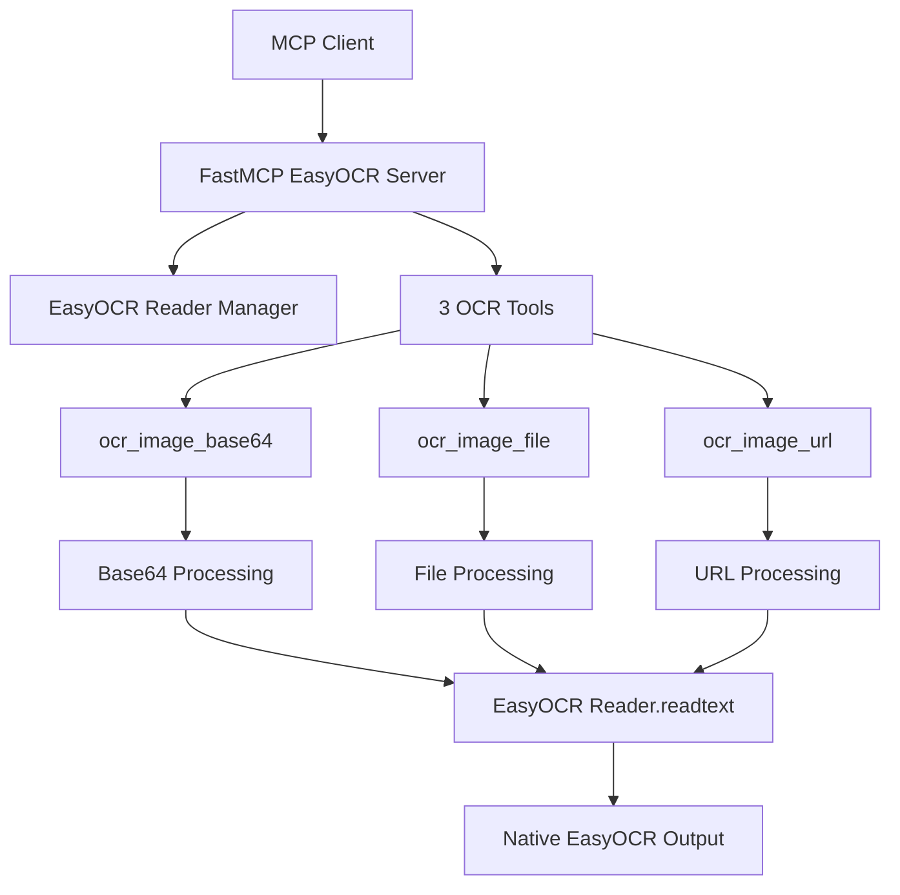

# EasyOCR FastMCP Server Implementation Plan

## 📋 Overview

This plan outlines the transformation of the existing Gemini-based OCR MCP server to use EasyOCR library while maintaining the FastMCP structure and adding enhanced capabilities.

## 🎯 Objectives

1. Replace Gemini API with EasyOCR library
2. Keep the FastMCP structure intact
3. Add 3 core OCR tools with language selection
4. Use EasyOCR's native output format
5. Remove configuration tools (handled in MCP config)

## 🏗️ Architecture



## 🔧 Implementation Plan

### Step 1: Remove Gemini Dependencies

- Remove `from google import genai` (line 6)
- Remove all Gemini API key and client code (lines 50-73)
- Remove Gemini-specific error handling

### Step 2: Add EasyOCR Infrastructure

- Add `import easyocr`
- Add `import requests` for URL image downloading
- Create reader management with language support
- Keep the existing PIL image processing for validation

### Step 3: Implement 3 Enhanced Tools

#### Tool 1: Enhanced `ocr_image_base64`
```python
@mcp.tool(title="OCR Image from Base64")
def ocr_image_base64(
    base64_image: str, 
    languages: list[str] = ['en'],
    detail: int = 1,
    paragraph: bool = False,
    width_ths: float = 0.7,
    height_ths: float = 0.7
) -> list:
    """
    Performs OCR on a base64 encoded image using EasyOCR.
    
    Args:
        base64_image: Base64 encoded image string
        languages: List of language codes (e.g., ['en', 'ch_sim'])
        detail: 0 for text only, 1 for full details with coordinates and confidence
        paragraph: Enable paragraph detection
        width_ths: Text width threshold for merging
        height_ths: Text height threshold for merging
    
    Returns:
        EasyOCR native output format
    """
```

#### Tool 2: Enhanced `ocr_image_file`
```python
@mcp.tool(title="OCR Image from File")
def ocr_image_file(
    image_path: str,
    languages: list[str] = ['en'], 
    detail: int = 1,
    paragraph: bool = False,
    width_ths: float = 0.7,
    height_ths: float = 0.7
) -> list:
    """
    Performs OCR on an image file using EasyOCR.
    
    Args:
        image_path: Path to the image file
        languages: List of language codes (e.g., ['en', 'ch_sim'])
        detail: 0 for text only, 1 for full details with coordinates and confidence
        paragraph: Enable paragraph detection
        width_ths: Text width threshold for merging
        height_ths: Text height threshold for merging
    
    Returns:
        EasyOCR native output format
    """
```

#### Tool 3: New `ocr_image_url`
```python
@mcp.tool(title="OCR Image from URL")
def ocr_image_url(
    image_url: str,
    languages: list[str] = ['en'],
    detail: int = 1, 
    paragraph: bool = False,
    width_ths: float = 0.7,
    height_ths: float = 0.7
) -> list:
    """
    Performs OCR on an image from a URL using EasyOCR.
    
    Args:
        image_url: URL of the image to process
        languages: List of language codes (e.g., ['en', 'ch_sim'])
        detail: 0 for text only, 1 for full details with coordinates and confidence
        paragraph: Enable paragraph detection
        width_ths: Text width threshold for merging
        height_ths: Text height threshold for merging
    
    Returns:
        EasyOCR native output format
    """
```

### Step 4: Core Implementation Details

#### Reader Management
- Create readers dynamically based on language selection
- Cache readers by language combination for performance
- Handle GPU/CPU based on installation (no runtime detection)

#### Image Processing
- Keep existing PIL validation logic (lines 25-48)
- Add URL image downloading with requests
- Convert images to format compatible with EasyOCR

#### Output Format
- Return EasyOCR's native format directly
- `detail=1`: `[([[x1,y1], [x2,y2], [x3,y3], [x4,y4]], 'text', confidence), ...]`
- `detail=0`: `['text1', 'text2', ...]`

## 🚀 Key Features

- **Same FastMCP Structure**: Keep `mcp = FastMCP("EasyOCR")` and `mcp.run()`
- **Enhanced Parameters**: Language selection, detail levels, fine-tuning options
- **Native Output**: EasyOCR's original output format (no custom wrappers)
- **URL Support**: New capability to process images from web URLs
- **Error Handling**: Robust error handling for EasyOCR-specific issues

## 📦 Dependencies Update

Update `pyproject.toml`:
```toml
dependencies = [
    "easyocr>=1.7.2",
    "pillow>=8.0.0", 
    "requests>=2.25.0"
]
```

## 🔄 Expected Output Examples

### Detail Level 1 (Full Details)
```python
[
    ([[189, 75], [469, 75], [469, 165], [189, 165]], '愚园路', 0.3754989504814148),
    ([[86, 80], [134, 80], [134, 128], [86, 128]], '西', 0.40452659130096436),
    ([[517, 81], [565, 81], [565, 123], [517, 123]], '东', 0.9989598989486694)
]
```

### Detail Level 0 (Text Only)
```python
['愚园路', '西', '东', '315', '309', 'Yuyuan Rd.', 'W', 'E']
```

## 🔧 Implementation Steps

1. **Phase 1**: Remove Gemini dependencies and add EasyOCR imports
2. **Phase 2**: Implement reader management and caching system
3. **Phase 3**: Transform existing tools to use EasyOCR
4. **Phase 4**: Add new URL processing tool
5. **Phase 5**: Update error handling and validation
6. **Phase 6**: Test all tools with various image formats and languages

## 📝 Code Structure

The final code will maintain the same structure:
```python
from mcp.server.fastmcp import FastMCP
import easyocr
import requests
# ... other imports

# Create an MCP server
mcp = FastMCP("EasyOCR")

# Reader cache for performance
_reader_cache = {}

def get_reader(languages):
    # Reader management logic
    pass

@mcp.tool(title="OCR Image from Base64")
def ocr_image_base64(...):
    # Implementation
    pass

@mcp.tool(title="OCR Image from File") 
def ocr_image_file(...):
    # Implementation
    pass

@mcp.tool(title="OCR Image from URL")
def ocr_image_url(...):
    # Implementation
    pass

if __name__ == "__main__":
    mcp.run()
```

## 🎯 Success Criteria

- [ ] All Gemini dependencies removed
- [ ] EasyOCR successfully integrated
- [ ] 3 tools working with language selection
- [ ] Native EasyOCR output format maintained
- [ ] URL image processing functional
- [ ] Error handling robust
- [ ] Performance optimized with reader caching
- [ ] Compatible with existing MCP client usage

This plan provides a clear roadmap for transforming the existing Gemini-based OCR server into a more capable EasyOCR-powered MCP server while maintaining the familiar FastMCP structure.